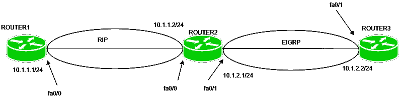
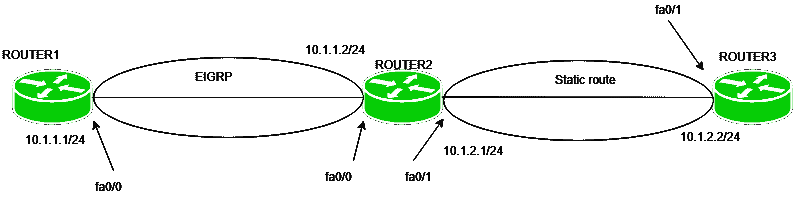
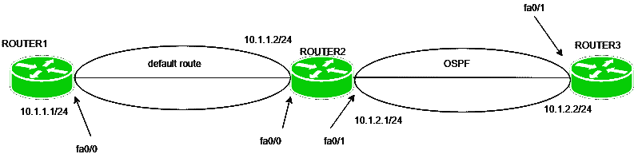

# 计算机网络中的再分发

> 原文:[https://www . geesforgeks . org/计算机网络再分发/](https://www.geeksforgeeks.org/redistribution-in-computer-network/)

通常，在组织中使用单一路由协议是首选，但在某些情况下，我们必须使用多协议路由。这些情况包括多个管理员运行多个协议、公司合并或使用多个供应商的设备。因此，我们必须在不同的路由协议中通告通过路由协议或任何其他方式(如静态路由或直连路由)获知的路由。这个过程叫做再分配。

**重分发–**
是将静态路由、直连路由或动态路由协议学习到的路由通告到另一个路由协议中的过程。


例如，在这里，路由器 2 的一个接口(fa0/0)正在运行 EIGRP，另一个接口(fa0/1)正在运行 OSPF，那么我们必须将 OSPF 的路由通告到 EIGRP 中，反之亦然，以便这些路由协议所获知的路由相互通告。这个过程叫做再分配。否则，路由器 1 将无法学习路由器 3 的路由，路由器 3 也将无法学习路由器 1 的路由。

**度量–**
众所周知，不同的路由协议使用不同的度量来找出最佳路径，因此，当我们将路由从一个路由协议重新分配到另一个路由协议时，我们必须定义路由协议可以理解的度量。

例如，我们知道 RIP 使用跳数作为度量，而 EIGRP 使用由带宽、负载、延迟、可靠性和 MTU(仅使用带宽和延迟)组成的复合矩阵。因此，当我们将 EIGRP 的路由通告到 RIP 时，我们必须定义度量跳数。

**示例–**

```
router(config)router rip
router(config-router)#redistribute Eigrp 1 metric 1 
```

其中，度量 1 表示跳数 1，而 EIGRP 1 表示自治系统 1。

**配置–**

**1。当路由器的一个接口运行 RIP，另一个接口运行 EIGRP 时**。



这是一个小型拓扑，其中 3 台路由器相互连接。路由器 1 的 fa0/0 上有 ip 地址 10.1.1.1/24，路由器 2 的 fa0/0 上有 IP 地址 10.1.1.2/24，fa0/1 上有 IP 地址 10.1.2.1/24，路由器 3 的 fa0/0 上有 IP 地址 10.1.2.1/24。

如图所示，路由器 2 的接口 fa0/0 运行 RIP，fa0/1 运行 EIGRP，路由器 1 运行 RIP，路由器 3 运行 EIGRP。
现在，在路由器 1 上配置 RIP。

```
Router1(config)#router rip
Router1(config-router)#network 10.1.1.0
Router1(config-router)#no auto-summary
```

在路由器 3 上配置 EIGRP:

```
Router3(config)#router Eigrp 100
Router3(config-router)#network 10.1.2.0
Router3(config-router)#no auto-summary
```

现在，在路由器 2 上配置 RIP 和 EIGRP。

```
Router2(config)#router rip
Router2(config-router)#network 10.1.1.0
Router2(config-router)#no auto-summary
Router2(config-router)#exit
Router2(config)#router Eigrp 100
Router2(config-router)#network 10.1.2.0
Router2(config-router)#no auto-summary
```

现在，在路由器 2 上配置重新分配，首先在 RIP 中重新分配 EIGRP 的路由:

```
Router2(config)#router rip
Router2(config-router)#redistribute eigrp 100 metric 1
```

这里，RIP 使用度量跳数，因此我们给出了度量 1。现在，在 EIGRP 中重新分配 RIP 的路由:

```
Router2(config)#router eigrp 100
Router2(config-router)#redistribute rip metric 1 0 1 1 1
```

这里，EIGRP 使用度量复合矩阵，因此，我们使用了 k 值(1 0 1 1 1)。

**2。当路由器的一个接口运行 OSPF，另一个接口运行 EIGRP** 时。


使用相同的拓扑。路由器 1 的 fa0/0 上有 ip 地址 10.1.1.1/24，路由器 2 的 fa0/0 上有 IP 地址 10.1.1.2/24，fa0/1 上有 IP 地址 10.1.2.1/24，路由器 3 的 fa0/0 上有 IP 地址 10.1.2.1/24。

如图所示，路由器 2 的接口 fa0/0 运行 EIGRP，fa0/1 运行 OSPF，路由器 1 运行 EIGRP，路由器 3 运行 OSPF。
现在，在路由器 1 上配置 EIGRP。

```
Router1(config)#router Eigrp 100
Router1(config-router)#network 10.1.1.0
Router1(config-router)#no auto-summary
```

在路由器 3 上配置 OSPF:

```
Router3(config)#router ospf 1
Router3(config-router)#network 10.1.2.0 0.0.0.255 area 0
```

在路由器 2 上配置 EIGRP 和 OSPF。

```
Router2(config)#router eigrp 100
Router2(config-router)#network 10.1.1.0
Router2(config-router)#no auto-summary
Router2(config-router)#exit
Router2(config-router)#router ospf 1
Router2(config-router)#network 10.1.2.0 0.0.0.255 area 0
```

现在，路由器 2 上的重新分发:

```
Router2(config)#router Eigrp 100
Router2(config-router)#redistribute ospf 1 metric 1 0 1 1 1
Router2(config-router)#exit
Router2(config)#router ospf 1
Router2(config-router)#redistribute eigrp 100 subnets
```

**3。当路由器的一个接口正在运行 EIGRP，而另一个接口被赋予静态路由时**。



使用相同的拓扑。路由器 1 的 fa0/0 上有 ip 地址 10.1.1.1/24，路由器 2 的 fa0/0 上有 IP 地址 10.1.1.2/24，fa0/1 上有 IP 地址 10.1.2.1/24，路由器 3 的 fa0/0 上有 IP 地址 10.1.2.1/24。

路由器 2 的接口 fa0/0 运行 EIGRP，路由器 1 运行 EIGRP，路由器 3 是静态的，如图所示。

```
Router1(config)#router eigrp 100
Router1(config-router)#network 10.1.1.0
Router1(config-router)#no auto-summary
```

现在，给路由器 3 静态路由。

```
Router3(config)#ip route 10.1.1.0 255.255.255.0 10.1.2.2
```

现在，在路由器 2 上配置 EIGRP。

```
Router2(config)#router eigrp 100
Router2(config-router)#network 10.1.1.0
Router2(config-router)#no auto-summary
```

现在，在路由器 2 上重新分发

```
Router2(config)#router Eigrp 100
Router2(config-router)#redistribute static metric 1 0 1 1 1
```

**注意–**路由器 2 没有必要给出静态路由，因为它直接连接到 10.1.1.0 和 10.1.2.0 网络。

**4。当路由器的一个接口运行 OSPF，另一个接口被赋予默认路由时**



使用相同的拓扑。路由器 1 的 fa0/0 上有 ip 地址 10.1.1.1/24，路由器 2 的 fa0/0 上有 IP 地址 10.1.1.2/24，fa0/1 上有 IP 地址 10.1.2.1/24，路由器 3 的 fa0/0 上有 IP 地址 10.1.2.1/24。

如图所示，路由器 2 的接口 fa0/1 运行 OSPF，路由器 1 被指定为默认路由，路由器 3 运行 OSPF。

在路由器 1 上配置默认路由。

```
Router1(config)#ip route 0.0.0.0 0.0.0.0 10.1.1.2
```

在路由器 3 上配置 OSPF:

```
Router3(config)#router ospf 1
Router3(config-router)#network 10.1.2.0 0.0.0.255 area 0
```

在路由器 2 上配置 ospf:

```
Router2(config)#router ospf 1
Router2(config-router)#network 10.1.2.0 0.0.0.255 area 0
```

现在，在路由器 2 上重新分配:

```
Router2(config)#router OSPF 1
Router2(config-router)#default-information originate
```

也有其他情况，但命令将与相应情况中显示的相同。