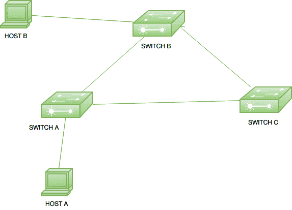
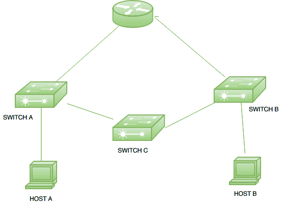
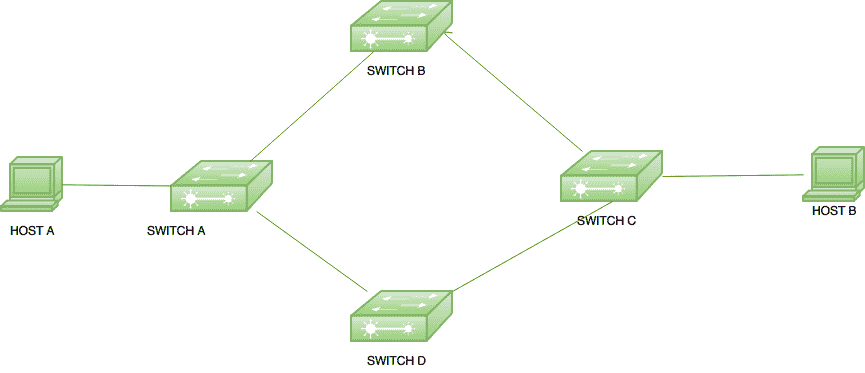

# 计算机网络中的冗余链路问题

> 原文:[https://www . geesforgeks . org/冗余链接-计算机网络中的问题/](https://www.geeksforgeeks.org/redundant-link-problems-in-computer-network/)

基本上，**冗余链路**用于防止严重的网络故障。它们用于提供冗余，即当链路出现故障时进行备份，即帧可以通过另一条路径转发出去，但也会导致问题。

以下是其中一些问题:

**广播风暴–**
交换机将另一台设备生成的广播帧转发到其所有端口。如果没有应用环路避免方案，那么交换机将在整个网络中无休止地泛洪广播，消耗所有可用带宽。这种现象被称为广播风暴。

广播风暴是一个严重的网络问题，可以在几秒钟内关闭整个网络。

**示例:**

这里，有 3 个交换机相互连接，以提供冗余。当主机 A 为主机 B 生成广播时，它首先被交换机 A 接收，然后交换机 A 将流量泛洪到其所有端口。由于交换机 B 和交换机 C 也连接到交换机 A，因此，这些交换机也接收广播帧，并通过其所有端口泛洪该帧。

因此，交换机 A 和交换机 C 也将接收交换机 B 生成的广播帧。此外，交换机 C 也将为交换机 B 和交换机 A 生成广播帧。这将导致环路消耗所有可用带宽，并可能导致网络关闭。

**多个副本–**
如果一个帧同时从不同的网段到达，设备可以接收同一帧的多个副本。

**示例:**

这是一个小型拓扑，其中一台路由器与两台交换机相连。交换机 A 连接到主机 A 和交换机 C。另一方面，交换机 B 连接到交换机 C 和主机 B。假设，如果主机 A 想要向路由器发送单播帧，那么它会将该帧转发到交换机 A。交换机 A 依次将其转发到路由器和交换机 C。此时，路由器将收到数据包。

但是交换机 C 又将数据包转发到交换机 B，交换机 B 将把它转发到路由器。此时，路由器将收到单个帧的多个副本。这是一个问题，因为大多数协议不能正确处理重复传输。

**媒体访问控制表抖动–**
交换机使用媒体访问控制地址表转发帧。当交换机收到帧时，它会在接收帧的交换机端口上输入设备 mac 地址，但是如果交换机从多条链路接收到同一来源的帧，那么交换机在 MAC 表中输入条目会造成混淆。会导致 MAC 表不稳定。

**示例:**

在给定的拓扑中，如果主机 A 向主机 B 发送单播帧，则交换机 A 将接收该帧。交换机 A 将把它转发到交换机 B 和交换机 D，交换机 B 和交换机 D 又把它转发到交换机 C。现在，交换机 C 将在具有相同源 mac 地址的两个不同端口上接收帧，因此这将导致交换机 C 的 MAC 表不稳定。生成树协议(STP)用于防止这些环路。它将使用自己的机制阻塞(端口)路径，通过这种机制，一次只有一条路径可用于帧传送。如果一条路径中断，则被阻塞的路径变为活动路径，并且可以从该路径(在交换机中)进行帧传输。