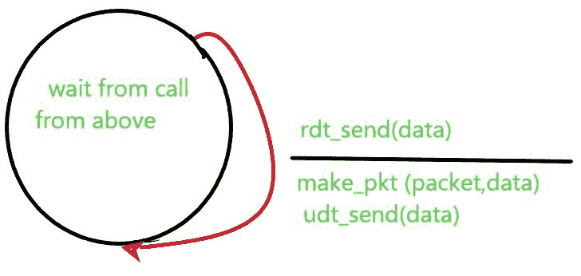
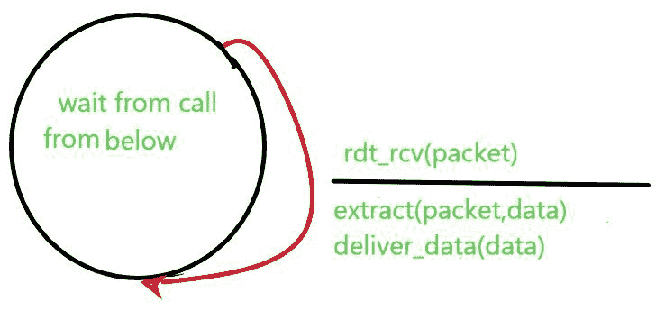

# 可靠数据传输(RDT) 1.0

> 原文:[https://www . geesforgeks . org/related-data-transfer-RDT-1-0/](https://www.geeksforgeeks.org/reliable-data-transfer-rdt-1-0/)

RDT 1.0 在完全(完美)可靠的频道上工作。为了在一层上建立可靠的数据传输协议，我们首先来看一个通过完全可靠的信道传输数据的简单例子，RDT 1.0 是一个简单的协议。这种数据传输是用有限状态机来表示的，有限状态机由发送方和接收方的有限状态机组成。在 RDT 1.0 中，发送方和接收方只有一种状态，这里箭头表示协议从一种状态转换到另一种状态。

**发送方:**
RDT 很简单，它从上面的层获取数据，在段的 for 中，它删除段头，使用 make_pkt 将数据做成数据包的形式，并使用 udt_send(不可靠的数据传输)将数据包发送到信道中。

**接收方**
RDT 通过 rdt_rcv(数据包)从底层信道接收数据包，使用 extract(数据包，数据)从数据包中删除数据，并将数据向上传递到上层。rdt_rcv(数据包)事件源于过程调用，即来自协议低层的 rdt_rcv()数据包。

在该协议中，数据单元和分组之间没有区别，在该协议中，所有分组以统一的方式从发送者流向接收者，因此不需要从接收者侧进行反馈来告诉发送者分组是否被接收。