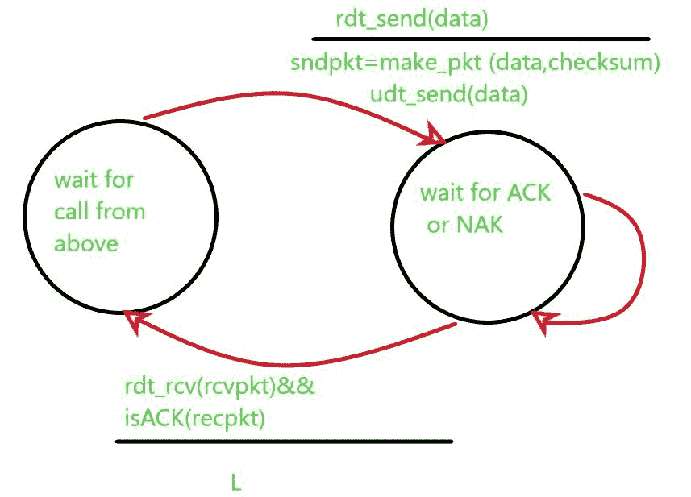
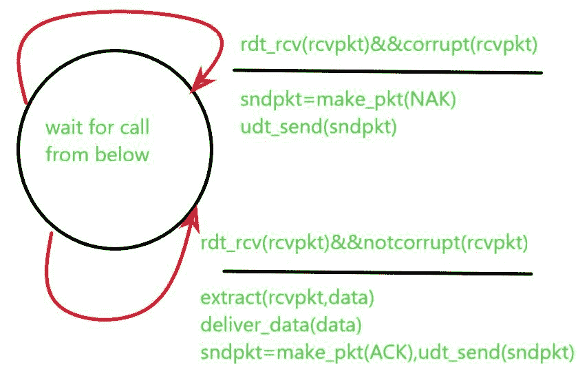

# 可靠数据传输(RDT) 2.0

> 原文:[https://www . geesforgeks . org/related-data-transfer-RDT-2-0/](https://www.geeksforgeeks.org/reliable-data-transfer-rdt-2-0/)

可靠数据传输(RDT) 2.0 协议通过位错误通道在[可靠数据传输](https://www.geeksforgeeks.org/principle-of-reliable-data-transfer-protocol/)上工作。这是一个更现实的模型，用于在传输信道时检查信道中存在的位错误，因为数据包中的位可能已损坏。当数据包被传输、传播或缓冲时，这种位错误发生在网络的物理组件中。在这种情况下，我们将假设所有传输的数据包都是按照发送的顺序接收的(无论它们是否损坏)。在这种情况下，我们要求用户发送确认(确认，即收到的数据包是正确的，没有损坏)或否定确认(否定确认，即收到的数据包损坏)。

在该协议中，我们通过使用**校验和字段**来检测错误，校验和是表示传输消息中位数的值。要检查最终用户计算的校验和值是否与原始校验和值略有不同，这意味着数据包已损坏，允许接收器使用校验和检测数据包中的位错误所需的机制称为*错误检测*。

这种技术允许接收机检测并可能纠正分组比特错误。在这种情况下，我们只需要知道这种技术需要额外的比特(超出要传输的原始数据的比特)从发送者发送到接收者；这些比特将被收集到 RDT 2.0 数据分组的分组校验和字段中。

另一种技术是**接收方反馈**由于发送方和接收方在不同的终端系统上执行，发送方了解接收方情况的唯一方法，即数据包是否被正确接收，就是接收方应向发送方提供明确的反馈。消息口述场景中的肯定(ACK)和否定确认(NAK)回复就是这种反馈的一个示例。零值表示否定，值 1 表示肯定。

**发送端:**
RDT 2.0 的发送端有两种状态。在一种状态下，发送端协议等待数据从上层向下传递到下层。在另一种状态下，发送方协议正在等待来自接收方的确认或否定数据包(反馈)。如果收到确认包，即 rdt_rcv(rcvpkt) & &为 ACK(rcvpkt)，发送方知道最近发送的包已被正确接收，因此协议返回到等待来自上层的数据的状态。

如果接收到一个否定应答，协议重新发送最后一个数据包，并等待接收机响应重新发送的数据包返回一个肯定应答或否定应答。需要注意的是，当接收方处于等待确认或否定状态时，它无法从上层获得更多的数据，这只会发生在发送方收到确认并离开该状态之后。因此，发送方在确定接收方已经正确接收到当前数据包之前不会发送新的数据，由于协议的这种行为，该协议也被称为*停止和等待协议*。

**接收方:**
接收方站点只有一个状态，一旦数据包到达，接收方会根据接收到的数据包是否损坏(即通过使用 rdt_rcv(rcvpkt) & &损坏(rcvpkt)接收到数据包并发现有错误)或 rdt_rcv(rcvpkt) & &未损坏(rcvpkt)接收到的数据包是否正确进行回复。

RDT 2.0 看起来很有效，但是它有一些缺陷。很难理解确认/否定包的比特实际上是否被破坏，如果包被破坏，协议将如何从确认或否定包的错误中恢复。这里的困难在于，如果确认或否定被破坏，发送方无法知道接收方是否正确接收了最后一段传输的数据。