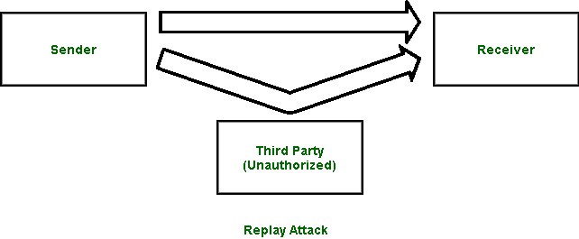

# 重放攻击

> 原文:[https://www.geeksforgeeks.org/replay-attack/](https://www.geeksforgeeks.org/replay-attack/)

近年来，数据对我们变得非常重要。数据的安全和保障至关重要。有几个机密和敏感的信息，我们不能冒险落入坏人之手。然而，有时未经授权的人可以访问我们的信息。任何未经授权的人或黑客对数据的完整性、保密性和认证构成威胁的行为都被称为*安全攻击*。

**什么是重放攻击？**
重放攻击是对通过网络发送的数据的一种安全攻击。
在此攻击中，黑客或任何未经授权访问的人捕获流量，并将通信发送到其原始目的地，充当原始发送者。接收者觉得这是一条经过验证的消息，但实际上它是攻击者发送的消息。重播攻击的主要特点是客户端会收到两次消息，因此得名**重播攻击**。

**注–**
上图中的箭头表示通信流。

**防止重放攻击:**

1.  **时间戳方法–**
    如果将时间戳与数据一起使用，则可以防范此类攻击者。按说，一个数据上的时间戳超过了一定的限制，就可以丢弃，可以要求发送方再次发送数据。
2.  **会话密钥法–**
    另一种预防方式，是通过使用会话密钥。该密钥在每次交易中只能使用一次(发送方和接收方)，不能重复使用。