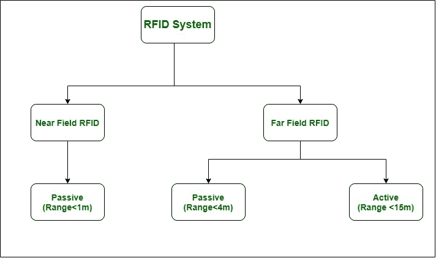

# 射频识别完整表单

> 原文:[https://www.geeksforgeeks.org/rfid-full-form/](https://www.geeksforgeeks.org/rfid-full-form/)

**RFID 或射频识别**是一种使用无线非接触射频波的自动识别方法，其中数据被数字编码在 RFID 标签或智能标签中，阅读器可以通过无线电波读取这些标签或标签。数据传输发生在阅读器和可移动物体之间，可移动物体可以被识别&轨迹。射频识别可以被认为类似于条形码，因为从标签读取的数据存储在数据库中，或者你可以说捕获标签数据的设备将数据存储在数据库中。

条形码或二维码与射频识别的主要区别在于，射频识别标签数据可以在视线之外读取，而传统条形码不能。射频识别不需要阅读器或扫描仪和标签物品之间的任何物理接触。标签内放置了一个微芯片，当标签暴露在无线电波中时，微芯片用来传输数据。射频识别标签主要用于工业中跟踪产品的进度。

**RFID 系统:**
RFID 系统由 RFID 阅读器& RFID 标签组成。

1.  **射频识别阅读器–**
    它是一种用于与射频识别标签通信的设备，由一个或多个天线组成，用于发射无线电波&从射频识别标签接收信号。射频识别阅读器也被称为询问器，因为它用于询问射频识别标签。
2.  **射频识别标签–**
    射频识别标签由两部分组成:

*   **集成电路:**
    用于存储&处理数据。
*   **天线:**
    用于发射接收信号。
*   **有源标签:**
    这些都有自己的电源，可以读取 100 英尺左右的范围。
*   **无源标签:**
    由于无源标签没有自己的电源，读取器感应供电给无源标签。无源标签是最广泛使用的标签，其读取范围约为 30 英尺。

**RFID 系统分类:**
RFID 系统分为 2 个领域，近场 RFID 和远场 RFID。

1.  **近场射频识别–**
    近场射频识别具有小型全向阅读器天线&标签读取范围在 5 毫米到 10 厘米之间，具体取决于频率&天线。
    *   消极的
2.  **远场 RFID–**
    远场 RFID 具有谐振、定向天线&标签范围可达 22.1 米
    *   消极的
    *   活跃的

**射频识别的应用:**

*   文档跟踪。
*   控制进入受限区域
*   资产跟踪
*   人员跟踪
*   存货管理
*   id 敲打
*   供应链管理
*   制造业
*   卫生保健