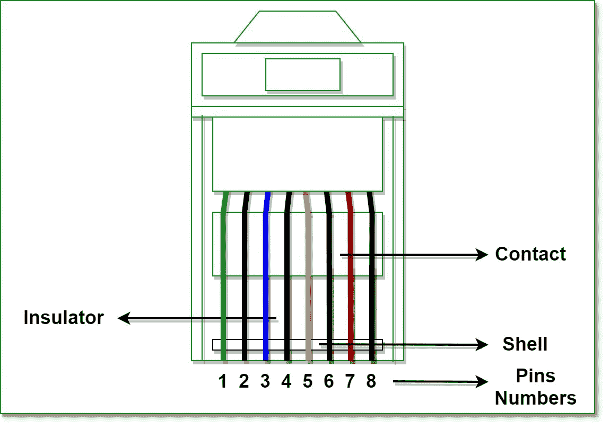

# RJ 完整版

> 原文:[https://www.geeksforgeeks.org/rj-full-form/](https://www.geeksforgeeks.org/rj-full-form/)

**RJ** 代表**注册杰克**。
是用于连接语音和数据设备的电信网络接口的标准格式。注册插孔的主要功能之一是将不同的数据设备和电信设备与电话交换机(如长短交换运营商)提供的服务连接起来。

**历史–**
注册接口是由贝尔系统公司发明的，该公司受 1976 年联邦通信委员会的监管，负责为客户和电话交换公司订购标准接口。模块化插孔的标准格式仅为综合业务数字网(ISDN)系统而设计。但是后来，模块化插孔由于其特点和能力在 1990 年的 IEEE 802.3i 中实现了国际标准化。

**RJ(注册杰克)–**

*   **RJ-11 :** 
    This is a 4-wire or 6-wire telephone-type connector (Registered Jack) that connects telephone lines with wall plates. Primarily, it is located in houses and offices where old telephone-wired systems are connected with the ISP’s (Internet Service Providers) line. 
*   **RJ-11w :** 
    Here ‘w’ stands for wall mount. This one is an extended version of RJ-11 and is used with wall mount functionalities by establishing a bridged connection for one telephone line. 
*   **RJ-14 :** 
    This one is similar to RJ-11, but created for two lines and four lines respectively. 
*   **RJ-21 :** 
    This registered jack was designed with 50 conductors to implement 25 lines at a time. These are used in network areas with multiple switches and devices. 
*   **RJ-25 :** 
    This registered jack’s compatibility is too high and is often used for three telephones lines. 
*   **RJ-45 :** 
    This one is the best suited registered jack that has the ability to make the connection for both unshielded twisted-pair (UTP) and shielded twisted-pair (STP) cabling in star-topology of ethernet networks. It is one of the main registered jacks with an 8-wire telephone-type connector used with twisted-pair cabling for connecting computers and its lines, wall plates, patch panels, and other types of networking components. 
*   **RJ-48 :** 
    This jack is one of the best-registered jacks that use the same jack as RJ-45 but uses different types of pinning, where one pair of wires is used for transmitting signals, one pair for receiving signals, one pair for draining signals, and one pair is left unused. It comes in three different types such as RJ-48C for surface mount, RJ-48X for complex jack, and RJ-48S for a wall mount. Primarily it is used in LANs (Local Area Networks). 
*   **RJ-61 :**
    这个也类似于 RJ-11，但用于双绞线电缆的端接，并使用八针模块化连接器。

**特征–**

*   通过使用配置接口安装表面，能够处理表面。
*   它们包含许多潜在的触点位置和安装在这些位置的实际触点数量。
*   具有模块化接口的特征，用于一、二和三线服务的电话连接。
*   可以对两个系统进行交叉连接。

**优势–**

*   注册插孔非常容易安装。
*   它们的可靠性水平很高。
*   接口模块化，连接速度更快。

**缺点–**

*   它们仅用于最短网络。
*   它们提供有限的移动性。
*   它们总是需要必要的线路和设备。

要知道 RJ45 和 RJ11 的区别，请参考。