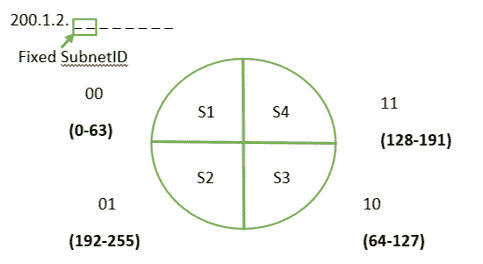
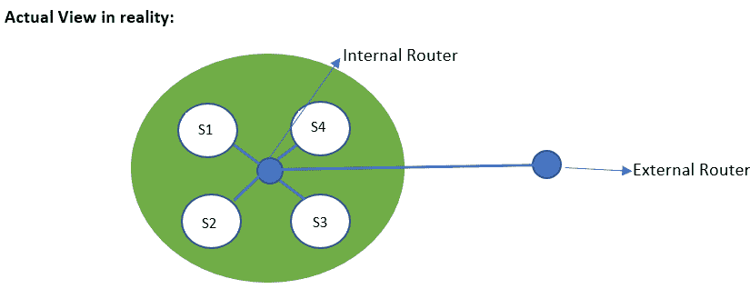
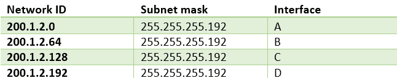

# 子网掩码的作用

> 原文:[https://www.geeksforgeeks.org/role-of-subnet-mask/](https://www.geeksforgeeks.org/role-of-subnet-mask/)

假设我们有一个 A 类网络，这意味着我们在一个网络中有 1600 万台主机。我们要做的任务是:

1.  如此庞大网络的维护
2.  网络安全–例如，我们公司有 4 个部门，所有 4 个部门都不需要访问整个网络。

为此，我们需要[划分子网](https://www.geeksforgeeks.org/introduction-to-subnetting/)，即将一个巨大的网络划分为更小的网络。现在每个部门都会有自己的网络。

在不划分子网的情况下进行寻址，到达地址的过程由 3 个步骤完成–

1.  网络标识
2.  主机的标识
3.  流程的标识

在使用子网划分寻址的情况下，到达地址的过程分为 4 个步骤–

1.  网络标识
2.  子网的标识
3.  主机的标识
4.  流程的标识

假设我们有一个 C 类网络，我们想把它分成 4 个子网。要进行分割，我们需要从主机部分选择 2 位。



由于第一个和最后一个 IP 地址是为每个子网中的**网络 ID** 和**定向广播地址**预留的，因此在这种情况下我们必须预留 8 个 IP 地址。



收到目的地址为-200.1.2.20 的数据包。然后路由器将如何识别它属于哪个子网。这将使用*子网掩码*来完成。

**子网掩码**是一个 32 位的数字，用于标识一个 IP 地址的子网。子网掩码是 1 和 0 的组合。1 代表网络和子网标识，而 0 代表主机标识。在这种情况下，子网掩码是，

```
11111111.11111111.11111111.11000000 
or
255.255.255.192 
```

所以为了得到目的地址所属的网络，我们必须给**按位&** 加上子网掩码。

```
    11111111.11111111.11111111.11000000
&&  11001000.00000001.00000010.00010100
-----------------------------------------------------
    11001000.00000001.00000010.00000000 
```

地址属于，

```
11001000.00000001.00000010.00000000 
or
200.1.2.0 
```

内部路由器将通过接口将数据包转发到网络。该接口将由路由器中的路由表来识别。

**[路由表](https://www.geeksforgeeks.org/routing-tables-in-computer-network/) :**
如果网络 id 与任何一个都不匹配，那么数据包将被发送到**默认条目。**默认条目的网络 id 为 0.0.0.0。



在某些情况下，网络 id 可能与路由表中的两个条目相匹配，因此这里选择子网掩码最长的接口**(1 个以上)**。