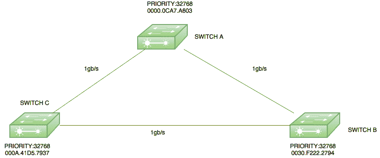
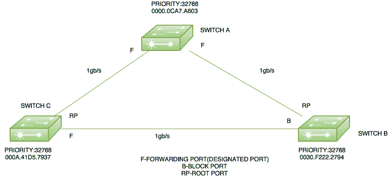

# 生成树协议中的根桥选举

> 原文:[https://www . geeksforgeeks . org/根桥-生成树中的选举-协议/](https://www.geeksforgeeks.org/root-bridge-election-in-spanning-tree-protocol/)

冗余链路用于在一条链路断开时提供备用路径，但冗余链路有时会导致交换环路。生成树协议(STP)的主要目的是确保当网络中有冗余路径时不会产生环路。

**生成树协议(STP)–**
由于 IEEE STP 用于通过监控网络来跟踪所有链路并关闭冗余链路来建立无环路网络。以下是与生成树协议相关的一些重要术语:

*   **网桥优先级数据单元(BPDU)–**它包含网桥标识、发送方网桥标识、根网桥的成本、根网桥上的定时器值。所有交换机交换 BPDU 以选择根桥。具有最低桥的交换机我会成为根桥。
*   **网桥 I d–**它是一个 8 字节字段，由网桥优先级(2 字节)和设备的基本 Mac 地址(6 字节)组合而成。如果网桥优先级相同，则考虑基本媒体访问控制地址。
*   **网桥优先级–**这是一个优先级，默认情况下分配给每台交换机 32768。
*   **根桥–**根桥是我想要的桥中最低的桥。像哪些端口是根端口(具有到根桥的最佳路径的端口)这样的所有决定都是从根桥的角度做出的。
*   **路径开销–**一台交换机在通往根桥的路径中可能会遇到一台或多台交换机。分析所有路径，选择成本最低的路径。

<figure class="table">

| 速度 | 链接成本 |
| --- | --- |
| 10 Mbps | One hundred |
| 100mbps | Nineteen |
| 1 Gbps | four |
| 10 Gbps | Two |

</figure>

**指定端口–**发送最佳 BPDU 的端口，即根桥上的端口，将处于转发状态。
**根端口–**在非根桥上接收最佳 BPDU 的端口。选择根端口的标准:

1.  到达根桥的最低路径成本
2.  最低发送者桥
3.  最低发送端口

(端口优先级+端口号)—默认情况下，端口优先级为 128，端口号为交换机接口号。

**选举程序–**
网络中的所有交换机都声明自己是根桥，并开始交换自己的 BPDU。桥最低的 BPDU 我会认为是优秀的。现在，接收上级 BPDU 的交换机对自己的 BPDU 进行更改，并将其转发给邻居。它用其优越的 BPDU 桥改变了根桥的价值。这个过程一直持续到所有的交换机都满意哪个桥有最低的 I 桥，因此那个交换机将被声明为根桥。

现在根据标准，将选择根端口，然后左侧端口将处于阻塞模式。

**示例–**

这里有一个小拓扑，有三个交换机交换机 A (mac 地址-0000.0ACA7.A603)，交换机 B(0030。F222.2794)和交换机 C(000A.41D5.7937)，它们都具有默认优先级(32768)。

**根桥选举–**
由于所有交换机都有默认优先级，因此在优先级的基础上有一个平局。现在，Mac 地址最低的交换机将成为根桥。在这里，交换机 A 将成为根桥，因为它的 Mac 地址最低。因此，交换机 A 的端口将处于转发状态，即指定端口。

**根端口选举–**
根端口在非根桥上选择，即交换机 B 和交换机 C。现在，例如，如果交换机 C 选择通过交换机 B 的路径，那么成本将是(4+4=8)，但是如果它选择直接连接到交换机 A 的路径，那么成本将是 4，因此，交换机 B 和交换机 C 都将选择连接到交换机 A 的端口作为它们的根端口。

现在，唯一剩下的事情就是分别找到哪个端口将处于转发模式和阻塞模式。现在，由于交换机 B 和交换机 C 之间的链路成本与根桥相同，因此，具有最低网桥的交换机将处于转发模式，因此交换机 C 端口将处于转发模式，交换机 B 端口将处于阻塞模式。