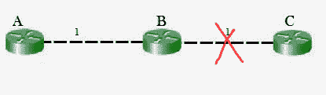
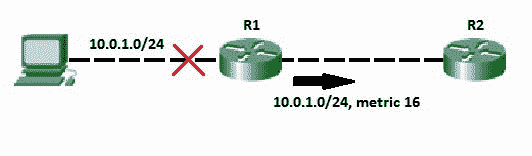
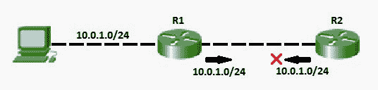

# 路由中毒和路由

中计数到无穷大问题

> 原文:[https://www . geesforgeks . org/route-中毒并计数到无穷大-路由中的问题/](https://www.geeksforgeeks.org/route-poisoning-and-count-to-infinity-problem-in-routing/)

由于[贝尔曼-福特算法](https://www.geeksforgeeks.org/dynamic-programming-set-23-bellman-ford-algorithm/)无法防止环路，因此 **D** 距离矢量 **R** 路由协议的主要问题是路由环路。DVR 网络中的路由环路会导致计数无穷大问题。当一个接口关闭或两台路由器同时发送更新时，通常会出现路由环路。

**计数到无穷大问题:**

因此，在这个例子中，贝尔曼-福特算法将为每台路由器收敛，它们将为彼此创建条目。B 会知道它可以以 1 的代价到达 C，A 会知道它可以通过 B 以 2 的代价到达 C。

如果 B 和 C 之间的链接断开，那么 B 将知道它不能再通过该链接到达 C，并将从它的表中删除它。在它可以发送任何更新之前，它有可能会收到一个来自 A 的更新，它会广告说它可以以 2 的成本到达 C。b 可以以 1 的代价到达 A，所以它会以 3 的代价更新一条经由 A 到 C 的路线。a 随后会收到 B 的更新，并将其成本更新为 4。然后，他们会继续向无穷远处互相传递不良信息，这被称为**计数到无穷远处问题**。

### 计数到无穷大问题的解决方案:-

**路线中毒:**
当一条路线失败时，距离矢量协议通过毒化路线来传播关于路线失败的*坏消息*。路线中毒指的是广告路线的做法，但带有一个称为 Infinity 的特殊度量值。路由器认为用无限度量通告的路由已经失败。每种距离矢量路由协议都使用表示无穷大的实际度量值的概念。RIP 将无穷大定义为 16。有害反向的主要缺点是，在某些相当常见的网络拓扑中，它会显著增加路由通告的大小。

**水平分割:**
如果 B 和 C 之间的链路中断，并且 B 收到了来自 A 的路由，B 最终可能会通过 A 使用该路由。A 会将数据包直接发送回 B，从而形成一个环路。但是根据水平分割规则，节点 A 不会通告其 C 的路由(即 A 到 B 到 C)返回 B。从表面上看，这似乎是多余的，因为 B 永远不会通过节点 A 路由，因为该路由的成本高于从 B 到 C 的直接路由。

考虑以下显示水平分割的网络拓扑

*   除了这些之外，我们还可以使用带路由中毒的水平分割，将上述两种技术结合使用，以实现更低的效率和增加路由公告的大小。
*   路由信息协议(RIP)使用带毒反向技术的水平分割来减少路由环路。此外，**抑制定时器**可用于避免环路的形成。当路由器被告知连接的链路断开时，抑制计时器立即启动。在此之前，路由器会忽略所有下行路由的更新，除非它从路由器收到该下行链路的更新。在定时器期间，如果下行链路再次可达，则可以更新路由表。

**参考文献:**
[https://en . Wikipedia . org/wiki/Distance-vector _ routing _ protocol # Count-to-infinity _ problem](https://en.wikipedia.org/wiki/Distance-vector_routing_protocol#Count-to-infinity_problem)
[https://en.wikipedia.org/wiki/Route_poisoning](https://en.wikipedia.org/wiki/Route_poisoning)
[https://en . Wikipedia . org/wiki/Split _ horizon _ route _ advertision](https://en.wikipedia.org/wiki/Split_horizon_route_advertisement)

本文由**阿卡什·莎兰**供稿。如果你喜欢 GeeksforGeeks 并想投稿，你也可以使用[write.geeksforgeeks.org](https://write.geeksforgeeks.org)写一篇文章或者把你的文章邮寄到 review-team@geeksforgeeks.org。看到你的文章出现在极客博客主页上，帮助其他极客。

如果你发现任何不正确的地方，或者你想分享更多关于上面讨论的话题的信息，请写评论。