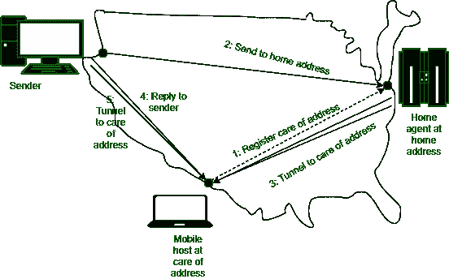

# 移动主机路由

> 原文:[https://www.geeksforgeeks.org/routing-for-mobile-hosts/](https://www.geeksforgeeks.org/routing-for-mobile-hosts/)

数百万人在旅途中使用电脑，从在移动的汽车中使用无线设备的真正移动环境，到在一系列不同地点使用笔记本电脑的游牧环境。我们使用术语“移动主机”来表示任一类别，以区别于从不移动的固定主机。移动主机引入了一种新的复杂性，将数据包路由到移动主机，网络首先必须找到它。

**假设模型:**

我们将考虑的世界模型是假设所有主机都有一个永远不变的永久主位置。每台主机都有一个永久的家庭地址，可用于确定家庭位置。像电话号码 1-212-5551212 指示美国(国家代码 1)和曼哈顿(212)。

**特征:**

*   互联网和蜂窝网络上用于移动路由的基本思想是，移动主机告诉位于本地的主机。
*   该主机代表移动主机，称为归属代理。
*   一旦它知道移动主机当前所在的位置，它就可以转发数据包，以便传递它们。该图显示了正在运行的移动路由。
*   本地地址称为转交地址。
*   一旦它有了这个地址，它就可以告诉它的本地代理它现在在哪里。它通过向本地代理发送注册消息并注意地址来实现这一点。

**图表说明:**

该消息在图中用虚线表示，表示它是控制消息，而不是数据消息。发送方使用其永久地址向移动主机发送数据包。这个数据包由网络路由到主机的归属位置，因为归属地址属于那里。它用新的报头封装数据包，并将这个包发送到转交地址。这种机制被称为隧道。它在互联网上非常重要，所以我们以后会更详细地了解它。

**图示:**

*   当封装的数据包到达转交地址时，移动主机会将其打开，并从发送方检索数据包。
*   总的路线被称为三角形路线，因为它的方式是迂回的，如果远程位置远离家庭位置。
*   作为步骤的一部分，4 个发送者学习当前的转交地址。
*   随后的数据包可以直接路由到移动主机，方法是绕过归属位置将它们隧穿到转交地址(步骤 5)。
*   如果随着移动设备的移动，由于任何原因导致连接丢失，家庭地址始终可以用来联系移动设备。