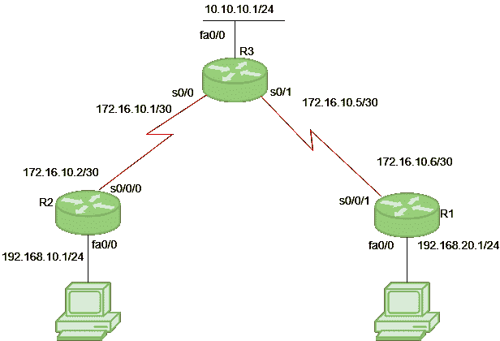

# 路由信息协议

> 原文:[https://www . geesforgeks . org/routing-information-protocol-rip/](https://www.geeksforgeeks.org/routing-information-protocol-rip/)

**路由信息协议** (RIP)是一种动态路由协议，它使用跳数作为路由度量来寻找源网络和目的网络之间的最佳路径。它是一种距离矢量路由协议，AD 值为 120，适用于 OSI 模型的网络层。RIP 使用端口号 520。

#### **跳数**

跳数是源网络和目的网络之间的路由器数量。跳数最低的路径被认为是到达网络的最佳路由，因此被放在路由表中。RIP 通过限制从源到目的地的路径中允许的跳数来防止路由环路。RIP 允许的最大跳数为 15，跳数为 16 被视为网络不可达。

### **RIP 的特性**

1.网络的更新定期交换。
2。更新(路由信息)总是被广播。
3。完整的路由表将在更新中发送。
4。路由器总是信任从邻居路由器收到的路由信息。这也被称为上的*路由谣言。*

### **RIP 版本:**

路由信息协议有三个版本–**RIP 版本 1** 、 **RIP 版本 2** 和 **RIPng** 。

<figure class="table">

| RIP v1 | RIP v2 | RIPng(消歧义) |
| --- | --- | --- |
| 以广播形式发送更新 | 以多播方式发送更新 | 以多播方式发送更新 |
| 255.255.255.255 广播 | 224.0.0.9 的多播 | FF02::9 的组播(RIPng 只能在 IPv6 网络上运行)
 |
| 不支持更新邮件的身份验证 | 支持 RIPv2 更新消息的身份验证 | – |
| 有类路由协议 | 无类协议更新支持有类 | 发送无类更新 |

</figure>

**RIP v1** 被称为*有类*路由协议，因为它在路由更新中不发送子网掩码信息。
**RIP v2** 被称为*无类*路由协议，因为它在路由更新中发送子网掩码信息。

> >>使用调试命令获取详细信息:
> 
> ```
>  # debug ip rip 
> ```
> 
> >>使用此命令显示路由器中配置的所有路由，例如路由器 R1:
> 
> ```
> R1# show ip route
> ```
> 
> >>使用此命令显示路由器中配置的所有协议，例如路由器 R1:
> 
> ```
> R1# show ip protocols
> ```

### **配置:**



考虑上面给出的具有 3 个路由器 R1、R2 和 R3 的拓扑。R1 的 IP 地址为 s0/0/1 上的 172.16.10.6/30，fa0/0 上的 192.168.20.1/24。R2 的 IP 地址为 s0/0/0 上的 172.16.10.2/30，fa0/0 上的 192.168.10.1/24。R3 的 IP 地址在 s0/1 上为 172.16.10.5/30，在 s0/0 上为 172.16.10.1/30，在 fa0/0 上为 10.10.10.1/24。

**为 R1 配置 RIP:**

```
R1(config)# router rip
R1(config-router)# network 192.168.20.0
R1(config-router)# network 172.16.10.4
R1(config-router)# version 2
R1(config-router)# no auto-summary
```

**注意:**无自动汇总命令禁用自动汇总。如果我们不选择任何自动总结，那么子网掩码在版本 1 中将被视为有类。

**为 R2 配置 RIP:**

```
R2(config)# router rip
R2(config-router)# network 192.168.10.0
R2(config-router)# network 172.16.10.0
R2(config-router)# version 2
R2(config-router)# no auto-summary
```

**同样，为 R3 配置 RIP:**

```
R3(config)# router rip
R3(config-router)# network 10.10.10.0
R3(config-router)# network 172.16.10.4
R3(config-router)# network 172.16.10.0
R3(config-router)# version 2
R3(config-router)# no auto-summary
```

### **RIP 定时器:**

*   **更新定时器:**运行 RIP 的路由器交换路由信息的默认时间为 30 秒。使用更新计时器，路由器定期交换路由表。
*   **无效定时器:**如果直到 180 秒都没有更新，那么目的路由器认为它无效。在这种情况下，该路由器的目的路由器标记跳数为 16。
*   **按住定时器:**这是路由器等待邻居路由器响应的时间。如果路由器无法在给定时间内做出响应，那么它将被宣布为死亡。默认为 180 秒。
*   **刷新时间:**如果在刷新时间内没有响应，则该路由的入口将被刷新。默认为 60 秒。该计时器在路线被宣布无效后 60 秒后启动，即时间为 180 + 60 = 240 秒。

请注意，所有这些时间都是可调的。使用此命令更改计时器:

```
R1(config-router)#  timers basic
R1(config-router)#  timers basic 20   80    80    90  
```