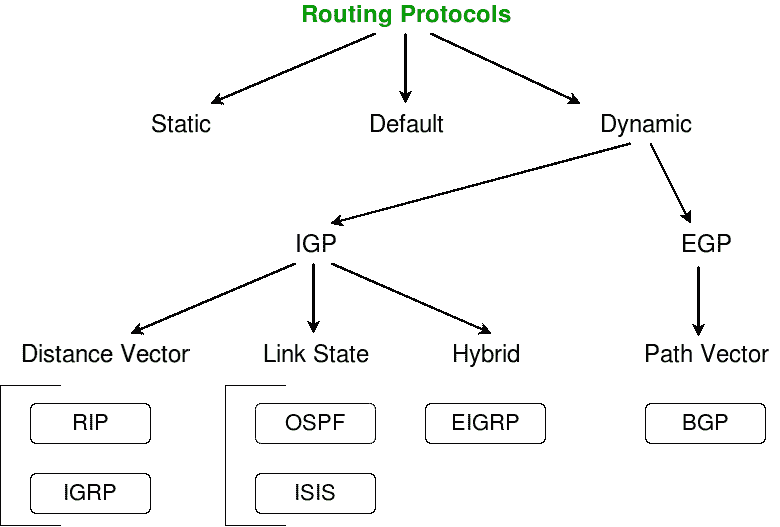

# 在计算机网络中路由 v/s 路由协议

> 原文:[https://www . geesforgeks . org/routing-v-s-routed-protocol-in-computer-network/](https://www.geeksforgeeks.org/routing-v-s-routed-protocols-in-computer-network/)

现场视察模型的网络层负责提供逻辑寻址，路由器使用逻辑寻址来选择路由数据包的最佳路径。该层使用两种类型的数据包:

1.  **数据包–**
    用户数据通过这些数据包在网间传输。**路由协议**是支持此类数据流量的协议。路由协议的例子有 IPv4、IPv6 和 AppleTalk。
2.  **路由更新数据包–**
    连接到所有路由器的网络信息通过路由更新数据包更新到相邻路由器。**路由协议**负责发送它们。路由协议的例子有 RIP(路由信息协议)、EIGRP(增强型内部网关路由协议)和 OSPF(开放最短路径优先)。

现在，让我们用现实生活中的例子来更好地理解路由协议和路由协议之间的区别。

假设你想在学期考试后回家。你可以预定一辆出租车或乘公共汽车回家。在你的旅途中，你会遇到几个标志板，帮助你选择正确或最佳的路线，或者在出租车的情况下，谷歌地图将帮助你选择最佳路线。

在这个类比中，把你自己看作是数据，把公共汽车或出租车看作是路由协议，把安装在司机手机里的标志牌或全球定位系统看作是路由协议。
同样，在网络中，路由器使用路由协议来确定数据包在网络间更高效传输的最佳路径。路由协议被分配给一个接口，并决定传送数据包的方法。

现在，让我们继续讨论不同类型的路由协议。

**缩写–**
**IGP**–内部网关协议
**EGP**–外部网关协议
**RIP**–路由信息协议
**IGRP**–内部网关路由协议
**OSPF**–开放最短路径优先
**ISIS**–中间系统到中间系统
**EIGRP**–增强型内部网关路由协议

**参考资料─**
[【Todd lamle 电子书籍】](http://www.innos.in/downloads/CISCO%20-%20640-802-ccna.pdf)
【维基百科】

本文由 **[阿契夫·肖汉](https://www.linkedin.com/in/achiv-chauhan-b67863109/)** 供稿。如果你喜欢 GeeksforGeeks 并想投稿，你也可以使用[contribute.geeksforgeeks.org](http://www.contribute.geeksforgeeks.org)写一篇文章或者把你的文章邮寄到 contribute@geeksforgeeks.org。看到你的文章出现在极客博客主页上，帮助其他极客。

如果你发现任何不正确的地方，或者你想分享更多关于上面讨论的话题的信息，请写评论。