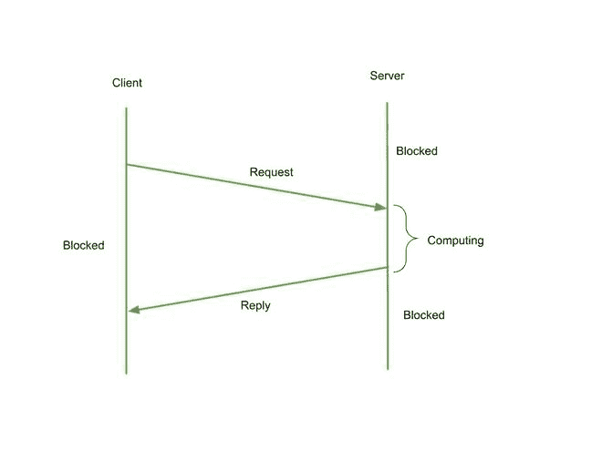

# RPC 消息协议

> 原文:[https://www.geeksforgeeks.org/rpc-message-protocol/](https://www.geeksforgeeks.org/rpc-message-protocol/)

分布式信息系统被定义为“由网络链接的多个相互依赖的计算机，用于在它们之间共享信息”。分布式信息系统由通过计算机网络进行信息通信或交换的多台自主计算机组成。分布式系统中的实体有三种通信方式:

*   进程间通信:它是一种低级的通信范式。例如:像邮箱一样的分布式共享内存
*   远程调用:它是一个高级和直接的通信范例。例如:RPC、RMI 等
*   间接传播:是一种高层次的间接传播范式。例如:群组通信、发布/订阅模式等

RPC 代表远程过程调用。在 RPC 中，计算机程序使一个过程在不同的地址空间中运行，并且它被编程为好像它是一个正常的过程调用。无论子程序是在当前程序的本地还是远程，程序员编写的代码基本上是相同的。请求-响应消息传递机制通常用于完成这种类型的客户机-服务器交互。最好将其视为分布式系统的通用结构。RPC 之所以流行，是因为它建立在本地过程调用的语义上:应用软件对过程进行调用，而不管它是本地的还是远程的，并等待它返回。在面向对象编程范式中，RPC 通过远程方法调用来表示。

作为网络操作范例的远程过程调用的理论建议来自于 20 世纪 70 年代，而实际实现则来自于 20 世纪 80 年代初。1981 年，布鲁斯·杰伊·纳尔逊被认为创造了“远程过程调用”这个术语。它广泛应用于:

*   Protobufs(谷歌)
*   脸书的节俭
*   推特上的大结局

RPC 旨在使网络通信看起来像是一个函数调用。如果应用程序开发人员完全不知道操作是本地的还是远程的，那么他的工作可以大大简化。当被调用的过程是面向对象语言中对象的方法时，RPC 被称为远程方法调用。虽然 RPC 概念很简单，但它有一些缺陷，如下所示:

*   调用进程和被调用进程之间的网络倾向于限制消息大小，并且倾向于丢失和重新排序消息。
*   调用和被调用的进程可能在具有截然不同的体系结构和数据表示类型的机器上运行。

### **RPC 机制由两个关键组件组成:**

*   一种控制客户端和服务器进程之间传递的消息并处理底层网络可能的不利特征的协议。
*   参数被打包成客户端计算机上的请求消息，然后在服务器上被转换回参数，返回值被转换回参数。存根编译器是 RPC 系统这一部分的名称。
*   客户端-服务器请求丢失
*   服务器-客户端回复丢失
*   收到请求后服务器崩溃
*   客户端在传递请求后崩溃

基本算法很容易理解。客户端发送一个请求消息，该消息被服务器确认。然后，服务器在完成操作后发送回复消息，客户端对此进行确认。

RPC 时间线

**RPC 机制遵循以下步骤:**

*   每个 RPC 都发生在一个线程中。线程是单个控制流，在任何时候都只有一个执行点。应用程序线程是由应用程序代码生成和维护的线程。
*   RPC 和 RPC 运行时调用都是由 RPC 应用程序使用应用程序线程发出的。一个或多个客户端应用程序线程组成了一个 RPC 客户端，每个线程可以执行一个或多个 RPC。
*   此外，RPC 服务器使用由 RPC 运行时框架提供的一个或多个调用线程来执行被调用的远程操作。服务器应用程序线程设置它开始侦听时将执行的最大并发调用数。
*   单线程程序中只有一个调用线程。在多线程应用程序中，调用线程的最大数量由应用程序的体系结构和 RPC 实现策略决定。调用线程是由 RPC 运行时机制在服务器执行上下文中创建的。
*   RPC 可以在客户端和服务器环境中使用。因此，当客户端应用程序线程联系远程过程时，它会成为 RPC 线程的一部分，而 RPC 线程是执行的逻辑线程。
*   RPC 线程是一种概念结构，它在实际执行线程和网络上扩展，包括 RPC 的不同阶段。
*   调用客户端应用程序线程在进行 RPC 后加入 RPC 线程。在调用返回之前，RPC 线程通常会保留执行控制。
*   成功的 RPC 的 RPC 线程会通过 RPC 线程执行阶段中描述的执行阶段。
*   执行阶段包括以下项目:
    *   当客户端应用程序线程对其存根进行 RPC 时，RPC 线程在客户端进程中启动；客户端线程然后加入 RPC 线程。
    *   RPC 线程通过网络连接到服务器。
    *   RPC 线程成为调用线程，运行远程过程。
    *   当被调用的远程操作正在运行时，调用线程成为 RPC 线程的一部分。
    *   当调用完成时，调用线程不再是 RPC 线程的一部分。
    *   然后，RPC 线程通过网络返回到客户端。
    *   当 RPC 线程到达调用客户端应用程序线程时，它传递任何调用结果，客户端应用程序+线程退出 RPC 线程。

### **避开网络限制:**

为了应对网络不是理想管道的现实，RPC 协议经常执行额外的任务。有两个这样的功能:

*   及时传递信息。
*   碎片和重组用于支持巨大的消息大小。

在大多数情况下，RCP 协议在不可靠的基础之上构建自己可靠的消息传递层(例如，UDP/IP)。类似于 TCP，这种 RPC 协议很可能使用确认和超时来实现可靠性。

### **RPC 的好处:**

*   面向过程和面向线程的体系结构都受远程过程调用的支持。
*   远程过程调用可以在分布式和本地环境中使用。
*   用户不知道 RPC 的底层消息传输方法。
*   为了提高性能，RPC 跳过了几个协议层。
*   在远程过程调用中，重写和开发代码所需的工作很少。

### **RPC 的缺点:**

*   远程过程调用的概念可以通过多种方式实现。这不是一套规则。
*   RPC 不允许硬件架构的灵活性。它完全依赖于互动。
*   远程过程调用导致成本增加。