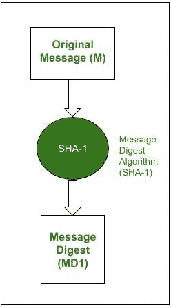
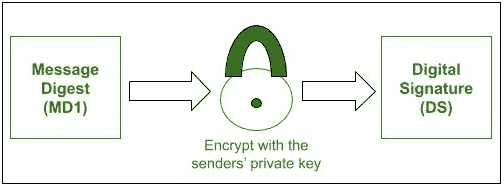
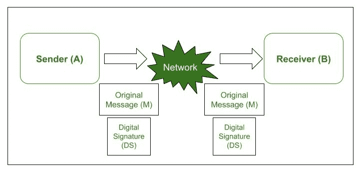
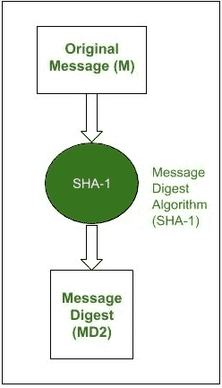
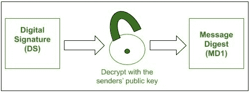
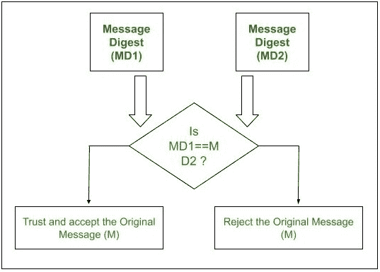

# RSA 和数字签名

> 原文:[https://www.geeksforgeeks.org/rsa-and-digital-signatures/](https://www.geeksforgeeks.org/rsa-and-digital-signatures/)

[数字签名:](https://www.geeksforgeeks.org/digital-signatures-certificates/)
正如名字听起来是数字签署文件的新选择。它确保消息由预期用户发送，不会被任何第三方(攻击者)篡改。简而言之，数字签名用于验证电子邮件的真实性。

[RSA :](https://www.geeksforgeeks.org/rsa-algorithm-cryptography/)
它是最流行的非对称密码算法。它主要用于加密消息，但也可用于对消息执行数字签名。

让我们逐步了解 RSA 如何用于执行数字签名。
假设有发送方(A)和接收方(B)。a 希望向 B 发送一条消息(M)以及对该消息计算的数字签名(DS)。

**步骤-1 :**
发送方 A 使用 SHA-1 消息摘要算法计算原始消息 m 上的消息摘要(MD1)

消息摘要计算

**步骤-2 :**
A 现在用其私钥加密消息摘要。这个过程的输出称为 A.
的数字签名(DS)

数字签名创建

**步骤-3 :**
现在，发送方 A 将数字签名(ds)与原始消息(M)一起发送给 b。

同时传输原始消息和数字签名

**步骤-4 :**
当 B 从 A 接收到原始消息(M)和数字签名(DS)时，它首先使用与 A 相同的消息摘要算法，并为 M 计算自己的消息摘要(MD2)

接收者计算自己的消息摘要

**步骤-5 :**
现在 B 用 A 的公钥解密数字签名，因为它是用 A 的私钥加密的。这个过程的结果是由 A.
计算的原始消息摘要(MD1)

接收方检索发送方的消息摘要

**Step-6 :**
如果 MD1==MD2，以下事实成立如下。

*   b 接受原始消息 M 作为来自 a 的正确的、未改变的消息
*   它还确保消息来自 A，而不是冒充 A 的人。

数字签名验证

消息摘要(MD1)使用 A 的私钥加密，以生成数字签名。因此，数字签名可以使用 A 的公钥解密(由于 RSA 的非对称形式)。如果接收者 B 能够使用 A 的公钥解密数字签名，这意味着消息是从 A 本身接收的，现在 A 不能否认他/她没有发送消息。

它还证明了原始消息没有被篡改，因为当接收者 B 试图找到自己的消息摘要 MD2 时，它与 A 的消息摘要 MD1 相匹配。

假设一个恶意用户试图访问原始消息并执行一些修改。现在，他/她将根据修改后的消息计算新的消息摘要。这可能会让你担心数据的完整性和保密性，但问题是。攻击者将不得不使用 A 的私钥对修改后的消息进行签名，以便为接收者 b 冒充 A。但是，攻击者不能使用 A 的私钥对消息进行签名，因为只有 A 知道它。因此，RSA 签名非常强大、安全和可靠。

**对 RSA 签名的攻击:**
攻击者可以尝试对 RSA 数字签名进行一些攻击。其中一些如下。

1.  **选择消息攻击–**
    在选择消息攻击中，攻击者创建了两个不同的消息，M1 和 M2，并设法说服真正的用户使用 RSA 数字签名方案对这两个消息进行签名。让我们考虑消息 M1 和消息 M2。因此，攻击者计算一条新消息 M = M1 x M2，然后声称真正的用户已经签署了消息 M
2.  **仅密钥攻击–**
    在这次攻击中，假设攻击者可以访问真实的用户公钥，并试图获得消息和数字签名。只有攻击者然后试图创建另一个消息 MM，这样相同的签名 S 在 MM 上看起来是有效的。然而，这不是一个容易发起的攻击，因为超过这个的数学复杂性相当高。
3.  **已知消息攻击–**
    在已知消息攻击中，攻击者试图利用 RSA 的一个特性，将具有两个不同签名的两个不同消息组合起来，从而使它们的签名也组合起来。举个例子，假设我们有两条不同的消息，M1 和 M2 分别有数字签名，如 S1 和 S2。然后如果 M = (M1 x M2) mod n，数学上 S = (S1 S2) mod n。因此，攻击者可以计算 M = (M1 x M2) mod n，然后 S = (S1 x S2) mod n 来伪造签名。