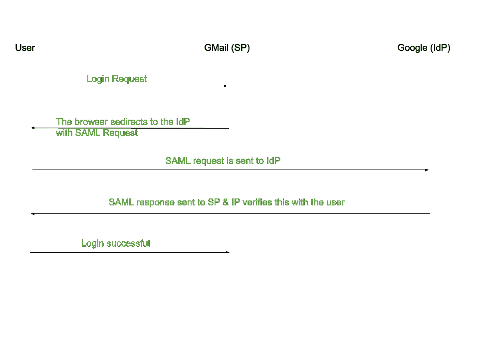

# SAML 认证

> 原文:[https://www.geeksforgeeks.org/saml-authentication/](https://www.geeksforgeeks.org/saml-authentication/)

SAML 是一个基于 XML 的框架，代表**安全断言标记语言**。让我们看看如何使用 SAML 来启用单点登录。单点登录(SSO)是一种登录方法，其中公司配置其所有网络应用程序，用户只需登录一次即可登录所有这些应用程序。

**示例–**当一个人登录 gmail.com 时，他们可以访问 YouTube、Google Drive 和其他 Google 服务，而无需单独登录每个服务。

SAML 身份验证流程基于两个实体–

1.  **服务提供商(SP)–**服务提供商接收来自 IdP 的认证，并向用户授予授权。
2.  **身份提供者(IDp)–**IDp 对用户进行身份验证，并将用户的凭据及其对服务的访问权限发送给服务提供商。

在上面给出的例子中，SP 将是 Gmail，IdP 将是谷歌。SAML 支持单点登录，如上所述，用户可以登录一次，相同的凭据将用于登录其他服务点。

**SAML 认证工作流程–**
[](https://media.geeksforgeeks.org/wp-content/uploads/20200803122354/SAML.png)

1.  用户试图登录 Gmail。
2.  Gmail 生成一个 SAML 请求。
3.  SAML 请求由浏览器发送到 Google，Google 解析这个请求，认证用户并创建 SAML 响应。这个 SAML 响应被编码并发送回浏览器。
4.  浏览器将这个 SAML 响应发送回 Gmail 进行验证。
5.  如果用户验证成功，他们将登录 Gmail。

**SAML 请求–**

SAML 请求中的一些重要术语定义如下–

1.  **标识–**特定 SAML 请求的标识符。
2.  **发行人–**服务提供商(SP)的名称。
3.  **名称标识–**用于识别用户的用户名/电子邮件地址或电话号码。
4.  **身份验证消费者服务 URL–**服务点的 SAML URL 接口，在此接口上，IP 发送身份验证令牌。

**SAML 响应–**

SAML 响应由两部分组成–

1.  **断言–**
    这是一个包含用户详细信息的 XML 文档。这包含用户登录事件的时间戳和使用的身份验证方法(例如 2 因素身份验证、Kerberos 等)。)
2.  **Signature–**
    这是一个 Base64 编码的字符串，用于保护断言的完整性。(如果攻击者试图将断言中的用户名更改为受害者的用户名，签名将阻止黑客以用户身份登录)。

**密钥生成–**

身份提供者(IdP)生成一个私钥和一个公钥。它用私钥对断言进行签名。公钥与服务提供商共享，服务提供商使用它来验证 SAML 响应，然后让用户登录。

**被黑客利用的 SAML 漏洞–**

1.  **签名未检查–**
    如果由于缺少签名检查过程，有人能够在 SAML 响应中更改姓名 id(用户名)并以其他人身份登录。
2.  **签名只有在存在时才被检查–**
    如果有人在浏览器收到响应之前更改了姓名 id 值并移除了签名，并且仍然可以作为受害者登录。
3.  **Comment Injection –**
    A user can be registered with an XML comment in the username as follows –

    ```
    email: prerit<!--notprerit-->@test.com
    ```

    在处理 SAML 响应时，SP 将忽略该评论，并以受害者身份登录我们。整个 SAML 响应可以通过使用像打嗝套件这样的代理来拦截。请注意，它必须首先通过网址格式解码，然后通过 Base64 格式解码才能被查看。

4.  **SAML 重播–**
    攻击者捕获 SAML 响应，并多次使用它作为受害者登录。