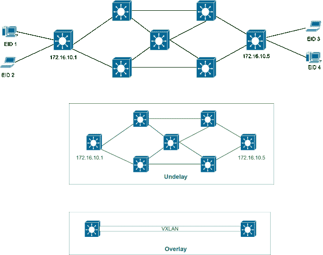
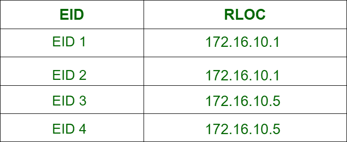

# SDA 底层和上层

> 原文:[https://www.geeksforgeeks.org/sda-underlay-and-overlay/](https://www.geeksforgeeks.org/sda-underlay-and-overlay/)

考虑到用于通信的设备的[网络](https://www.geeksforgeeks.org/network-and-communication/)，存在连接到端点设备的边缘联网设备。它们封装或解封装端点发送的数据。还有许多网络设备位于这些边缘设备之间，为边缘设备提供连接。

存在于边缘网络设备之间的设备底层网络称为**底层。** 它们包括交换机、路由器、电缆和无线链路来创建物理网络。

像 GRE 隧道一样，为数据包定义的路径(由使用的协议指定)可以被视为边缘设备之间的虚拟连接。该虚拟路径与边缘设备一起被统称为**叠加**。

实现 SDA 的网络也使用覆盖和底层的概念。SDA 网络中使用的分布层和接入层的所有交换机都是第 3 层交换机。使用第 3 层接入层交换机的网络称为路由接入层。SDA 网络中边缘网络设备之间存在的虚拟链路称为 VXLAN。

在 SDA 网络架构中，覆盖层和底层统称为 SDA 结构，边缘网络设备称为**结构边缘节点。**

**图-** SDA 底层和覆盖层

**位置标识符分离协议:**
在实现 SDA 的网络中，通过与传统 mac 和 ip 地址学习不同的概念来学习用于识别端点设备的位置和到达它们的路由。这些概念由位置标识符分离协议定义。每个端点设备都有一个名为**端点标识符(EID)的标识号。**

*   结构边缘节点使用传统的 mac 或 IP 地址方法来识别端点设备。然后给所有端点设备一个 EID。
*   一个名为 LISP 地图服务器的数据库包含 EID 列表。
*   LISP 地图服务器还包含通过结构边缘节点的 IP 地址到达每个 EID 的列表。结构边缘节点的 IP 地址称为路由位置(RLOC)。该列表包含 EID 和匹配的 RLOC。

Lisp map server