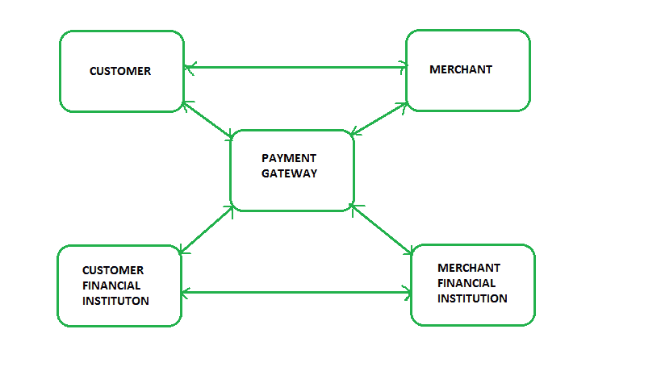
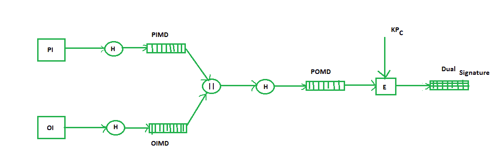
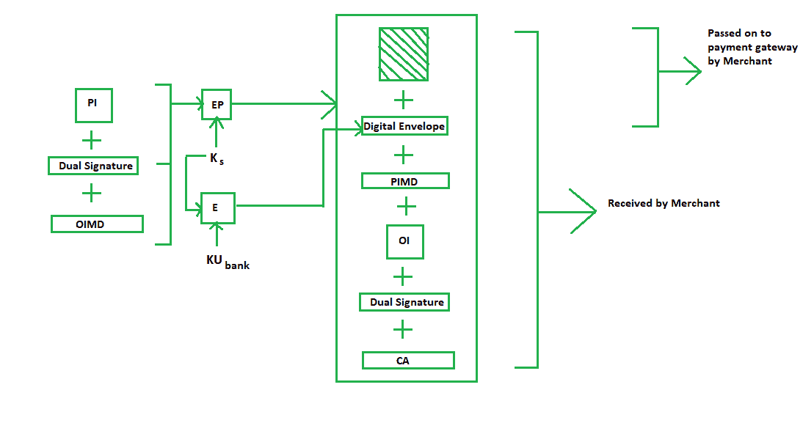
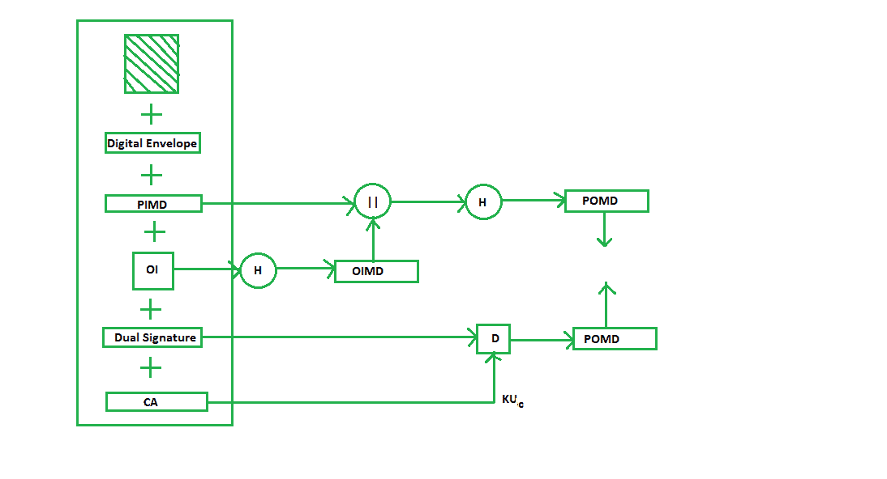

# 安全电子交易(SET)协议

> 原文:[https://www . geesforgeks . org/secure-electronic-transaction-set-protocol/](https://www.geeksforgeeks.org/secure-electronic-transaction-set-protocol/)

**安全电子交易**或 SET 是一个系统，确保在场景中使用信用卡进行的电子交易的安全性和完整性。SET 并不是一种支持支付的系统，而是一种应用于这些支付的安全协议。它使用不同的加密和散列技术来保护通过信用卡进行的互联网支付。SET 协议的开发得到了主要组织的支持，如 Visa、万事达卡、提供安全交易技术(STT)的微软和提供安全套接字层(SSL)技术的网景公司。

SET 协议限制向商家透露信用卡的详细信息，从而防止黑客和小偷进入。SET 协议包括使用标准数字证书(如 X.509 证书)的证书颁发机构。

在进一步讨论 SET 之前，我们先来看看电子交易的一般场景，包括客户端、支付网关、客户端金融机构、商户、商户金融机构。



**SET 中的要求:**
SET 协议有一些要求需要满足，其中一些重要的要求是:

*   它必须提供相互认证，即通过确认客户是否是预期用户来进行客户(或持卡人)认证，以及商家认证。
*   它必须通过适当的加密对付款信息和订单信息保密。
*   它必须能够抵抗消息修改，也就是说，不允许对正在传输的内容进行任何更改。
*   SET 还需要提供互操作性，并利用最好的安全机制。

**SET 中的参与者:**
在一般的网上交易场景中，SET 包括类似的参与者:

1.  **持卡人–**客户
2.  **发行人–**客户金融机构
3.  **商户**
4.  **收购方–**商户金融
5.  **证书颁发机构–**遵循特定标准并向所有其他参与者颁发证书(如 X.509V3)的机构。

#### 设置功能:

*   **提供认证**
    *   **商户认证**–为防止被盗，SET 允许客户检查商户与金融机构之前的关系。标准 X.509V3 证书用于此验证。
    *   **客户/持卡人认证**–SET 检查信用卡的使用是否由授权用户完成，或者是否使用 X.509V3 证书。
*   **提供消息保密性**:保密性是指防止非预期人员阅读正在传输的消息。SET 通过使用加密技术实现机密性。传统上，DES 用于加密目的。
*   **提供消息完整性** : SET 不允许借助签名修改消息。SHA-1 使用 RSA 数字签名保护邮件免受未经授权的修改，SHA-1 使用 HMAC 的数字签名保护邮件免受未经授权的修改，

**双签名:**
双签名是 SET 引入的一个概念，旨在连接两个不同接收者的两条信息:
**商户的订单信息(OI)**
**银行的支付信息(PI)**

你可能认为分开发送它们是一种简单且更安全的方式，但是以关联的形式发送它们可以解决任何未来可能的争议。这里是双签名的生成:



```
Where,

   PI stands for payment information
   OI stands for order information
   PIMD stands for Payment Information Message Digest
   OIMD stands for Order Information Message Digest
   POMD stands for Payment Order Message Digest
   H stands for Hashing
   E stands for public key encryption
   KPc is customer's private key
   || stands for append operation
   Dual signature, DS= E(KPc, [H(H(PI)||H(OI))])
```

采购申请生成:

生成采购申请的过程需要三个输入:

*   支付信息
*   双重签名
*   订单信息消息摘要

采购请求按如下方式生成:



```
Here,
PI, OIMD, OI all have the same meanings as before.
The new things are :
EP which is symmetric key encryption
Ks is a temporary symmetric key
KUbank is public key of bank
CA is Cardholder or customer Certificate
Digital Envelope = E(KUbank, Ks)
```

**商户端购买请求验证:**
商户通过比较 PIMD 哈希生成的 POMD 和双签名解密生成的 POMD 进行验证，如下所示:



由于我们在加密中使用了客户的私钥，因此我们使用 KUC，即客户或持卡人的公钥来解密“D”。

**支付授权和支付捕获:**
支付授权顾名思义就是商家对支付信息的授权，保证商家收到支付。支付捕获是商家接收支付的过程，包括再次向网关生成一些请求块，然后支付网关向商家发出支付。