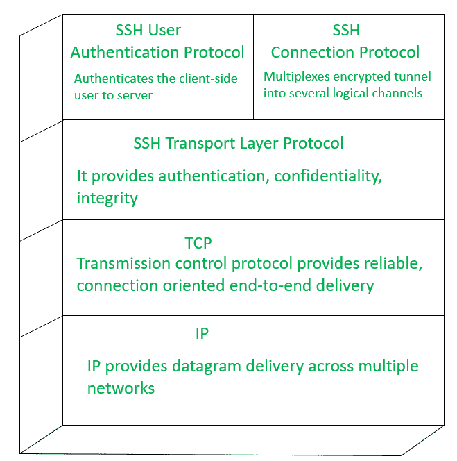

# 保护外壳和张力腿平台

> 原文:[https://www.geeksforgeeks.org/secure-shell-and-tls/](https://www.geeksforgeeks.org/secure-shell-and-tls/)

**安全外壳:**
安全外壳旨在非常简单且经济高效地实现安全网络通信。SSH 客户端和服务器应用程序广泛适用于大多数操作系统。

SSH 运行在 TCP 之上，有如下三个协议栈。

1.  **SSH 传输层协议–**
    主要用于提供服务器认证、数据完整性、保密性。可选地提供压缩。
2.  **SSH 用户认证协议–**
    该协议用于向服务器认证用户。
3.  **SSH 连接协议–**
    它通过单个 SSH 连接多路复用多个逻辑通信通道。

**主机密钥:**
身份验证发生在传输层，由于服务器使用不同的非对称加密技术，服务器有多个主机密钥，服务器必须交换其密钥才能识别主机。要实现这个过程，客户端主机还必须知道服务器主机密钥。

客户端有两种验证服务器主机身份的方法，如下所示。

1.  客户在自己的本地数据库中存储每个主机名和名称到密钥的关联，这种方法需要维护大量的数据。
2.  如果每台主机都由证书颁发机构认证，则客户端可以使用证书颁发机构来验证主机的身份。