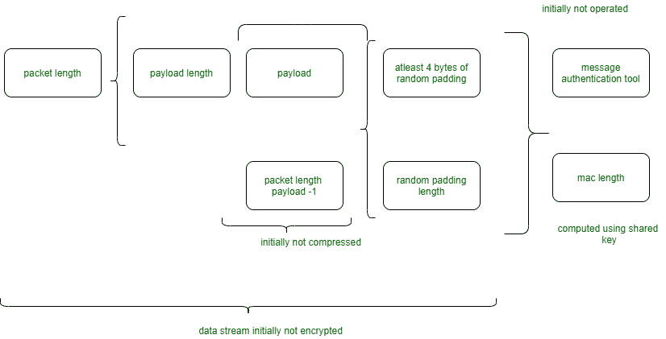

# 安全外壳架构

> 原文:[https://www.geeksforgeeks.org/secure-shell-architecture/](https://www.geeksforgeeks.org/secure-shell-architecture/)

在本文中，我们将讨论 SSH(安全外壳)协议的概述，然后将主要关注其体系结构部分，并解释其工作原理。我们一个一个来讨论。

**SSH(安全外壳协议):**

1.  它是一种科学学科网络协议，用于在不安全的网络上运行网络服务。
2.  它旨在取代不安全的协议，如 telnet 和不安全的文件传输方法(如 FTP)。
3.  它使用消费者服务器设计。
4.  它使用公钥加密/非对称密钥加密来演示远程服务器。即向远程服务器验证其身份。

**SSH 架构:**
SSH-2 协议具有内部设计(在 RFC 4251 中定义)，具有良好分离的层，即如下。

1.  **传输层(RFC 4253)–**
    它通常在 TCP/IP 的素数上运行。该层处理供应方和目的方之间的初始密钥交换。

2.  **用户认证层(RFC 4252)–**
    该层处理消费者认证，并提供一系列认证方式。一旦用户提示输入口号，而不是服务器，其消费者 SSH 消费者联合国机构就会做出回应。服务器只需响应客户端的身份验证请求。广泛使用的用户身份验证方式包括以下内容。

3.  **口令–**
    口令认证的透明方式，以及允许修改口令的设施。只有少数几个联合国机构实施这种方法。

4.  **公钥–**
    一种基于公钥的身份验证技术，有时支持最少的 DSA、ECDSA 或 RSA 密钥对，不同的实现共同支持 X.509 证书。

5.  **键盘交互(RFC 4256)–**
    在此期间，服务器发送一个或多个额外的提示来输入数据，因此消费者会显示这些提示，并发回用户键入的响应。“习惯”提供一次性口令身份验证，如“安全密钥”或“安全身份”。

6.  **GSSAPI 身份验证–**
    这将执行 SSH 身份验证，而不会亏待外部机制，如 Kerberos 五或 NTLM，从而为 SSH 会话提供单点登录功能。这些方法有时会被组织中使用的工业 SSH 实现强制执行。

7.  **关联层(RFC 4254)–**
    在这种想法的通道期间，通道请求和国际请求虐待 SSH 服务被提供。一个 SSH 协会会同时主持几个频道，知识会双向传递。信道请求习惯于传递带外信道特定的知识，如终端窗口的修改大小或服务器端方法的退出代码。

8.  **ssh FP DNS 记录(RFC 4255)–**
    它提供了公共主机密钥指纹，有助于验证主机的合法性。

**注意–**
尽管有标准的思想，SSH 并没有将远程登录与安全套接字层(SSL)提供的加密技术关联起来。