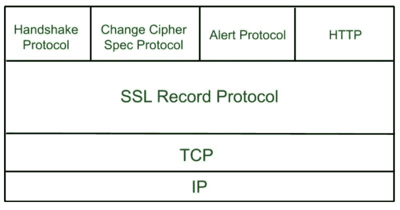
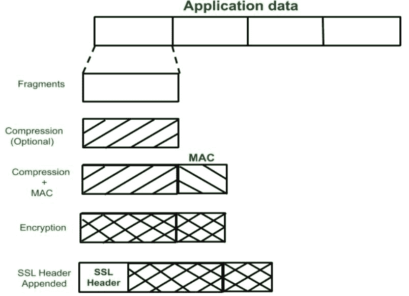
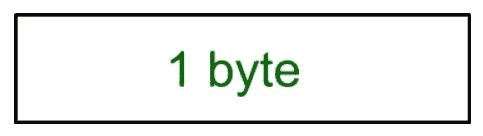
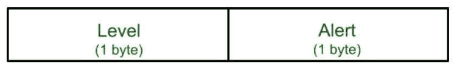

# 安全套接字层(SSL)

> 原文:[https://www.geeksforgeeks.org/secure-socket-layer-ssl/](https://www.geeksforgeeks.org/secure-socket-layer-ssl/)

[**【安全套接字层(SSL)**](https://practice.geeksforgeeks.org/problems/what-is-ssl) 为网络浏览器和服务器之间传输的数据提供安全性。SSL 加密网络服务器和浏览器之间的链接，确保它们之间传递的所有数据都是私有的，不会受到攻击。

**安全套接字层协议:**

*   SSL 记录协议
*   信号交换协议
*   变更密码规范协议
*   警报协议

**SSL 协议栈:**

**SSL 记录协议:**
SSL 记录为 SSL 连接提供两种服务。

*   机密
*   消息完整性

在 SSL 记录协议中，应用程序数据被分成多个片段。该片段被压缩，然后附加由 SHA(安全散列协议)和 MD5(消息摘要)等算法生成的加密 MAC(消息认证码)。之后，数据加密完成，最后一个 SSL 头被附加到数据上。

**握手协议:**
握手协议用于建立会话。该协议允许客户端和服务器通过向彼此发送一系列消息来相互认证。握手协议使用四个阶段来完成它的周期。

*   **阶段 1:** 在阶段 1 中，客户端和服务器都相互发送问候数据包。在这个 IP 会话中，为了安全起见，交换了密码套件和协议版本。
*   **阶段 2:** 服务器发送他的证书和服务器密钥交换。服务器通过发送服务器端数据包来结束第 2 阶段。
*   **阶段 3:** 在此阶段，客户端通过发送其证书和客户端交换密钥来回复服务器。
*   **第 4 阶段:**在第 4 阶段中，发生了密码变更，在此之后，握手协议结束。

**变更密码协议:**
该协议采用 SSL 记录协议。除非握手协议完成，否则 SSL 记录输出将处于挂起状态。握手协议后，挂起状态转换为当前状态。
变更密码协议由一条长度为 1 字节且只能有一个值的消息组成。该协议的目的是将挂起状态复制到当前状态。

**告警协议:**
该协议用于向对等实体传递与 SSL 相关的告警。该协议中的每个消息包含 2 个字节。

级别进一步分为两部分:

*   **警告:**
    此警报对发送方和接收方之间的连接没有影响。

*   **致命错误:**
    此警报断开发送方和接收方之间的连接。

**安全套接字层的静默特性:**

*   这种方法的优势在于，服务可以根据给定应用程序的特定需求进行定制。
*   安全套接字层是由网景公司首创的。
*   SSL 旨在利用 TCP 提供可靠的端到端安全服务。
*   这是一个两层协议。

参见【安全套接字层(SSL)和传输层安全性(TLS)】
之间的[区别](https://www.geeksforgeeks.org/difference-between-secure-socket-layer-ssl-and-transport-layer-security-tls/)