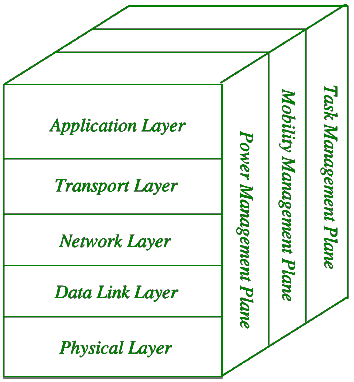
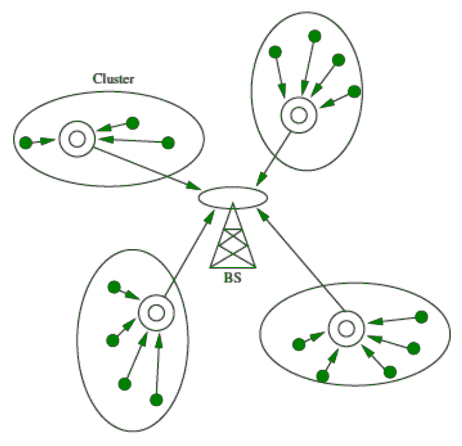
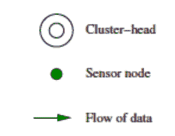

# 传感器网络架构

> 原文:[https://www.geeksforgeeks.org/sensor-network-architecture/](https://www.geeksforgeeks.org/sensor-network-architecture/)

**传感器网络架构**用于[无线传感器网络(WSN)](https://www.geeksforgeeks.org/wireless-sensor-network-wsn/) 。可用于学校、医院、建筑、道路等各种场所，用于灾难管理、安全管理、危机管理等各种应用。

WSN 使用的架构有 *2 种:*分层网络架构和集群架构。这些解释如下。

**1。分层网络架构:**
分层网络架构利用几百个传感器节点和一个强大的基站。网络节点被组织成同心层。
由 5 层和 3 个交叉层组成。
这 5 层是:

```
1. Application Layer
2. Transport Layer
3. Network Layer
4. Data Link Layer
5. Physical Layer 
```

交叉层包括以下内容:

*   电源管理平面
*   移动性管理平面
*   任务管理平面



使用*分层网络架构*的优势在于，每个节点仅参与到邻近节点的节点的短距离、低功率传输，因为与其他传感器网络架构相比，其功耗更低。它具有可扩展性和较高的容错性。

**2。群集网络体系结构:**
在群集网络体系结构中，传感器节点自动组成称为群集的组。它基于利用集群的 *Leach 协议*。Leach 协议代表低能量自适应分簇层次结构。

**Leach 协议的属性:**

*   它是一个两层的层次集群架构。
*   它是一种分布式算法，用于将传感器节点组织成称为集群的组。
*   每个自主形成的簇中的簇头节点创建时分多址(TDMA)调度。
*   它利用了名为*数据融合*的概念，这使得它节能。



这里:



由于数据融合的特性，分簇网络结构是一种非常有用的传感器网络。在每个集群中，每个节点都与集群头通信以收集信息。形成的所有集群将它们收集的信息共享给基站。每个簇内簇头的形成和选择是一个独立自主的分布式过程。