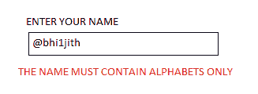

# 网络安全领域的服务器端过滤器

> 原文:[https://www . geesforgeks . org/服务器端-过滤网络安全-字段/](https://www.geeksforgeeks.org/server-side-filter-in-cyber-security-field/)

过滤器是对用户输入执行的验证检查，以确保用户输入的输入符合预期的输入。

例如，下图描述了用户输入时的过滤器检查。

从上图可以看出，输入应该是字母 ie- letters >=('a '或' A ')和字母< =(z 或' Z ')，其他任何按键输入都不会被网页接受。在这里，名称@abhi1jith 不会被网页接受，因为有一个与输入字段相关联的过滤器检查，即-名称的字母必须只包含字母，并且在这里，输入包含整数和字母数字字符，根据其背后编程的过滤器，这是不允许的。

### **网络应用过滤器的类型**

基本上有两种类型的网络应用过滤器:

*   **客户端过滤器:**这里输入的验证发生在[客户端](https://www.geeksforgeeks.org/what-is-client-side-filter-bypass/)本身，因为客户端的浏览器包含所需的过滤器。如果用户输入的数据满足过滤标准，则浏览器接受用户的数据，否则通过显示必要的错误消息来拒绝用户的数据。客户端过滤器更容易被入侵者或黑客篡改或绕过，因为客户端浏览器很容易被他们访问，因此它不能为数据提供更好的安全性，也不能防止数据被篡改。由于过滤器存在于客户端浏览器中，与服务器端过滤器相比，响应时间逐渐变短，因为输入数据和有效性检查必须从计算机用户的浏览器来回发送。客户端过滤器用 HTML、Java 等编写的代码。
*   **服务器端过滤器**:这些是服务器中存在的过滤器检查。服务器检查输入是否符合公认的标准。与客户端过滤器不同，用户输入的数据或信息被直接转发到服务器，而不被浏览器检查。如果用户的输入满足服务器中存在的过滤器，则数据被接受，否则通过显示基本错误消息来拒绝。服务器端过滤器很难被入侵者或黑客篡改或绕过，因为他们不容易访问服务器，因此它通过保护数据免受篡改来提供更好的安全性。由于过滤器存在于服务器中，与客户端过滤器相比，响应时间逐渐变长，因为输入数据和有效性检查必须从服务器来回发送给计算机用户。因此，这增加了服务器的额外开销。服务器端过滤器用 PHP、c++编写的代码。

**我们用一个例子来理解服务器端过滤器。**

*   假设我们以错误的格式输入了一些东西，假设我们在输入电子邮件时没有输入“@”。
*   我们输入的信息将被转发到服务器。
*   服务器中的服务器端过滤器将检查我们给出的输入是否符合正确的输入标准。
*   服务器端过滤器将检测到电子邮件输入中缺少“@”，这与正确的标准有偏差。
*   在发现错误时，服务器端过滤器不会接受我们的输入。
*   它会将错误和正确的消息一起转发回我们的网络浏览器。
*   将向用户显示错误消息“@在电子邮件中丢失”。

### **服务器端过滤器的特性:**

*   服务器端攻击很难执行，因为代码在我们手中不容易到达，而且我们不知道如何使用服务器端过滤器验证输入。因此，黑客或入侵者发现很难通过利用服务器端过滤器在服务器端执行全面攻击。
*   由于黑客无法直接访问服务器，服务器端的过滤器无法轻易绕过。因此，服务器端过滤器确保检测到可疑请求并立即阻止它们，从而阻止黑客入侵它们。
*   用户输入的数据不会被浏览器或客户端检查，而是直接转发到服务器进行验证，因此浏览器不会得到任何额外的开销，因为过滤器存在于服务器端而不是客户端。因此，检查用户的数据并验证它是否遵循正常的标准程序是服务器的责任。

### **服务器端过滤器的优势:**

与客户端过滤器相比，服务器端过滤器有更多的优势。服务器端过滤器的优势如下-

*   服务器执行数据的速度被认为是强大的机器。
*   此外，过滤后的数据是指大量数据中数量较少的有用数据，从而直接影响客户端和服务器之间的传输速度。
*   过滤后的数据量较少，因此流量较小
*   它确保了数据的适当安全性，因为它不容易被黑客捕获。
*   [服务器端过滤器](https://www.geeksforgeeks.org/difference-between-client-side-filter-and-server-side-filters-in-cyber-security/)在可用资源未知的情况下效果最佳，从而降低客户端浏览器过滤数据的负荷。