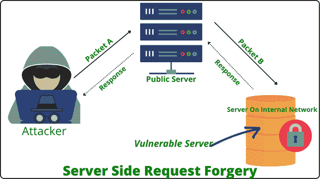

# 服务器端请求伪造(SSRF)深度

> 原文:[https://www . geesforgeks . org/服务器端-请求-伪造-ssrf-in-deep/](https://www.geeksforgeeks.org/server-side-request-forgery-ssrf-in-depth/)

**服务器端请求伪造(SSRF) :**
SSRF 代表服务器端请求伪造。SSRF 是一个服务器站点攻击，导致敏感信息从应用程序的后端服务器泄露。在服务器站点请求伪造中，攻击者向任何面向互联网的网络服务器发送恶意数据包，该网络服务器代表攻击者向运行在内部网络上的后端服务器发送数据包。该漏洞主要存在于那些能够提供从相应服务器获取数据的网址的应用程序中，也存在于来自不同主机的两个或多个服务器相互通信以共享信息的应用程序中。

**我们借助例子来探讨一下这个概念:**



在上面的图中，您可以观察到攻击者向公共可用的服务器发送精心制作的数据包 A，并且为了完全填充用户查询，公共服务器用数据包 B 向后端服务器发送请求，因为来自公共服务器的该请求后端服务器将信任来自内部网络的数据包 B，并接受该数据包并发送响应。这是可能的，因为攻击者代表其他服务器发出请求。

**SSRF 类型:**
**1。盲目的 SSRF:**
在盲目的 SSRF，攻击者无法控制发送到可信内部网络中的应用程序的数据包 B 的数据。在这里攻击者可以控制服务器的 IP 地址和端口。为了利用这种类型的 SSRF，我们必须提供后跟冒号和端口号的 URL，通过观察服务器的响应和错误消息，我们可以找到服务器的打开和关闭端口。我们已经对不同的端口尝试了这个过程来检查它们的状态。

**示例:**

```
http://example.com:1337
http://example.com:9923
http://example.com:43
http://example.com:22
```

**2。有限的响应/部分 SSRF :**
在这种类型的 SSRF 中，我们从服务器获得有限的响应，如页面标题或访问资源但看不到数据。我们只能控制到达内部应用程序的数据包 B 的某些部分。这种类型的漏洞可用于读取本地系统文件，如/etc/config、/etc/hosts、etc/passwd 和许多其他文件。通过使用 file://协议，我们可以读取系统上的文件。在某些情况下，XXE 注入、分布式拒绝服务这些类型的漏洞可能有助于利用部分 SSRF 漏洞。

**示例:**

```
file:///etc/hosts
file:///etc/config
file:///etc/passwd
```

**3。全响应 SSRF :**
在全 SSRF，我们完全控制了数据包 B(如图)。现在我们可以访问内部网络运行的服务，并发现内部网络中的漏洞。在这种类型的 SSRF 中，我们可以使用像 file://、dict://、http://、gopher://等协议。在这里，我们有很大的范围来创建不同的请求，并利用内部网络，如果有任何漏洞存在。全 SSRF 漏洞可能会通过缓冲区溢出导致应用程序崩溃，在请求中发送大字符串会导致缓冲区溢出。

**示例:**

```
http://192.168.1.8/BBBBBBBBBBBBBBBBBBBBBBBBBBBBBB
BBBBBBBBBBBBBBBBBBBBBBBBBBBBBBBBBBBBBBBBBBBBBBBBB
```

**测试 SSRF 漏洞期间的潜在障碍:**

*   白名单:服务器只允许在请求中使用少数域名，服务器有一个白名单，如果该名单中的域名与请求中的域名匹配，则只接受请求，否则服务器拒绝请求。
*   黑名单:-服务器从服务器黑名单中丢弃所有包含 IP 地址、域名、关键字的请求。
*   受限内容:-服务器只允许用户访问特定数量的文件，它只允许少数文件扩展名类型供公众访问。

**测试 SSRF 漏洞的关键点:**

1.  始终确保您是代表公共服务器而不是从浏览器向后端服务器发出请求。
2.  要从服务器获取数据，也请尝试 http://localhost/xyz/和 http://127.0.0.1/xyz。
3.  服务器可能有防火墙保护，如果可能，请始终尝试绕过防火墙。
4.  确保请求来自服务器，而不是本地主机。