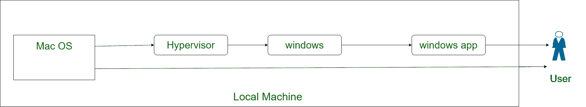
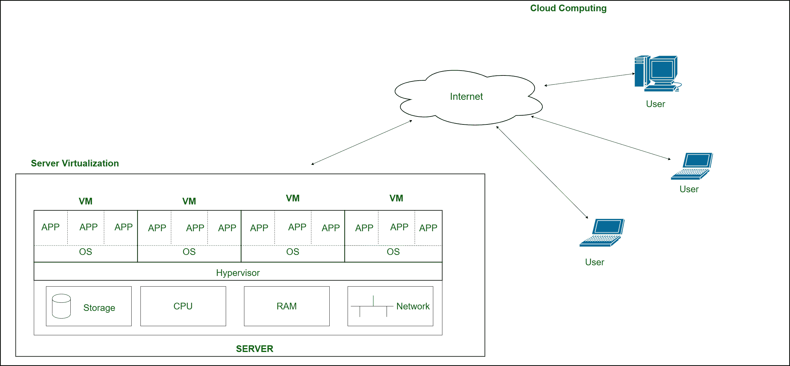

# 服务器虚拟化

> 原文:[https://www.geeksforgeeks.org/server-virtualization/](https://www.geeksforgeeks.org/server-virtualization/)

**服务器虚拟化**是[云计算](https://www.geeksforgeeks.org/cloud-computing/)最重要的部分。所以，说到云计算，它是由两个词组成的，云和计算。云意味着互联网，计算意味着借助计算机解决问题。计算与数字世界中的中央处理器&内存有关。

现在考虑一下这种情况，您正在您的机器上使用苹果操作系统，但是您项目的特定应用程序只能在窗口上运行。您可以购买运行 windows 的新机器，也可以创建可以安装和使用 windows 的虚拟环境。第二种选择更好，因为成本更低，易于实施。这个场景叫做 **[虚拟化](https://www.geeksforgeeks.org/virtualization-cloud-computing-types/)** 。

其中，虚拟中央处理器、内存、网卡等资源被提供给它需要运行的操作系统。这些资源实际上是由名为 Hypervisor 的应用程序提供和控制的。运行在虚拟硬件资源上的新操作系统统称为**虚拟机(VM)** 。

**Figure –** Virtualization on local machine

现在将这一概念迁移到数据中心，在那里有大量服务器(具有快速中央处理器、大内存和巨大存储的机器)可用。拥有数据中心的企业根据客户的需求提供他们所需的资源。数据中心拥有所有资源，并根据用户要求，向用户提供特定数量的中央处理器、随机存取存储器、网卡和带有首选操作系统的存储。这种通过互联网请求和提供服务的虚拟化概念被称为**服务器虚拟化。**

**Figure –** Server Virtualization

为了实施服务器虚拟化，服务器上安装了虚拟机管理程序，用于管理主机硬件需求并将其分配给每个虚拟机。该虚拟机管理程序位于服务器硬件之上，并管理每个虚拟机的资源。用户可以根据自己的需要增加或减少资源，或者删除整个虚拟机。这种在其上创建虚拟机的服务器被称为服务器虚拟化，用户通过互联网控制这种虚拟机的概念被称为**云计算。**