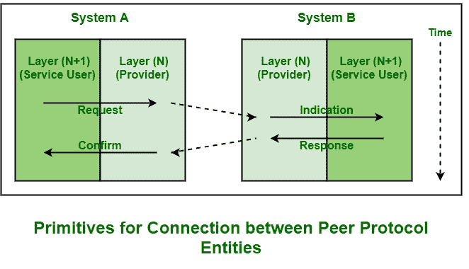

# 服务原语

> 原文:[https://www.geeksforgeeks.org/service-primitives/](https://www.geeksforgeeks.org/service-primitives/)

**服务**一般包括一组各种原语。一个原语仅仅意味着操作。

服务是由一组原语指定的，这些原语可供用户或其他各种实体访问。所有这些原语只是告诉服务执行一些动作或者报告对等实体采取的动作。在分层结构中通信的每个协议也以对等方式与其一些远程协议实体通信。

原语被称为层之间的调用函数，用于管理相邻协议层之间的通信，即同一通信节点之间的通信。可用的原语集合通常取决于所提供服务的性质。

**服务原语分类:**

| 原始的 | 意义 |
| **请求** | 它代表希望或请求服务来执行一些动作或做一些工作(请求连接到远程计算机)实体。 |
| **指示** | 它代表将被告知事件实体(接收者刚刚接收到连接请求)。 |
| **回应** | 它代表响应事件的实体(接收者只是发送许可或允许连接)。 |
| **确认** | 它代表一个实体，该实体确认对先前返回的请求的响应(发送者只确认连接到远程主机的许可)。 |

在上图中，这四个原语的工作原理如下:

*   **请求–**
    这个原语被逐层(N+1)传输或发送到第 N 层，只是请求服务。
*   **指示–**
    该原语由第 N 层返回到第(N+1)层，仅通知激活正在请求的服务或由第 N 层的服务发起的动作
*   **响应–**
    这个原语是由 Layer (N+1)简单提供的，作为对指示原语的回复。它可能会确认或完成先前由指示原语调用的操作。
*   **确认–**
    这个原语由第 N 个层返回到请求(N+1) 个层，以简单地确认或完成请求原语之前调用的动作。

**服务原语参数:**
部分服务原语需要参数。这些内容如下:

*   **连接。请求–**
    发起实体执行此连接。请求。它只是指定并确定我们要连接的机器、所需的服务类型以及连接中使用的数据包或消息的最大大小。
*   **连接。指示–**
    接收方得到这个连接指示，它只是指定了我们想要使用的呼叫者身份服务，比如 FTP 和 Telnet 等。，以及交换的数据包的最大大小。
*   **连接。响应-**
    它只是指定它是想接受还是简单地拒绝正在请求的连接。
*   **连接。确认-**
    它只是使用发出初始连接的实体来发现或确定发生了什么。请求。

**面向连接服务的原语:**

| 原始的 | 意义 |
| **听** | 当服务器准备好接受传入连接的请求时，它只需将这个原语付诸行动。监听原语只是等待传入的连接请求。 |
| **连接** | 该原语用于通过创建或建立与等待对等方的连接来连接服务器。 |
| **接受** | 这个原语只是接受来自对等方的传入连接。 |
| **接收** | 这些原语随后会阻塞服务器。接收原语只是等待传入的消息。 |
| **发送** | 客户端使用这个原语来发送请求，然后使用接收原语来获得回复。发送原语只是将消息发送或传输给对等方。 |
| **断开** | 这个原语只是用来终止或结束连接，之后没有人能够发送任何消息。 |

**无连接服务的原语:**

| 原始的 | 意义 |
| 单位数据 | 发送数据包或信息只需要 Unitdata 原语。 |
| **设施，报告** | 获取有关网络性能和工作的详细信息(如交付统计数据或报告)需要该原语。 |

