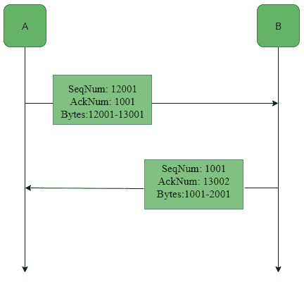

# TCP 中的服务和段结构

> 原文:[https://www . geesforgeks . org/services-and-segment-structure-in-TCP/](https://www.geeksforgeeks.org/services-and-segment-structure-in-tcp/)

传输控制协议是最常见的传输层协议。它与 IP 一起工作，并使用 IP 协议提供的网络层服务在进程之间提供可靠的传输服务。
TCP 向应用层提供的各种**服务**如下:

1.  **进程到进程的通信–**
    TCP 提供了一个进程到进程的通信，即在终端系统上执行的各个进程之间发生的数据传输。这是使用端口号或端口地址完成的。端口号为 16 位，有助于识别主机上哪个进程正在发送或接收数据。

2.  **面向流–**
    这意味着数据以字节流的形式发送和接收(不像 UDP 或 IP 那样将位分成数据报或数据包)。然而，为 TCP 提供服务的网络层发送的是信息包，而不是字节流。因此，TCP 将多个字节组合成一个*段*，并为每个段添加一个报头，然后将这些段传送到网络层。在网络层，这些网段中的每一个都被封装在一个 IP 数据包中进行传输。TCP 报头包含控制目的所需的信息，这些信息将与段结构一起讨论。

3.  **全双工服务–**
    这意味着通信可以同时在两个方向进行。

4.  **面向连接的服务–**
    与 UDP 不同，TCP 提供面向连接的服务。它定义了 3 个不同的阶段:
    *   连接建立
    *   数据传送
    *   连接终端
5.  **可靠性–**
    TCP 是可靠的，因为它使用校验和进行错误检测，试图通过重新传输、确认策略和计时器来恢复丢失或损坏的数据包。它使用字节号、序列号和确认号等特性来确保可靠性。此外，它使用拥塞控制机制。

6.  **复用–**
    TCP 在发送端和接收端分别进行复用和解复用，因为通过物理连接可以在端口号之间建立多个逻辑连接。

**字节号、序列号和确认号:**
所有要传输的数据字节都被编号，并且该编号的开始是任意的。给段赋予序列号，以便在接收端重组字节，即使它们以不同的顺序到达。段的序列号是正在发送的第一个字节的字节数。因为 TCP 提供全双工服务，所以需要确认号。确认号是接收方期望接收的下一个字节号，它也为接收前一个字节提供确认。
示例:

在这个例子中，我们看到 A 发送确认号 1001，这意味着它已经接收到数据字节直到字节号 1000，并期望接下来接收 1001，因此 B 接下来发送从 1001 开始的数据字节。类似地，由于在从 A 到 B 的第一次数据传输之后，B 已经接收到数据字节，直到字节号 13001，因此 B 发送确认号 13002，它期望接下来从 A 接收的字节号。

**TCP 段结构–**
TCP 段由要发送的数据字节和由 TCP 添加到数据中的报头组成，如图所示:

一个 TCP 段的报头可以是 20-60 字节。40 字节用于选项。如果没有选项，标题是 20 字节，否则它最多可以是 60 字节。
表头字段:

*   **源端口地址–**
    一个 16 位字段，保存发送数据段的应用程序的端口地址。

*   **目的端口地址–**
    一个 16 位字段，保存接收数据段的主机中应用程序的端口地址。

*   **序列号–**
    一个 32 位字段，保存序列号，即在该特定段中发送的第一个字节的字节号。它用于在接收端重组无序接收的报文段。

*   **确认号–**
    一个 32 位字段，保存确认号，即接收方预计接下来接收的字节数。这是对成功接收到的先前字节的确认。

*   **报头长度(HLEN)–**
    这是一个 4 位字段，通过报头中的一些 4 字节的字来指示 TCP 报头的长度，即如果报头是 20 字节(TCP 报头的最小长度)，那么这个字段将保存 5(因为 5×4 = 20)和最大长度:60 字节，那么它将保存值 15(因为 15×4 = 60)。因此，该字段的值始终在 5 到 15 之间。

*   **控制标志–**
    这些是 6 个 1 位控制位，用于控制连接建立、连接终止、连接中止、流量控制、传输模式等。它们的功能是:
    *   URG:紧急指针有效
    *   确认:确认号有效(用于累计确认的情况)
    *   PSH:请求推动
    *   RST:重置连接
    *   同步序列号
    *   终止连接
*   **窗口大小–**
    该字段以字节为单位显示发送 TCP 的窗口大小。

*   **校验和–**
    该字段保存错误控制的校验和。它在 TCP 中是强制性的，而不是 UDP。

*   **紧急指针–**
    该字段(仅在设置了 URG 控制标志时有效)用于指向急需的数据，该数据需要最早到达接收流程。该字段的值被添加到序列号中，以获得最后一个紧急字节的字节数。

**TCP 连接–**
TCP 是面向连接的。通过 [3 次握手](https://www.geeksforgeeks.org/computer-network-tcp-3-way-handshake-process/)建立 [TCP 连接](https://www.geeksforgeeks.org/computer-network-tcp-connection-establishment/)。