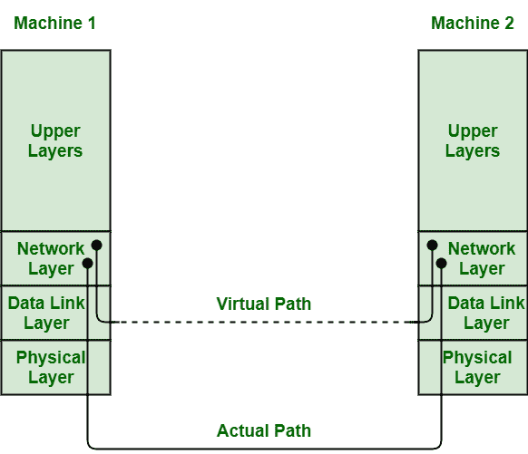

# 数据链路层提供的服务

> 原文:[https://www . geesforgeks . org/services-由数据链路层提供/](https://www.geeksforgeeks.org/services-provided-by-data-link-layer/)

**先决条件–**[数据链路层](https://www.geeksforgeeks.org/data-link-layer-in-osi-model/)

数据链路层通常表示程序中的协议层，仅用于处理和控制源机器和目标机器之间的数据传输。它只是负责通过物理网络介质在节点或机器之间交换帧。该层通常离物理层(硬件)最近。

数据链路层基本上是计算机网络的七层[开放系统互连(OSI)](https://www.geeksforgeeks.org/layers-of-osi-model/) 参考模型的第二层，位于物理层的正上方。

该层通常提供并赋予数据可靠性，并提供各种工具来建立、维护和释放网络节点之间的数据链路连接。它负责接收和获取通常来自物理层的数据位，然后将这些位转换成组，称为数据链路帧，以便进一步传输。它还负责处理因传输位而可能出现的错误。

**提供给网络层的服务:**
数据链路层的重要和本质功能是提供到网络层的接口。网络层是七层现场视察参考模型的第三层，位于数据链路层的正上方。

数据链路层的主要目的是将收到的数据帧传输到目的机器，以便将这些数据帧传递到目的机器的网络层。在网络层，这些数据帧基本上被寻址和路由。

该过程如图所示:



**1。实际通信:**
在该通信中，存在物理介质，数据链路层仅通过该介质传输数据帧。实际路径是发送机上的网络层- >数据链路层- >物理层，然后到物理介质，再到接收机上的物理层- >数据链路层- >网络层。

**2。虚拟通信:**
在这种通信中，数据链路层不存在传输数据的物理介质。只能想象两个数据链路层借助或使用数据链路协议相互通信。

**数据链路层提供的服务类型:**
数据链路层通常提供或提供以下三种服务:

```
1. Unacknowledged Connectionless Service
2. Acknowledged Connectionless Service
3. Acknowledged Connection-Oriented Service 
```

1.  **Unacknowledged Connectionless Service :**
    Unacknowledged connectionless service simply provides datagram styles delivery without any error, issue, or flow control. In this service, source machine generally transmits independent frames to destination machine without having destination machine to acknowledge these frames.

    此服务称为无连接服务，因为在数据传输之前或数据传输之后释放之前，发送或源计算机与目标或接收计算机之间没有建立连接。

    在数据链路层，无论如何，如果帧由于噪声而丢失，将不会尝试检测或确定丢失或从中恢复。这仅仅意味着不会有错误或流量控制。以太网就是一个例子。

2.  **Acknowledged Connectionless Service :**
    This service simply provides acknowledged connectionless service i.e. packet delivery is simply acknowledged, with help of stop and wait for protocol.

    在这种服务中，数据链路层传输的每一帧都被单独确认，然后发送方通常知道这些传输的数据帧是否被安全接收。没有建立逻辑连接，传输的每一帧都被单独确认。

    这种模式简单地提供了一种手段，通过这种手段，数据链路的用户可以发送或传输数据，同时请求返回数据。它还使用特定的时间段，如果它已经通过帧而没有得到确认，那么它将在该时间段重新发送数据帧。

    这种服务比未确认的无连接服务更可靠。这项服务通常在几个不可靠的信道上有用，如无线系统、无线网络服务等。

3.  **Acknowledged Connection-Oriented Service :**
    In this type of service, connection is established first among sender and receiver or source and destination before data is transferred.

    然后，数据会随着这个已建立的连接一起传输。在这种服务中，首先向发送的每一帧提供单独的号码，以便确认和保证每一帧也以适当的顺序和顺序只被接收一次。