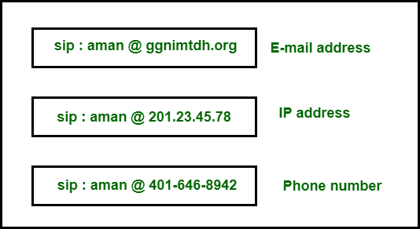
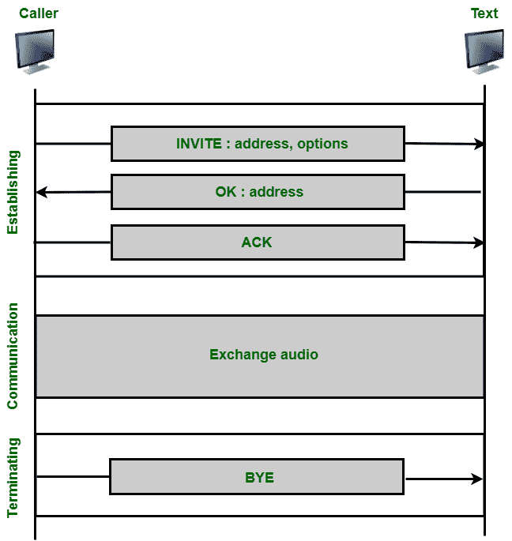

# 会话发起协议

> 原文:[https://www.geeksforgeeks.org/session-initiation-protocol/](https://www.geeksforgeeks.org/session-initiation-protocol/)

[会话发起协议](https://www.geeksforgeeks.org/difference-between-sip-and-voip/)由 IETF 设计，在 RFC 3261 中有描述。是[应用层](https://www.geeksforgeeks.org/protocols-application-layer/)的协议描述了发现互联网电话呼叫、视频会议和其他多媒体连接、管理它们和终止它们的方法。这是一个模块。它准备好建立双向方会话，多方会话和多播会话。它的设计独立于底层传输层。它准备运行在 [UDP 或](https://www.geeksforgeeks.org/differences-between-tcp-and-udp/)TCP 上。

**SIP 地址:**
在常规电话通信中，一个电话号码标识发送方，另一个电话号码标识接收方。在 SIP 中，发送者和接收者通常由其中的任何一个来识别。

1.  电子邮件地址。
2.  一个 IP 地址。
3.  电话号码

该表示使用 sip 方案表示为 URL:

SIP 地址方案

**SIP 消息:**
SIP 可以是基于 HTTP 的文本协议。它使用 ASCII 文本格式的消息。每条消息都有一个标题和一个正文。各种 SIP 消息如下。

| -你好。不，不。 | 消息 | 描述 |
| --- | --- | --- |
| 1. | 邀请 | 它请求启动会话。 |
| 2. | 命令正确应答 | 它确认会话已经启动。 |
| 3. | 再见 | 它请求终止会话。 |
| 4. | 选择 | 它向主机询问其能力。 |
| 5. | 取消 | 它将取消挂起的请求。 |
| 6. | 注册 | 它向重定向服务器通知用户的当前位置。 |

**SIP 会话:**
使用 SIP 的简单会话包括以下内容。

1.  建立会话。
2.  交流。
3.  终止会话

会话发起协议

**建立会话:**
需要三方握手。呼叫者将发送 INVITE 消息。如果呼叫者愿意出发，他/她会发送回复消息。为了验证是否收到回复代码，呼叫者发送一条确认消息。

**通信:**
会话建立后，主叫和被叫使用两个临时端口进行通信。

**终止会话:**
会话通常可以通过使用呼叫者或被呼叫者发送的 BYE 消息来终止。