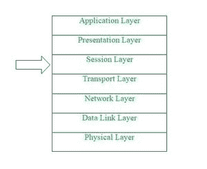
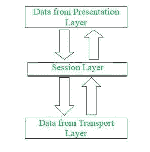

# OSI 模型中的会话层

> 原文:[https://www.geeksforgeeks.org/session-layer-in-osi-model/](https://www.geeksforgeeks.org/session-layer-in-osi-model/)

**前提:** [OSI 层](https://www.geeksforgeeks.org/layers-of-osi-model/)

**简介:**
会话层是开放系统互连(OSI)模型中的第 5 层。这一层允许不同机器上的用户在他们之间建立活动的通信会话。它负责建立、维护、同步和终止终端用户应用程序之间的会话。在会话层，数据流被接收并被进一步标记，然后被正确地重新同步，这样消息的末端最初不会被切断，并且避免了进一步的数据丢失。这一层基本上建立了会话实体之间的连接。该层处理和操纵从会话层和表示层接收的数据。

**会话层的工作:**
会话层是 OSI 模型中的第五层，使用传输层提供的服务，使应用程序能够建立和维护会话，并同步会话。
现在，为了建立会话连接，应该遵循几件事。

首先，我们应该将会话地址映射到发货地址。第二件事是我们需要选择所需的传输服务质量(也称为 QoS)参数。接下来，我们需要处理会话参数之间的谈判。
那么我们进一步需要传输有限的透明用户数据。最后，我们需要适当地监控数据传输阶段。
能够发送更大数量的数据文件是极其重要的，也是必要的。

**会话层的功能:**
会话层是现场视察模型中的第五层，执行建立和维护安全连接所需的几种不同的重要功能。

下面是会话层执行的一些功能–

*   会话层作为一个对话控制器，它允许系统以半双工模式或全双工模式进行通信。
*   该层还负责令牌管理，通过令牌管理防止两个用户同时访问或尝试相同的关键操作。
*   该层通过允许添加检查点的过程来实现同步，检查点被认为是数据流的同步点。
*   该层还负责会话检查点和恢复。
*   该层基本上提供了一种在最终用户应用程序进程之间打开、关闭和管理会话的机制。
*   会话层提供的服务通常使用远程过程调用(RPC)在应用程序环境中实现。
*   会话层还负责同步来自不同来源的信息。
*   该层还控制每个最终用户应用程序的单个或多个连接，并直接与表示层和传输层通信。
*   会话层创建检查点过程，然后是暂停、重启和终止。
*   会话层使用检查点来启用通信会话，这些会话将从发生通信故障的特定检查点恢复。
*   会话层负责从前一层(传输层)获取或接收数据信息，并进一步将数据发送到后一层(表示层)。

**会话层协议:**
会话层使用一些协议，这些协议是存在于两个终端用户应用之间的安全、可靠和精确通信所必需的。
下面是会话层提供或使用的一些协议–

1.  [**【Apple talk 数据流协议(ADSP)**](https://www.geeksforgeeks.org/adsp-fullform/)**–**
    ADSP 是由苹果公司开发的协议类型，它包括许多允许局域网无需预先设置即可连接的功能。该协议于 1985 年发布。
    该协议严格遵循协议分层的 OSI 模型。ADSP 本身有两个协议:苹果对话地址解析协议(AARP)和名称绑定协议(NBP)，这两个协议都旨在使系统自我配置。
2.  [**实时传输控制协议(RTCP)–**](https://www.geeksforgeeks.org/real-time-transport-control-protocol-rtcp/) **RTCP 是一种为 RTP(实时传输协议)会话提供带外统计和控制信息的协议。
    RTCP 的主要功能是通过定期向流式多媒体会话中的参与者发送统计信息，如传输的八位字节和数据包计数或数据包丢失，来提供媒体分发中服务质量(QoS)的反馈。**
3.  **[**点对点隧道协议(PPTP)**](https://www.geeksforgeeks.org/pptp-full-form/)**–**
    PPTP 是一个提供实现虚拟专用网络方法的协议。PPTP 使用一个 TCP 控制信道和一个通用路由封装隧道来封装点对点协议数据包。
    该协议提供的安全级别和远程访问级别与典型的 VPN(虚拟专用网)产品相当。**
4.  **[**密码认证协议(PAP)**](https://www.geeksforgeeks.org/password-authentication-protocol-pap/#:~:text=PAP%20is%20a%20password%20Authentication,allowed%20to%20access%20otherwise%20denied.)**–**
    密码认证协议是点对点协议(PPP)用来验证用户的基于密码的认证协议。
    几乎所有的网络操作系统、远程服务器都支持 PAP。PAP 身份验证在初始链路建立时完成，并使用双向握手验证客户端的身份(客户端发送数据，服务器在客户端发送的数据完全验证后发送身份验证确认(Acknowledgement))。**
5.  **[**【远程过程调用协议(RPCP)**](https://www.geeksforgeeks.org/remote-procedure-call-rpc-in-operating-system/#:~:text=Remote%20Procedure%20Call%20(RPC)%20is,space%20as%20the%20calling%20procedure.)**–**
    远程过程调用协议(RPCP)是一种协议，当计算机程序使一个过程(或一个子程序)在不同的地址空间中执行时使用，而程序员没有为远程交互明确编码细节。
    这基本上是客户机-服务器交互的形式，通常通过请求-响应消息传递系统来实现。**
6.  ****套接字直接协议(SDP)–**
    套接字直接协议(SDP)是一种支持远程直接内存访问(RDMA)网络结构上套接字流的协议。
    SDP 的目的是为 TCP 协议提供一个 RDMA 加速的替代方案。主要目标是以对应用程序透明的方式执行一件特定的事情。**