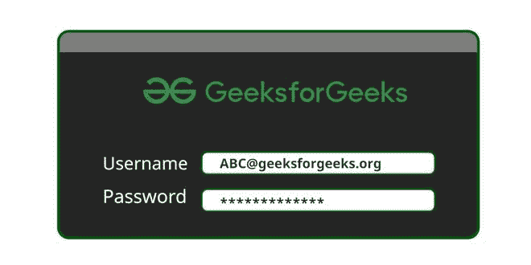
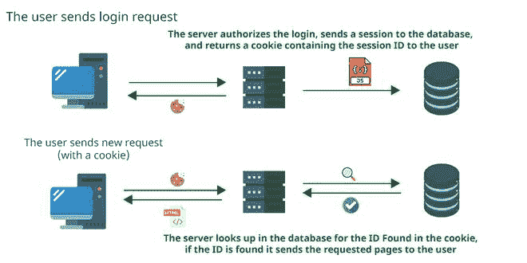
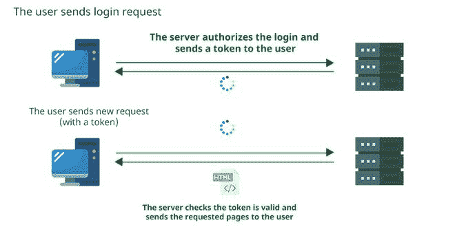

# 会话与基于令牌的认证

> 原文:[https://www . geesforgeks . org/session-vs-基于令牌的身份验证/](https://www.geeksforgeeks.org/session-vs-token-based-authentication/)

基于会话和令牌的身份验证方法用于使服务器信任由经过身份验证的用户通过互联网发送的任何请求。通过这种方式，用户可以与他们的帐户进行交互，而无需不断指定他们的凭据。这些方法通常用于不同的目的。

*例如*，会话通常用于网站应用程序，而令牌在服务器到服务器的连接中是首选的。

证明

## **会话认证**

一个[会话](https://www.geeksforgeeks.org/session-cookies-in-node-js/)是一个很小的文件，很可能是 JSON 格式的，它存储了关于用户的信息，比如唯一的标识、登录时间和过期时间等等。它被生成并存储在服务器上，以便服务器能够跟踪用户请求。用户会收到其中的一些细节，尤其是 ID，作为 cookies，将随每个新请求一起发送，这样服务器就可以识别 ID 并授权用户的请求。

### 工作

1.  用户向服务器发送登录请求。
2.  服务器验证登录请求，向数据库发送会话，并向用户返回包含会话标识的 cookie。
3.  服务器在数据库中检查在 cookie 中找到的标识，如果找到该标识，它会将请求的页面发送给用户。
4.  现在，用户发送新的请求(带有 cookie)。

会话认证

### 赞成/反对

由于会话存储在服务器上，因此服务器管理员有权控制它们。*例如*，如果安全团队怀疑某个账户被泄露，他们可以立即使会话 ID 无效，以便用户立即注销。另一方面，由于会话存储在服务器上，服务器负责查找用户发送的会话标识。这可能会导致可伸缩性问题。

Cookies 可能会受到跨站点请求伪造攻击。攻击者可能会将用户误导到一个敌对的网站，其中一些 JS 脚本可能会利用 cookies 向服务器发送恶意请求。另一个漏洞涉及中间人攻击的机会，攻击者可以拦截会话标识并对服务器执行有害的请求。

## **基于令牌的认证**

一个[令牌](https://www.geeksforgeeks.org/what-is-authentication-tokens-in-network-security/)是一个不可篡改的授权文件。它由服务器使用密钥生成，发送给用户并由用户存储在本地存储中。就像在 cookies 的情况下一样，用户将这个令牌和每个新的请求一起发送给服务器，这样服务器就可以验证它的签名并授权这些请求。

### 工作

1.  用户向服务器发送登录请求。
2.  服务器授权登录并向用户发送令牌。
3.  服务器检查令牌是否有效，如果令牌有效，它会将请求的页面发送给用户。
4.  现在，用户发送一个新的请求(带有一个令牌)。

令牌认证

*注意-那些是**不是** **认证文件，**是**授权文件**。在接收令牌时，服务器并不**查找用户是谁，它只是依靠令牌的有效性来授权用户的请求。***

### 赞成/反对

当用户想要减少他们必须发送其凭证的次数时，令牌会很有用。在服务器到服务器的连接中，使用凭证变得很困难，而令牌克服了这个问题。此外，使用令牌的服务器可以提高它们的性能，因为它们不需要持续查看所有会话细节来授权用户的请求。

但是，身份验证详细信息存储在客户端，因此服务器无法像会话方法那样执行某些安全操作。如上所述，服务器不对用户进行身份验证，因此将令牌链接到其用户可能会更加困难。如果一个假想的攻击者设法获得了一个有效的令牌，他们就可以无限制地访问服务器数据库。如果服务器使用旧算法生成密钥，这些密钥可能会被破解。

### 基于会话和令牌的身份验证方法的区别

<figure class="table">

|   | 标准 | 

**会话认证方法**

 | **基于令牌的认证方法** |
| --- | --- | --- | --- |
| 1. | 连接的哪一方存储身份验证详细信息 | 计算机网络服务器 | 用户 |
| 2. | 用户发送给服务器以授权其请求的内容 | 一块饼干 | 令牌本身 |
| 3. | 服务器如何授权用户的请求 | 通过用户发送的带有 cookie 的 ID，在数据库中查找以找到正确的会话 | 解密用户令牌并验证其签名 |
| 4. | 服务器管理员能否执行安全操作，如注销用户、更改他们的详细信息等 | 是的，因为会话存储在服务器上 | 不，因为令牌存储在用户的机器上 |
| 5. | 该方法可能遭受哪种攻击 | 中间人、跨站点请求伪造 | 中间人，令牌窃取，违反密钥 |
| 6. | 首选方法应用 | 用户到服务器的连接 | 服务器到服务器的连接 |

</figure>

### 结论

1.  会话和基于令牌是两种身份验证方法，允许服务器信任它从用户接收的所有请求。主要区别是基于会话的连接身份验证存储了身份验证详细信息。会话方法使服务器存储大部分细节，而在基于令牌的情况下，客户端存储它们。
2.  会话身份验证方法基于通过 cookie 文件与客户端共享标识的概念，而其余细节则存储在服务器上的会话文件中。
3.  基于令牌的身份验证方法基于这样一个概念，即拥有令牌是用户唯一需要让服务器授权其请求的东西，而服务器必须只验证签名。令牌使用安全，因为它不能被篡改。
4.  这两种方法都有固有的漏洞，可以通过不同的变通方法最容易地解决。最后，开发人员必须决定哪种方法更适合他们的需求和应用。