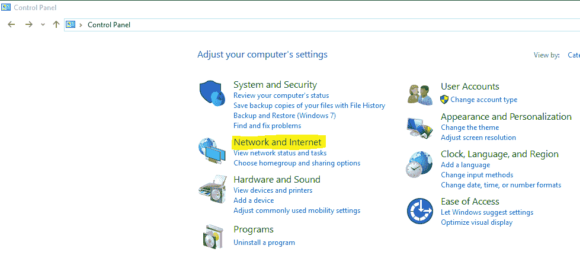
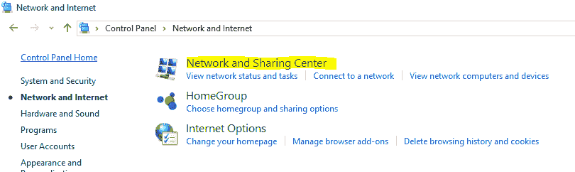
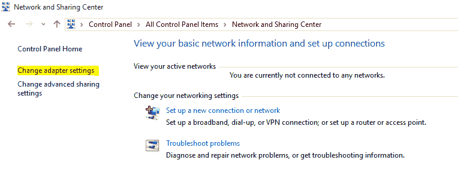
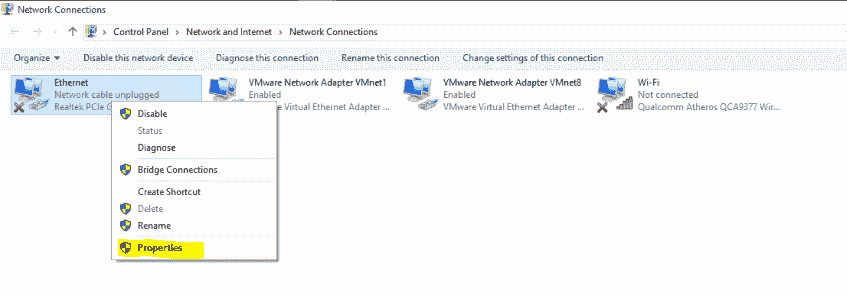
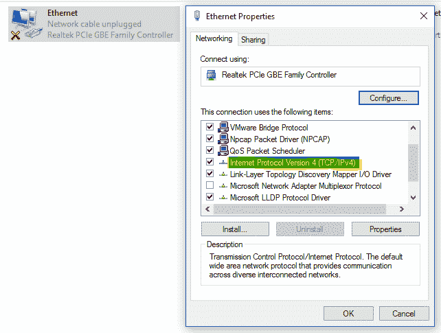
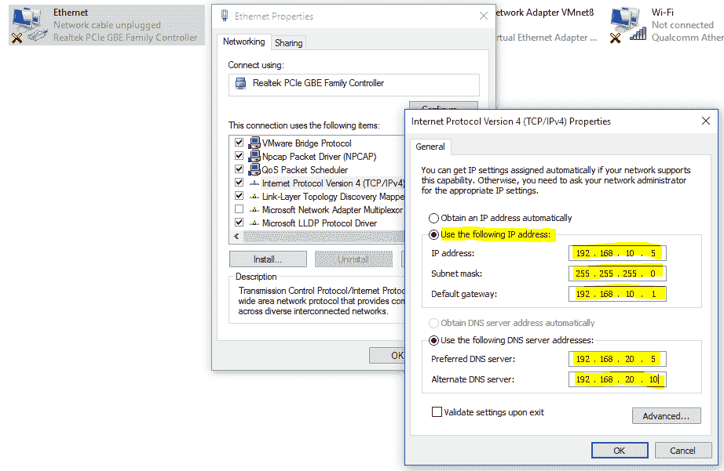

# 在 Windows 中设置静态 IP 地址

> 原文:[https://www . geesforgeks . org/setting-static-IP-address-in-window/](https://www.geeksforgeeks.org/setting-static-ip-address-in-windows/)

**Windows 上的静态 IP:**
IP 地址是网络中连接的系统的真实逻辑标识。所有系统都使用这些 IP 地址来定位不同子域中的另一个系统。DHCP 服务器和管理员可以动态分配 IP 地址。DHCP 服务器分配一个动态 IP，该 IP 可以更改，但手动分配的 IP 不能更改，直到访问管理控件对其进行配置。

默认情况下，基于 Windows 的计算机配置为使用 DHCP 服务器分配的 IP 地址、子网掩码和 DNS 服务器地址。但是，控制面板下提供的设置可用于分配静态 IP 地址、相关子网掩码和 DNS 服务器地址。IP 地址和子网掩码可用于确定系统的网络，系统使用分配的 DNS 服务器地址使用域名访问网络资源。

下面列出了在基于 Windows 的机器上分配静态 IP 地址的步骤:

**步骤 1–**
**控制面板→网络和互联网→网络和共享中心**

要开始在 Windows 机器上分配静态 IP 地址，需要访问控制面板，如下面提供的屏幕截图所示。从它提供的各种设置中，需要选择网络和互联网。此外，需要选择网络和共享中心设置。

Windows 控制面板

网络和共享中心

**步骤 2–**
**网络和共享中心→更改适配器设置**

打开网络和共享中心后，需要选择**“更改适配器设置”**。如下图所示，该选项位于屏幕左侧。

单击更改适配器设置

**步骤 3–**
进一步打开适配器设置，系统上所有可用的适配器都会显示出来，静态 IP 可以分配给其中任何一个。这些适配器可以是物理机，也可以是虚拟机。分配静态逻辑地址需要访问这些适配器的属性。

**步骤 4–**
**选择适配器→右键→属性**

选择任何可用的适配器并右键单击它。将显示各种选项，并从中选择属性选项。

属性选项

**步骤 5–**
**适配器属性→互联网协议版本 4 (TCP/IPv4)→双击**

此外，将为选定的网络适配器打开属性面板，并显示其当前设置。从中双击**‘互联网协议版本 4(TCP/IP v4)’**。

通过选择网络适配器的这个属性，静态 IP 版本 4 地址被分配了适当的子网掩码和 DNS 服务器地址。组织通常使用这些设置来配置内部网络中的系统。

将显示网络适配器属性

**步骤 6–**
在此步骤中，选择“**使用以下 IP 地址”**选项，并为系统分配静态 IP 地址、子网掩码、默认网关地址和 DNS 服务器地址。单击确定，逻辑地址将被成功分配。

静态 IP 已分配