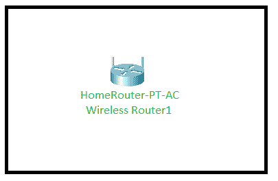
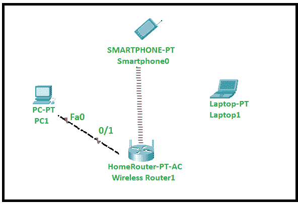
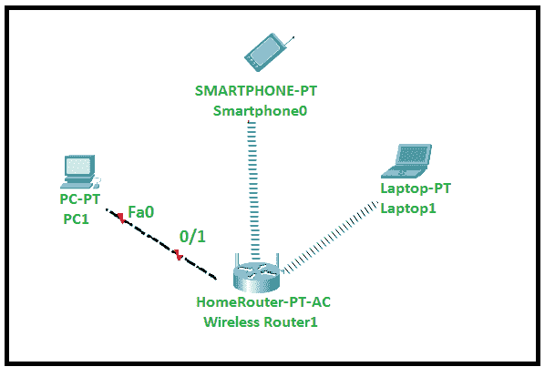

# 使用数据包跟踪器建立基本家庭网络

> 原文:[https://www . geeksforgeeks . org/setting-a-basic-home-network-use-packet-tracer/](https://www.geeksforgeeks.org/setting-up-a-basic-home-network-using-packet-tracer/)

Packet Tracer 是一个网络模拟工具，它允许我们通过构建虚拟网络设备来创建网络拓扑。网络爱好者非常鼓励使用 Packet Tracer，因为它可以让他们对网络有深刻的了解。让我们看看如何使用 Packet Tracer 轻松创建一个简单的家庭网络。

**步骤-1:**
打开 Packet Tracer，从无线设备中选择家庭路由器，并将其放在工作区中。

 

**第 2 步:**
将智能手机、PC、笔记本电脑从终端设备放到工作区。

请注意，智能手机放在工作区

**后会自动连接到家庭路由器步骤 3:**
通过将电脑配置为快速以太网 0，将家庭路由器配置为千兆以太网 1，使用“连接”中提供的铜线将电脑连接到家庭路由器。

 

**步骤-4:**
要将笔记本电脑连接到家庭路由器，我们需要更新笔记本电脑配置中的一个 pin，为此，单击笔记本电脑并转动笔记本电脑，找到 pin WPC300N 并将其放入笔记本电脑中。

**注意:**要用 WPC300N 更新 pin，必须关闭笔记本电脑。

**【教程】**

<video class="wp-video-shortcode" id="video-477059-1" width="665" height="374" preload="metadata" controls=""><source type="video/mp4" src="https://media.geeksforgeeks.org/wp-content/uploads/20200829235731/gfg-1.mp4?_=1">[https://media.geeksforgeeks.org/wp-content/uploads/20200829235731/gfg-1.mp4](https://media.geeksforgeeks.org/wp-content/uploads/20200829235731/gfg-1.mp4)</video>