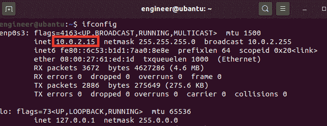
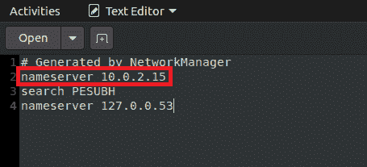
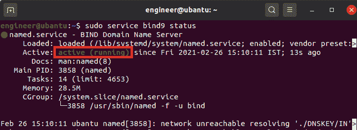
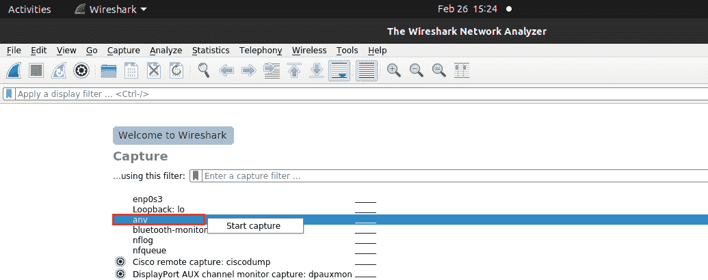
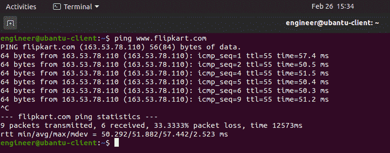
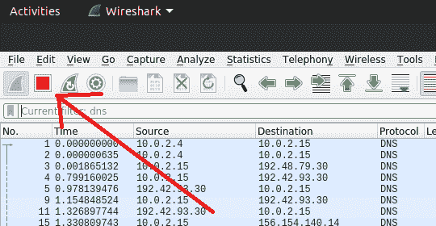
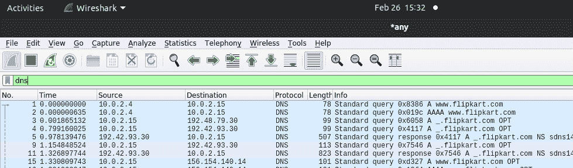
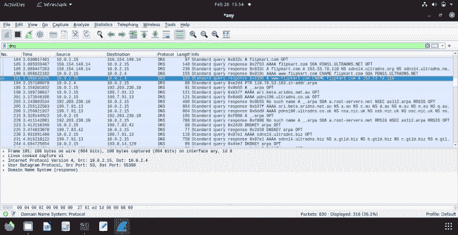

# 在客户端-服务器之间设置本地域名系统服务器

> 原文:[https://www . geesforgeks . org/setting-local-DNS-server-inter-client-server-machines/](https://www.geeksforgeeks.org/setting-up-local-dns-server-between-client-server-machines/)

在本文中，您将看到域名系统服务器的概述，以及如何在客户端和服务器之间设置本地域名系统服务器。这里我们将使用 Wireshark。我们一个一个来讨论。

**简介:**
一台 [DNS 服务器](https://www.geeksforgeeks.org/domain-name-system-dns-in-application-layer/)是一台计算机服务器，包含一个公共 IP 地址及其相关主机名的数据库，在大多数情况下，用于根据请求将这些名称解析或转换为 IP 地址。DNS 服务器运行特殊的软件，并使用特殊的协议相互通信。

为了设置 DNS 服务器，我们需要两个虚拟机，这里，我们将在我的笔记本电脑上运行的 2 个 Ubuntu 虚拟机的帮助下实现，我将服务器虚拟机命名为 Ubuntu，将客户端虚拟机命名为 Ubuntu 客户端。为了了解 DNS 服务器如何工作，我们使用 Wireshark 数据包捕获来查看 DNS 服务器如何处理请求。

**步骤-1:在服务器虚拟机上安装 Wireshark:**

*   在这种情况下，您可以使用下面给出的命令用这个命令安装 Wireshark。安装 Wireshark 后，我们将开始设置 DNS 服务器。

```
sudo apt-get install wireshark
```

**步骤 2:配置客户端虚拟机:**

*   我们需要将自定义域名系统服务器的 IP 地址添加到客户端机器。这是通过将服务器的 IP 地址添加到存储 DNS 服务器解析顺序的文件 **/etc/resolv.conf** 中来完成的。这确保了自定义域名系统服务器将用于解析名称。要找到服务器虚拟机的 IP 地址，首先转到服务器虚拟机，并在终端中执行以下命令

```
ifconfig
```

*   inet 后的值是 IP 地址在我的例子中，我的服务器的 IP 地址是 10.0.2.15。



*   现在，转到客户端虚拟机，在终端中运行该命令，并输入用户密码以打开该文件。

```
sudo gedit /etc/resolv.conf
```

*   您会发现类似这样的屏幕，现在在文件的第一行添加这一行并保存它。

```
nameserver 10.0.2.15
```

**注意–**
将 10.0.2.15 更改为您的服务器机器 IP 地址在我的情况下，我的服务器 IP 地址是 10.0.2.15。



**步骤 3:配置服务器虚拟机:**

*   为了设置 DNS 服务器，我们需要一个名为 bind9 的软件，bind9 服务器被用作服务器虚拟机上的 DNS 服务器。可以使用下面的命令安装它。

```
sudo apt-get install bind9
```

*   安装 bind9 后，让我们用这个命令检查 bind9 服务器的状态，看它是否在运行。

```
sudo service bind9 status
```



*   如果您看到活动的(正在运行)，那么我们就可以开始了，如果您看到其他情况，如故障、停止或不活动，请键入此命令并重新启动您的服务器虚拟机，这将解决问题。

```
sudo service bind9 restart
```

*   现在，我们刚刚完成了本地域名系统服务器的设置，现在我们来看看它是如何工作的。

**步骤-4:使用 Wireshark 执行数据包捕获:**

*   转到服务器虚拟机并打开终端，键入以下命令打开 Wireshark。

**注意–**
使用 **sudo** 命令以管理员权限打开 Wireshark，如下图所示。

```
sudo wireshark
```

*   Wireshark 打开后，双击**任意**或点击**任意**，右键点击**开始捕捉。**



*   现在快速进入客户端虚拟机，打开终端，ping 任意网站，例如 ping**www.flipkart.com**

```
ping www.flipkart.com
```

*   15 或 20 秒后，按下【T0+C】停止敲击 www.flipkart.com。



*   现在转到服务器虚拟机，按下面板左上角的红色按钮，停止对 Wireshark 的捕获。这将停止对 Wireshark 的捕获。



*   现在，在**上键入 DNS，应用显示过滤器**，然后按回车键。



*   现在，观察图 7 中数据包捕获的第一帧，源是客户端虚拟机的 IP 地址，目的地是服务器的 IP 地址，这意味着客户端正在向服务器虚拟机发送请求，以获取网页 www.flipkart.com 的结果
*   现在，观察帧号 191，源是服务器虚拟机的 IP 地址，目的地是客户端虚拟机的 IP 地址，这意味着服务器虚拟机向客户端虚拟机发送响应。

