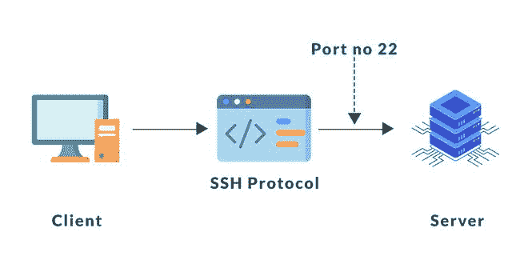
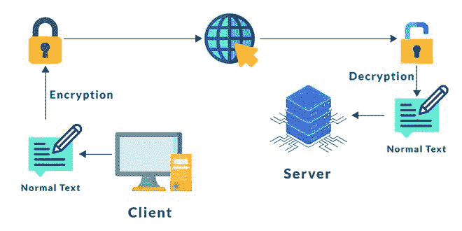
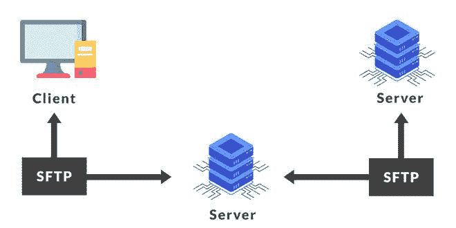

# SFTP 文件传输协议

> 原文:[https://www.geeksforgeeks.org/sftp-file-transfer-protocol/](https://www.geeksforgeeks.org/sftp-file-transfer-protocol/)

SFTP(安全文件传输协议)是 FTP(文件传输协议)的高级版本，它确保在组织/计算机之间传输文件时的安全性。又名 [**SSH** (安全壳)](https://www.geeksforgeeks.org/introduction-to-sshsecure-shell-keys/)。它在 22 号端口工作，使用[客户端-服务器模型](https://www.geeksforgeeks.org/client-server-model/)。

**SFTP 特色:**

*   它加密数据。
*   它执行命令。
*   它保护和压缩数据以便传输。
*   它提供用户名和密码的身份验证。
*   它改进了上传和下载文件的功能。
*   它还为公钥提供身份验证。

**工作:**
SFTP 通过对数据包应用 SSH 消息认证码(MAC)来确保数据安全。首先，SFTP 建立了安全可靠的连接，然后为数据传输提供了高级别的保护。用户对 SSH 数据流上共享文件的认证，一切都由 SFTP 加密。如果任何未经授权的人或第三方试图访问数据，由于加密，这些数据将是不可理解或不可读的。
*例如*–在 WhatsApp 中，消息是端到端加密的。

加密

**SFTP 优势:**

**1。速度和效率–**
它可以一次性传输大而笨重的文件。数据将被快速有效地传输。

**2。降低交换数据时的风险–**
SFTP 以加密形式发送数据，因此未经授权的人无法访问。它还提供主机身份验证来检查服务器是否正确。

加密和解密

**3。电源数据可访问性–**
数据很容易访问，因为 SFTP 提供了用户到服务器以及服务器到服务器的设施。

客户端-服务器

**SFTP 的劣势:**

**1。难以管理–**
由于保护功能太多，管理变得更加困难。

**2。安全威胁–**
SFTP 没有完全安全。它很容易被网络攻击者攻击。甚至密码和用户标识也不总是受到保护。

**SFTP 配置:**

**SFTP 车窗的配置–**

*   在大多数 windows 操作系统中，SSH 是预先安装的，否则首先从开源安装 SSH 到您的系统中。
*   打开控制面板，搜索“*窗口默认防火墙”，*然后点击“*高级设置”。*
*   一个新的弹出窗口将会打开，点击*入站规则。*
*   现在点击右上角的“*新规则”*。
*   最后，选择一个 SFTP 客户端使用。一般来说，窗口 SFTP 客户端使用 WinSCP，FileZilla，Cyberduck。

【MacOS 的 SFTP 配置–

*   在所有的 Mac 设备中，都预装了 SSH。
*   现在要打开 SFTP 端口，可以通过系统偏好设置>安全和隐私>防火墙>防火墙选项来访问 MacOS 防火墙设置。
*   SFTP 客户可以使用 FileZilla 和 Cyberduck。

【Linux 的 SFTP 配置–

*   要在 ubuntu 上安装 SSH，请在命令提示符下编写“*sudo apt install SSH”*。
*   对于允许 SFTP 22 号端口，编写“ *sudo ufw 允许 ssh”*命令。
*   Linux SFTP 客户端可以使用 FileZilla 和许多开源软件。

**如何保护 SFTP 服务器–**

*   使用强密码(通过使用大写字母、小写字母、特殊字符 Ex-Geeks123_45#@$Cn#)
*   持续检查帐户，如果有任何不必要的活动，请联系您的管理员并更改密码。
*   通过使用强大的算法。
*   使用文件安全性来保护您的数据
*   使用黑名单和白名单可以保护 SFTP 服务器。