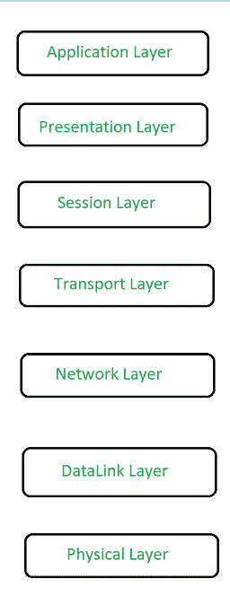
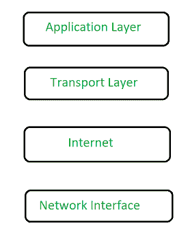

# TCP/IP 模型与 OSI 模型的相似之处

> 原文:[https://www . geesforgeks . org/相似点-TCP-IP-model-和-osi-model/](https://www.geeksforgeeks.org/similarities-between-tcp-ip-model-and-osi-model/)

网络主题的 TCP/IP 模型和现场视察模型有很多相似之处。但是在这里，我们将讨论与 TCP/IP 相关的几个要点，如下所示。

[**OSI 模型**](https://www.geeksforgeeks.org/layers-of-osi-model/)【T4:
开放系统互联简称 OSI 模型，由 7 层组成，每层都有一定的功能。这里是数据到达目的地之前流动的层，基本上从底层开始，当数据在网络的帮助下从地球上的一个位置传输到另一个位置时，在顶层结束。这些是现场视察网络模型中存在的层。

[**TCP/IP 模型**](https://www.geeksforgeeks.org/tcp-ip-model/)T4:
传输控制协议简称 TCP/IP 模型。它由 4 层组成，每层都对它有一定的作用。这里是数据到达目的地之前流动的层，基本上从底层开始，当数据在网络的帮助下从地球上的一个位置传输到另一个位置时，在顶层结束。这些是存在于 TCP/IP 模型中的层。

**TCP/IP 模型与 OSI 模型的相似之处:**
这些是 TCP/IP 与 OSI 模型的相似之处，具体如下。

<figure class="table">

| 没有 | 类似 | [TCP/IP 和 OSI 模型](https://www.geeksforgeeks.org/osi-tcp-ip-and-hybrid-models/) |
| --- | --- | --- |
| 1. | 模型 | 两者都是逻辑模型。 |
| 2. | 结构 | 两者都是分层排列的，这也称为架构模型。这些模型有一个协议堆栈，这意味着协议被安排在每一层。这两个模型都有一些协议。 |
| 3. | 建立工作关系网 | TCP/IP 都定义了网络标准。 |
| 4. | 结构 | TCP/IP 都为创建和实施网络标准和设备提供了一个框架。 |
| 5. | 沟通过程 | TCP/IP 都将网络通信过程划分为各自的层。 |
| 6. | 相似组件 | 在这两种 TCP/IP 模型中，制造商允许制造设备和网络组件集，这些设备和网络组件集可以共存，并与其他制造商制造的设备和组件一起工作。 |
| 7. | 功能 | 在两个 TCP/IP 模型中，一个单独的层定义了一个特定的功能，并且只为该功能设置标准。 |
| 8. | 解决纷争 | 两种 TCP/IP 模型都通过将该层的复杂功能划分为该层的更简单的组件来简化其故障排除过程。 |
| 9. | 以太网标准 | 而不是在 TCP/IP 模型中定义已经定义的标准和协议。例如，在创建这些模型之前，IEEE 已经定义了以太网标准。因此，与其在 IEEE 以太网标准的两个模型中再次定义它们。 |

**结论:**
在本节中，我们已经介绍了 OSI 和 TCP/IP 模型的概述，并且您将能够理解当 TCP/IP 和 OSI 模型都是计算机网络时的相似之处。

</figure>