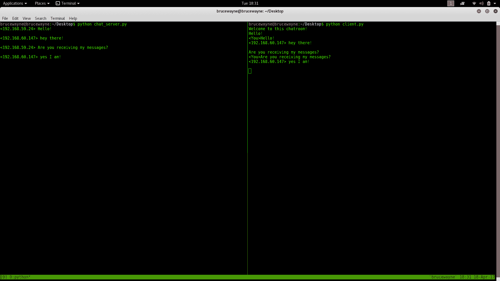

# 使用 Python 的简单聊天室

> 原文:[https://www . geesforgeks . org/simple-chat-room-use-python/](https://www.geeksforgeeks.org/simple-chat-room-using-python/)

本文演示了如何设置一个简单的聊天室服务器，并允许多个客户端使用客户端脚本连接到它。代码使用了套接字和线程的概念。

### **插座编程**

套接字可以被认为是双向通信信道中的端点，它在服务器和一个或多个客户端之间建立通信。这里，我们在每一端设置一个套接字，并允许一个客户端通过服务器与其他客户端交互。服务器端的套接字与服务器端的某个硬件端口相关联。任何拥有与同一端口相关联的套接字的客户端都可以与服务器套接字通信。

### **多线程**

线程是独立于任何其他线程运行一组命令的子进程。因此，每次用户连接到服务器时，都会为该用户创建一个单独的线程，并且从服务器到客户端的通信是基于为了每个客户端的身份而创建的套接字对象沿着各个线程进行的。
我们将需要两个脚本来建立这个聊天室。一个是保持服务运行，另一个是每个客户端都应该运行以便连接到服务器。

### **服务器端脚本**

服务器端脚本将尝试建立一个套接字，并将其绑定到用户指定的 IP 地址和端口(windows 用户可能必须在其防火墙设置中为指定的端口号破例，或者可以使用已经打开的端口)。然后，该脚本将保持打开状态并接收连接请求，并将相应的套接字对象追加到一个列表中，以跟踪活动的连接。每次用户连接时，
将为该用户创建一个单独的线程。在每个线程中，服务器等待一条消息，并将该消息发送给当前正在聊天的其他用户。如果服务器在尝试从特定线程接收消息时遇到错误，它将退出该线程。

### 用法

通过选择计算机上的任意一个作为服务器节点，并使用该计算机的私有 IP 地址作为服务器 IP 地址，可以在局域网上设置该服务器。
例如，如果局域网分配了一组私有 IP 地址，范围从 192.168.1.2 到 192.168.1.100，那么这 99 个节点中的任何一台计算机都可以充当服务器，其余节点可以使用服务器的私有 IP 地址连接到服务器节点。必须小心选择当前未使用的端口。例如，端口 22 是 ssh 的默认值，端口 80 是 HTTP 协议的默认值。所以最好不要使用或重新配置这两个端口，让它们免费使用。
但是，如果服务器需要通过本地网络访问，则需要公共 IP 地址才能使用。如果本地网络中的节点(不是路由器的节点)希望托管服务器，这将需要端口转发。在这种情况下，我们将要求所有到达公共 IP 地址的请求都被重新路由到我们本地网络中的私有 IP 地址，因此需要端口转发。
关于端口转发的更多阅读:[链接](https://en.wikipedia.org/wiki/Port_forwarding)
要运行脚本，只需从帖子底部指定的 GitHub 链接下载，保存在电脑上方便的位置即可。

```
/* Both the server and client script can then be run
   from the Command prompt (in Windows) or from bash 
   Terminal (Linux users) by simply typing 
   "python chat_server.py  " or "python client.py  ". 
   For example, */
python chat_server.py 192.168.55.13 8081
python client.py 192.168.55.13 8081
```

下面是服务器端脚本，必须一直运行才能保持聊天室运行。

## 蟒蛇 3

```
# Python program to implement server side of chat room.
import socket
import select
import sys
from thread import *

"""The first argument AF_INET is the address domain of the
socket. This is used when we have an Internet Domain with
any two hosts The second argument is the type of socket.
SOCK_STREAM means that data or characters are read in
a continuous flow."""
server = socket.socket(socket.AF_INET, socket.SOCK_STREAM)
server.setsockopt(socket.SOL_SOCKET, socket.SO_REUSEADDR, 1)

# checks whether sufficient arguments have been provided
if len(sys.argv) != 3:
    print ("Correct usage: script, IP address, port number")
    exit()

# takes the first argument from command prompt as IP address
IP_address = str(sys.argv[1])

# takes second argument from command prompt as port number
Port = int(sys.argv[2])

"""
binds the server to an entered IP address and at the
specified port number.
The client must be aware of these parameters
"""
server.bind((IP_address, Port))

"""
listens for 100 active connections. This number can be
increased as per convenience.
"""
server.listen(100)

list_of_clients = []

def clientthread(conn, addr):

    # sends a message to the client whose user object is conn
    conn.send("Welcome to this chatroom!")

    while True:
            try:
                message = conn.recv(2048)
                if message:

                    """prints the message and address of the
                    user who just sent the message on the server
                    terminal"""
                    print ("<" + addr[0] + "> " + message)

                    # Calls broadcast function to send message to all
                    message_to_send = "<" + addr[0] + "> " + message
                    broadcast(message_to_send, conn)

                else:
                    """message may have no content if the connection
                    is broken, in this case we remove the connection"""
                    remove(conn)

            except:
                continue

"""Using the below function, we broadcast the message to all
clients who's object is not the same as the one sending
the message """
def broadcast(message, connection):
    for clients in list_of_clients:
        if clients!=connection:
            try:
                clients.send(message)
            except:
                clients.close()

                # if the link is broken, we remove the client
                remove(clients)

"""The following function simply removes the object
from the list that was created at the beginning of
the program"""
def remove(connection):
    if connection in list_of_clients:
        list_of_clients.remove(connection)

while True:

    """Accepts a connection request and stores two parameters,
    conn which is a socket object for that user, and addr
    which contains the IP address of the client that just
    connected"""
    conn, addr = server.accept()

    """Maintains a list of clients for ease of broadcasting
    a message to all available people in the chatroom"""
    list_of_clients.append(conn)

    # prints the address of the user that just connected
    print (addr[0] + " connected")

    # creates and individual thread for every user
    # that connects
    start_new_thread(clientthread,(conn,addr))    

conn.close()
server.close()
```

### 客户端**脚本**

客户端脚本将简单地尝试访问在指定的 IP 地址和端口创建的服务器套接字。一旦连接，它将不断检查输入是来自服务器还是来自客户端，并相应地重定向输出。如果输入来自服务器，它会在终端上显示消息。如果输入来自用户，它会将用户输入的消息发送到服务器，以便向其他用户广播。
这是客户端脚本，每个用户必须使用它才能连接到服务器。

## 蟒蛇 3

```
# Python program to implement client side of chat room.
import socket
import select
import sys

server = socket.socket(socket.AF_INET, socket.SOCK_STREAM)
if len(sys.argv) != 3:
    print ("Correct usage: script, IP address, port number")
    exit()
IP_address = str(sys.argv[1])
Port = int(sys.argv[2])
server.connect((IP_address, Port))

while True:

    # maintains a list of possible input streams
    sockets_list = [sys.stdin, server]

    """ There are two possible input situations. Either the
    user wants to give manual input to send to other people,
    or the server is sending a message to be printed on the
    screen. Select returns from sockets_list, the stream that
    is reader for input. So for example, if the server wants
    to send a message, then the if condition will hold true
    below.If the user wants to send a message, the else
    condition will evaluate as true"""
    read_sockets,write_socket, error_socket = select.select(sockets_list,[],[])

    for socks in read_sockets:
        if socks == server:
            message = socks.recv(2048)
            print (message)
        else:
            message = sys.stdin.readline()
            server.send(message)
            sys.stdout.write("<You>")
            sys.stdout.write(message)
            sys.stdout.flush()
server.close()
```

**输出:**

在下面给出的图片中，在终端的左侧已经初始化了一个服务器，在终端的右侧初始化了一个客户端脚本。(终端拆分使用 tmux 完成，‘sudo apt-get install tmux’)。出于初始化的目的，您可以看到每当用户发送消息时，消息和 IP 地址都会显示在服务器端。



下图是同一台服务器上两个人的基本对话。多个客户端可以以相同的方式连接到服务器！


链接下载脚本:[链接](https://github.com/dvatsav/Chat-Room-server)
本文由 **Deepak Srivatsav** 供稿。如果你喜欢 GeeksforGeeks 并想投稿，你也可以使用[contribute.geeksforgeeks.org](http://www.contribute.geeksforgeeks.org)写一篇文章或者把你的文章邮寄到 contribute@geeksforgeeks.org。看到你的文章出现在极客博客主页上，帮助其他极客。
如果发现有不正确的地方，或者想分享更多关于上述话题的信息，请写评论。