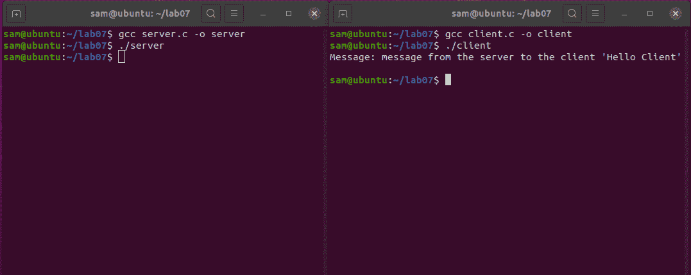

# C 语言中简单的客户端/服务器应用

> 原文:[https://www . geesforgeks . org/simple-client-server-application-in-c/](https://www.geeksforgeeks.org/simple-client-server-application-in-c/)

**概述:**
使用[套接字编程](https://www.geeksforgeeks.org/socket-programming-cc/)的概念，在 [C](https://www.geeksforgeeks.org/c-language-set-1-introduction/) 中创建一个简单的客户端/服务器应用程序。服务器在连接时向客户端发送一些消息。

**客户端:**
在本节中，通过用于实现客户端的不同功能，定义了术语“客户端”，并详细解释了其套接字工作流。在个人计算机上运行的应用程序。它有一个广泛而吸引人的用户界面，但是它没有可以操作或呈现给用户的数据。客户端应用程序“询问”用户想要什么，然后连接到服务器应用程序以获取该数据。一旦获得了数据，它就会以一种很好的格式呈现给用户。客户端通常一次从一个服务器获取数据，并且只与一个用户交互。

**客户端工作流程:**

*   任何套接字编程的第一部分都是创建套接字本身。
*   客户端套接字是通过套接字()调用创建的。socket()函数返回一个整数。在套接字调用中，我们指定了以下参数
    *   域:IPv4(由 _INET 表示)
    *   套接字类型:TCP/UDP (SOCK_STREAM)
    *   协议:IP (0)
*   通过 connect()调用创建到远程地址的连接。在这里，我们指定要连接的 IP 地址和端口。如果连接成功，将返回一个值。
*   使用 recv()调用检索数据。接收到的数据可以存储在文件中，也可以存储在字符串中。
*   通过 connect()调用创建到远程地址的连接。在这里，我们指定要连接的 IP 地址和端口。如果连接成功，将返回一个值。
*   使用 recv()调用检索数据。接收到的数据可以存储在文件中，也可以存储在字符串中。

**代码实现–**

## C

```
#include <netinet/in.h> //structure for storing address information
#include <stdio.h>
#include <stdlib.h>
#include <sys/socket.h> //for socket APIs
#include <sys/types.h>

int main(int argc, char const* argv[])
{
    int sockD = socket(AF_INET, SOCK_STREAM, 0);

    struct sockaddr_in servAddr;

    servAddr.sin_family = AF_INET;
    servAddr.sin_port
        = htons(9001); // use some unused port number
    servAddr.sin_addr.s_addr = INADDR_ANY;

    int connectStatus
        = connect(sockD, (struct sockaddr*)&servAddr,
                  sizeof(servAddr));

    if (connectStatus == -1) {
        printf("Error...\n");
    }

    else {
        char strData[255];

        recv(sockD, strData, sizeof(strData), 0);

        printf("Message: %s\n", strData);
    }

    return 0;
}
```

**服务器:**
在本节中，通过用于实现服务器的不同功能，定义了术语“服务器”，并详细解释了其套接字工作流。应用程序在大型计算机上运行(大型意味着快速或大存储空间或两者都有)。服务器应用程序通常以不提供任何与用户交互的方法的方式编写。相反，它等待其他程序连接。通常，服务器应用程序可以控制大量数据，并且可以快速高效地访问这些数据。它还可以同时(或多或少)处理许多客户端的请求。

**服务器套接字工作流:**

*   首先，将创建一个套接字(类似于客户端程序)。
*   接下来，将使用 bind()函数绑定套接字的 IP 和端口(客户端使用 connect()函数连接到服务器；服务器将使用 bind()函数监听连接)。
*   然后调用 listen()函数来监听连接(查看是否有客户端试图连接到服务器套接字)。
*   调用函数 accept()。该函数返回一个客户端套接字(已连接的客户端)。

**代码实现–**

## C

```
#include <netinet/in.h> //structure for storing address information
#include <stdio.h>
#include <stdlib.h>
#include <sys/socket.h> //for socket APIs
#include <sys/types.h>

int main(int argc, char const* argv[])
{

    // create server socket similar to what was done in
    // client program
    int servSockD = socket(AF_INET, SOCK_STREAM, 0);

    // string store data to send to client
    char serMsg[255] = "Message from the server to the "
                       "client \'Hello Client\' ";

    // define server address
    struct sockaddr_in servAddr;

    servAddr.sin_family = AF_INET;
    servAddr.sin_port = htons(9001);
    servAddr.sin_addr.s_addr = INADDR_ANY;

    // bind socket to the specified IP and port
    bind(servSockD, (struct sockaddr*)&servAddr,
         sizeof(servAddr));

    // listen for connections
    listen(servSockD, 1);

    // integer to hold client socket.
    int clientSocket = accept(servSockD, NULL, NULL);

    // send's messages to client socket
    send(clientSocket, serMsg, sizeof(serMsg), 0);

    return 0;
}
```

**执行指令:**

1.  在你的机器上打开两个终端，在不同的终端上编译服务器和客户端程序。
2.  首先运行服务器程序，然后运行客户端程序。
3.  可以看到，服务器发送的数据打印在运行客户端程序的终端上



**参考:**[](http://pirate.shu.edu/~wachsmut/Teaching/CSAS2214/Virtual/Lectures/lecture17.html) **[http://pirator . Shu . edu/~ wachsmut/Teaching/CSAs 2214/Virtual/听课/讲师 17.html](http://pirate.shu.edu/~wachsmut/Teaching/CSAS2214/Virtual/Lectures/lecture17.html)**