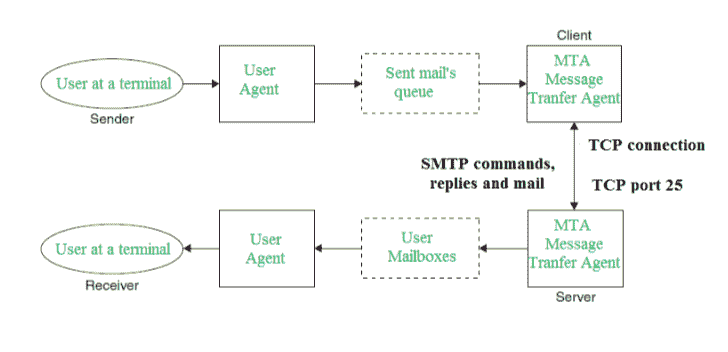

# 简单邮件传输协议(SMTP)

> 原文:[https://www . geesforgeks . org/simple-mail-transfer-protocol-SMTP/](https://www.geeksforgeeks.org/simple-mail-transfer-protocol-smtp/)

电子邮件正在成为当今互联网上最有价值的服务之一。大多数互联网系统使用 SMTP 作为从一个用户向另一个用户传输邮件的方法。SMTP 是一种推送协议，用于发送邮件，而 POP(邮局协议)或 IMAP(互联网消息访问协议)用于在接收方检索这些电子邮件。

**SMTP 基础**
SMTP 是应用层协议。想要发送邮件的客户端打开到 SMTP 服务器的 TCP 连接，然后通过该连接发送邮件。SMTP 服务器是一种始终在线的侦听模式。只要侦听到来自任何客户端的 TCP 连接，SMTP 进程就会通过端口 25 启动连接。成功建立 TCP 连接后，客户端进程会立即发送邮件。

**SMTP 协议**

SMTP 模型有两种类型:

1.  端到端方法
2.  存储转发法

端到端模型用于不同组织之间的通信，而存储转发方法用于组织内部。想要发送邮件的 SMTP 客户端将直接联系目标主机 SMTP，以便将邮件发送到目标。在邮件成功复制到收件人的 SMTP 之前，SMTP 服务器将保持邮件不变。
客户端 SMTP 是发起会话的那个，所以我们称之为客户端- SMTP，服务器 SMTP 是响应会话请求的那个，所以我们称之为接收者-SMTP。客户端- SMTP 将启动会话，接收方-SMTP 将响应请求。

**SMTP 系统模型**

在 SMTP 模型中，用户与用户代理打交道，例如微软 Outlook、网景、Mozilla 等。为了使用 TCP 交换邮件，使用了 MTA。发送邮件的用户不必与 MTA 打交道，因为设置本地 MTA 是系统管理员的责任。MTA 保持着一个小的邮件队列，以便在收件人不在的情况下可以安排邮件的重复投递。MTA 将邮件发送到邮箱，用户代理稍后可以下载这些信息。

**SMTP 客户端和 SMTP 服务器都应该有两个组件:**

1.  用户代理
2.  MTA 本地人

**发送方和接收方之间的通信:**
发送方的用户代理准备消息并将其发送到 MTA。MTA 的责任是通过网络将邮件传送到收件人的 MTA。要发送邮件，系统必须有客户端 MTA，要接收邮件，系统必须有服务器 MTA。

**发送电子邮件:**
邮件是由客户端和服务器之间的一系列请求和响应消息发送的。通过网络发送的信息由一个标题和一个正文组成。空行用于终止邮件头，空行之后的所有内容都被视为邮件的正文，这是一个 ASCII 字符序列。消息正文包含收据读取的实际信息。

**接收电子邮件:**
服务器端的用户代理以特定的时间间隔检查邮箱。如果收到任何信息，它会通知用户有关邮件的信息。当用户尝试阅读邮件时，它会显示一个电子邮件列表，其中包含邮箱中每封邮件的简短描述。通过选择任何邮件，用户可以在终端上查看其内容。

**一些 SMTP 命令:**

*   HELO–向服务器标识客户端，完全限定的域名，每个会话只发送一次
*   邮件–发起消息传输，发起者的完全合格域
*   RCPT–跟随 MAIL，识别收件人，通常是收件人的完全限定名，对于多个收件人，每个收件人使用一个 RCPT
*   数据–逐行发送数据

本文由**莫尼卡·辛格**供稿