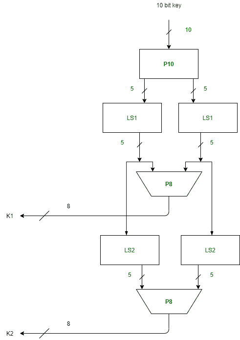
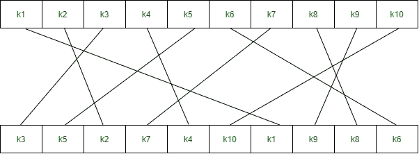
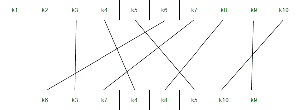
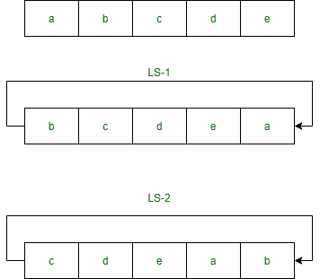

# 简化数据加密标准密钥生成

> 原文:[https://www . geesforgeks . org/simplified-data-encryption-standard-key-generation/](https://www.geeksforgeeks.org/simplified-data-encryption-standard-key-generation/)

简化数据加密标准是 [DES 算法](https://www.geeksforgeeks.org/data-encryption-standard-des-set-1/)的简单版本。它类似于 [DES](https://www.geeksforgeeks.org/des-full-form/) 算法，但比 DES 算法更小，参数更少。它是为了教育目的而制作的，这样理解 DES 会变得更简单。它是一种分组密码，将一个明文块转换成密文。它需要一个 8 位的块。

这是一种对称密钥密码，即加密和解密使用相同的密钥。在本文中，我们将演示 s-des 加密和解密算法的密钥生成。我们取一个随机的 10 位密钥，产生两个 8 位密钥，用于加密和解密。

**密钥生成概念:**在密钥生成算法中，我们接受 10 位密钥，并将其转换为两个 8 位密钥。该密钥由发送方和接收方共享。



**在密钥生成中，我们使用三个函数:**

**1。排列 P10**



**2。排列 P8**



**3。左移**



**步骤 1:** 我们接受了一个 10 位的密钥，并通过将这些位放入 P10 表中来置换它们。

```
Key = 1 0 1 0 0 0 0 0 1 0
(k1, k2, k3, k4, k5, k6, k7, k8, k9, k10) = (1, 0, 1, 0, 0, 0, 0, 0, 1, 0)

P10 Permutation is: P10(k1, k2, k3, k4, k5, k6, k7, k8, k9, k10) = (k3, k5, k2, k7, k4, k10, k1, k9, k8, k6) 
After P10, we get 1 0 0 0 0 0 1 1 0 0
```

**第二步:**我们将密钥分成两半，每一半 5 位。

```
l=1 0 0 0 0, r=0 1 1 0 0
```

**第 3 步:**现在我们在每个键上应用一位左移。

```
l = 0 0 0 0 1, r = 1 1 0 0 0 
```

**第 4 步:**在第 3 步后组合两个键，并通过将它们放入 P8 表来置换位。给定表的输出是第一个键 K1。

```
After LS-1 combined, we get 0 0 0 0 1 1 1 0 0 0
P8 permutation is: P8(k1, k2, k3, k4, k5, k6, k7, k8, k9, k10) = (k6, k3, k7, k4, k8, k5, k10, k9)
After P8, we get Key-1 : 1 0 1 0 0 1 0 0
```

**步骤 5:** 从步骤 3 获得的输出，即一位左移后的 2 个半，应该再次经历两位左移的过程。

```
Step 3 output - l = 0 0 0 0 1, r = 1 1 0 0 0 
After two bit shift - l = 0 0 1 0 0, r = 0 0 0 1 1
```

**第 6 步:**将第 5 步得到的 2 个一半组合起来，放入 P8 表中进行置换。给定表的输出是第二个键 K2。

```
After LS-2 combined = 0 0 1 0 0 0 0 0 1 1
P8 permutation is: P8(k1, k2, k3, k4, k5, k6, k7, k8, k9, k10) = (k6, k3, k7, k4, k8, k5, k10, k9)
After P8, we get Key-2 : 0 1 0 0 0 0 1 1
```

**最终输出:**

```
Key-1 is: 1 0 1 0 0 1 0 0
Key-2 is: 0 1 0 0 0 0 1 1
```