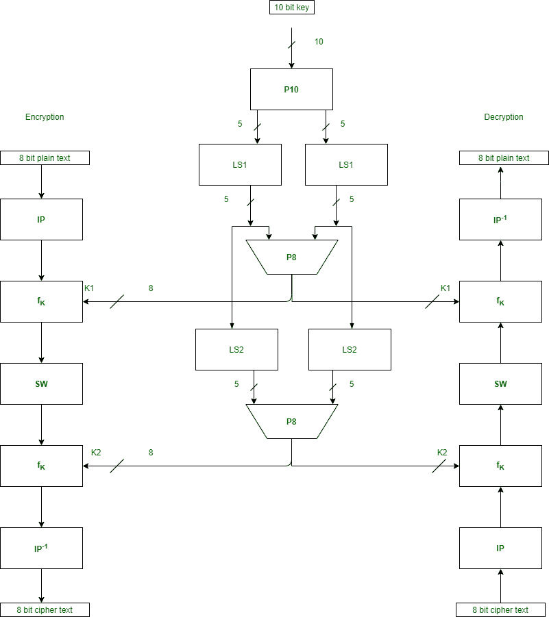
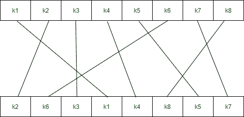
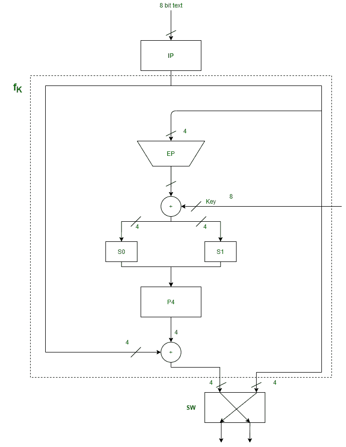
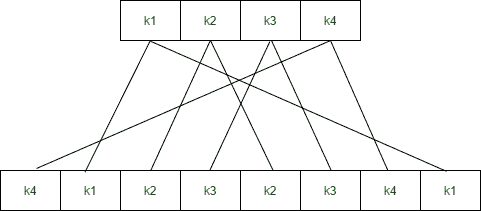
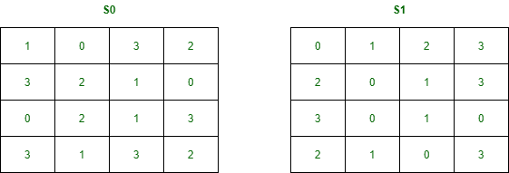
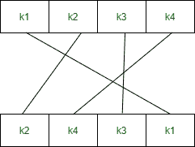
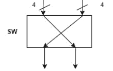
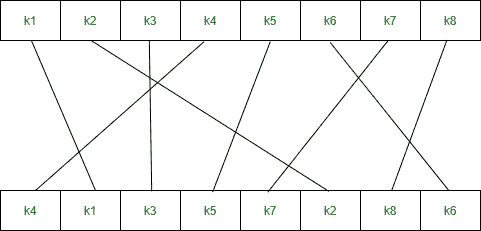

# 简化数据加密标准|第二套

> 原文:[https://www . geesforgeks . org/simplified-data-encryption-standard-set-2/](https://www.geeksforgeeks.org/simplified-data-encryption-standard-set-2/)

**先决条件–**[简化数据加密标准|第 1 套](https://www.geeksforgeeks.org/simplified-data-encryption-standard-key-generation/)

**简化数据加密标准**是[数据加密标准](https://www.geeksforgeeks.org/data-encryption-standard-des-set-1/)的简单版本，具有 10 位密钥和 8 位纯文本。它比 DES 算法小得多，因为它只接受 8 位纯文本，而 DES 接受 64 位纯文本。它是为教育目的开发的，因此理解 DES 变得容易。这是一种分组密码算法，其算法使用对称密钥，即加密和解密使用相同的密钥。它有两轮加密，使用两种不同的密钥。

首先，我们需要在加密之前生成 2 个密钥。生成密钥后，我们将它们传递给每一轮进行 s-des 加密。下图显示了 s-des 算法中涉及的步骤。



**组件:**
S-DES 加密涉及四个功能–

**1。初始排列(IP)–**



**2。复变函数(f<sub>k</sub>)–**
它是置换函数和置换函数的组合。下图代表一轮加密和解密。这一轮在每次加密和解密中重复两次。



f <sub>k</sub> 中的组件是–
**a .扩展排列(EP)–**
它接受 4 位输入并将其转换为 8 位输出。



**b. S 盒(S0 和 S1)–**
它是执行替换的对称密钥算法的基本组件。



**c .置换 P4–**



**3。开关(西南)–**



**4。初始排列的逆(IP<sup>-1</sup>)–**



**首先**，**我们需要在加密之前生成 2 个密钥。**

```
Consider, the entered 10-bit key is - 1 0 1 0 0 0 0 0 1 0
```

因此，

```
Key-1 is - 1 0 1 0 0 1 0 0
Key-2 is - 0 1 0 0 0 0 1 1
```

#### 加密–

```
Entered 8-bit plaintext is - 1 0 0 1 0 1 1 1
```

**步骤-1:**
我们使用 IP 表对我们的 8 位纯文本执行初始排列。初始排列定义为–

```
IP(k1, k2, k3, k4, k5, k6, k7, k8) = (k2, k6, k3, k1, k4, k8, k5, k7)
After ip = 0 1 0 1 1 1 0 1
```

**步骤 2:**
在初始排列之后，我们得到一个 8 位的文本块，我们将它分成两部分，每部分 4 位。

```
l = 0 1 0 1  and r = 1 1 0 1
```

在右半部分，我们使用 EP 表执行扩展置换，该表将 4 位转换为 8 位。扩展排列定义为–

```
EP(k1, k2, k3, k4) = (k4, k1, k2, k3, k2, k3, k4, k1)
```

```
After ep = 1 1 1 0 1 0 1 1
```

我们使用第一个密钥 K1 和扩展置换的输出来执行异或运算。

```
Key-1 is - 1 0 1 0 0 1 0 0
(1 0 1 0 0 1 0 0) XOR (1 1 1 0 1 0 1 1) =  0 1 0 0 1 1 1 1
After XOR operation with 1st Key = 0 1 0 0 1 1 1 1
```

我们再次将异或的输出分成两半，每一半 4 位。

```
l = 0 1 0 0  and r = 1 1 1 1
```

对于我们的 S 盒，我们将第一个和第四个位作为行，第二个和第三个位作为列。

```
S0 = [1,0,3,2
      3,2,1,0
      0,2,1,3
      3,1,3,2]

S1=  [0,1,2,3
      2,0,1,3
      3,0,1,0
      2,1,0,3]

For l = 0 1 0 0
row = 00 = 0, column = 10 = 2
S0 = 3 = 11

For r = 1 1 1 1 
row = 11 = 3, column = 11 = 3
S1 = 3 = 11

After first S-Boxes combining S0 and S1 = 1 1 1 1
```

S boxes 给出了一个 2 位输出，我们将它组合起来得到 4 位，然后使用 P4 表执行置换。P4 被定义为–

```
P4(k1, k2, k3, k4) = (k2, k4, k3, k1)
After P4 = 1 1 1 1
```

我们将 P4 表的输出与初始置换表即 IP 表的左半部分进行异或运算。

```
(0 1 0 1) XOR (1 1 1 1) = 1 0 1 0
After XOR operation with left nibble of after ip = 1 0 1 0
```

我们结合了两部分，即初始排列的右半部分和 ip 的输出。

```
Combine 1 1 0 1 and 1 0 1 0
After combine = 1 0 1 0 1 1 0 1
```

**步骤 3:**
现在，将输出分成两半，每一半 4 位。再把它们组合起来，但是现在左边的部分应该变成右边，右边的部分应该变成左边。

```
After step 3 = 1 1 0 1 1 0 1 0
```

**步骤-4:**
再次执行步骤 2，但这一次在进行异或运算后进行扩展排列时使用密钥 2 而不是密钥 1。

```
Expand permutation is defined as - 4 1 2 3 2 3 4 1
After second ep = 0 1 0 1 0 1 0 1
After XOR operation with 2nd Key = 0 0 0 1 0 1 1 0
After second S-Boxes = 1 1 1 1

P4 is defined as - 2 4 3 1
After P4 = 1 1 1 1

After XOR operation with left nibble of after first part = 0 0 1 0
After second part = 0 0 1 0 1 0 1 0

l = 1 1 0 1  and r = 1 0 1 0
```

在右半部分，我们使用 EP 表执行扩展置换，该表将 4 位转换为 8 位。扩展排列定义为–

```
EP(k1, k2, k3, k4) = (k4, k1, k2, k3, k2, k3, k4, k1)
After second ep = 0 1 0 1 0 1 0 1
```

我们使用第二密钥 K2 和扩展置换的输出来执行异或运算。

```
Key-2 is - 0 1 0 0 0 0 1 1
(0 1 0 0 0 0 1 1) XOR (0 1 0 1 0 1 0 1) =  0 0 0 1 0 1 1 0
After XOR operation with 2nd Key = 0 0 0 1 0 1 1 0
```

我们再次将异或的输出分成两半，每一半 4 位。

```
l = 0 0 0 1  and r = 0 1 1 0
```

对于我们的 S 盒，我们将第一个和第四个位作为行，第二个和第三个位作为列。

```
S0 = [1,0,3,2
      3,2,1,0
      0,2,1,3
      3,1,3,2]

S1 = [0,1,2,3
      2,0,1,3
      3,0,1,0
      2,1,0,3]

For l = 0 0 0 1
row = 01 = 1 , column = 00 = 0
S0 = 3 = 11

For r = 0 1 1 0
row = 00 = 0 , column = 11 = 3
S1 = 3 = 11

After first S-Boxes combining S0 and S1 = 1 1 1 1
```

S boxes 给出了一个 2 位输出，我们将它组合起来得到 4 位，然后使用 P4 表执行置换。P4 被定义为–

```
P4(k1, k2, k3, k4) = (k2, k4, k3, k1)
After P4 = 1 1 1 1
```

我们将 P4 表的输出与初始置换表即 IP 表的左半部分进行异或运算。

```
(1 1 0 1) XOR (1 1 1 1) = 0 0 1 0
After XOR operation with left nibble of after first part = 0 0 1 0
```

我们结合了两部分，即初始排列的右半部分和 ip 的输出。

```
Combine 1 0 1 0 and 0 0 1 0
After combine = 0 0 1 0 1 0 1 0
After second part = 0 0 1 0 1 0 1 0
```

**步骤-5:**
执行逆初始排列。该表的输出是 8 位的密文。

```
Output of step 4 : 0 0 1 0 1 0 1 0
```

逆初始排列定义为–

```
IP-1(k1, k2, k3, k4, k5, k6, k7, k8) = (k4, k1, k3, k5, k7, k2, k8, k6)
```

**8 位密文将为= 0 0 1 1 0 0 0**

## Java 语言(一种计算机语言，尤用于创建网站)

```
/*package whatever //do not write package name here */

import java.io.*;

public class GFG {
    // int key[]= {0,0,1,0,0,1,0,1,1,1};
    int key[] = {
        1, 0, 1, 0, 0, 0, 0, 0, 1, 0
    }; // extra example for checking purpose
    int P10[] = { 3, 5, 2, 7, 4, 10, 1, 9, 8, 6 };
    int P8[] = { 6, 3, 7, 4, 8, 5, 10, 9 };

    int key1[] = new int[8];
    int key2[] = new int[8];

    int[] IP = { 2, 6, 3, 1, 4, 8, 5, 7 };
    int[] EP = { 4, 1, 2, 3, 2, 3, 4, 1 };
    int[] P4 = { 2, 4, 3, 1 };
    int[] IP_inv = { 4, 1, 3, 5, 7, 2, 8, 6 };

    int[][] S0 = { { 1, 0, 3, 2 },
                   { 3, 2, 1, 0 },
                   { 0, 2, 1, 3 },
                   { 3, 1, 3, 2 } };
    int[][] S1 = { { 0, 1, 2, 3 },
                   { 2, 0, 1, 3 },
                   { 3, 0, 1, 0 },
                   { 2, 1, 0, 3 } };

    //    this function basically generates the key(key1 and
    //key2)     using P10 and P8 with (1 and 2)left shifts

    void key_generation()
    {
        int key_[] = new int[10];

        for (int i = 0; i < 10; i++) {
            key_[i] = key[P10[i] - 1];
        }

        int Ls[] = new int[5];
        int Rs[] = new int[5];

        for (int i = 0; i < 5; i++) {
            Ls[i] = key_[i];
            Rs[i] = key_[i + 5];
        }

        int[] Ls_1 = shift(Ls, 1);
        int[] Rs_1 = shift(Rs, 1);

        for (int i = 0; i < 5; i++) {
            key_[i] = Ls_1[i];
            key_[i + 5] = Rs_1[i];
        }

        for (int i = 0; i < 8; i++) {
            key1[i] = key_[P8[i] - 1];
        }

        int[] Ls_2 = shift(Ls, 2);
        int[] Rs_2 = shift(Rs, 2);

        for (int i = 0; i < 5; i++) {
            key_[i] = Ls_2[i];
            key_[i + 5] = Rs_2[i];
        }

        for (int i = 0; i < 8; i++) {
            key2[i] = key_[P8[i] - 1];
        }

        System.out.println("Your Key-1 :");

        for (int i = 0; i < 8; i++)
            System.out.print(key1[i] + " ");

        System.out.println();
        System.out.println("Your Key-2 :");

        for (int i = 0; i < 8; i++)
            System.out.print(key2[i] + " ");
    }

    //    this function is use full for shifting(circular) the
    //array n position towards left

    int[] shift(int[] ar, int n)
    {
        while (n > 0) {
            int temp = ar[0];
            for (int i = 0; i < ar.length - 1; i++) {
                ar[i] = ar[i + 1];
            }
            ar[ar.length - 1] = temp;
            n--;
        }
        return ar;
    }

    //    this is main encryption function takes plain text as
    //input     uses another functions and returns the array of
    //cipher text

    int[] encryption(int[] plaintext)
    {
        int[] arr = new int[8];

        for (int i = 0; i < 8; i++) {
            arr[i] = plaintext[IP[i] - 1];
        }
        int[] arr1 = function_(arr, key1);

        int[] after_swap = swap(arr1, arr1.length / 2);

        int[] arr2 = function_(after_swap, key2);

        int[] ciphertext = new int[8];

        for (int i = 0; i < 8; i++) {
            ciphertext[i] = arr2[IP_inv[i] - 1];
        }

        return ciphertext;
    }

    // decimal to binary string 0-3

    String binary_(int val)
    {
        if (val == 0)
            return "00";
        else if (val == 1)
            return "01";
        else if (val == 2)
            return "10";
        else
            return "11";
    }

    //    this function is doing core things like expansion
    //    then xor with desired key then S0 and S1
    //substitution     P4 permutation and again xor     we have used
    //this function 2 times(key-1 and key-2) during
    //encryption and     2 times(key-2 and key-1) during
    //decryption

    int[] function_(int[] ar, int[] key_)
    {

        int[] l = new int[4];
        int[] r = new int[4];

        for (int i = 0; i < 4; i++) {
            l[i] = ar[i];
            r[i] = ar[i + 4];
        }

        int[] ep = new int[8];

        for (int i = 0; i < 8; i++) {
            ep[i] = r[EP[i] - 1];
        }

        for (int i = 0; i < 8; i++) {
            ar[i] = key_[i] ^ ep[i];
        }

        int[] l_1 = new int[4];
        int[] r_1 = new int[4];

        for (int i = 0; i < 4; i++) {
            l_1[i] = ar[i];
            r_1[i] = ar[i + 4];
        }

        int row, col, val;

        row = Integer.parseInt("" + l_1[0] + l_1[3], 2);
        col = Integer.parseInt("" + l_1[1] + l_1[2], 2);
        val = S0[row][col];
        String str_l = binary_(val);

        row = Integer.parseInt("" + r_1[0] + r_1[3], 2);
        col = Integer.parseInt("" + r_1[1] + r_1[2], 2);
        val = S1[row][col];
        String str_r = binary_(val);

        int[] r_ = new int[4];
        for (int i = 0; i < 2; i++) {
            char c1 = str_l.charAt(i);
            char c2 = str_r.charAt(i);
            r_[i] = Character.getNumericValue(c1);
            r_[i + 2] = Character.getNumericValue(c2);
        }
        int[] r_p4 = new int[4];
        for (int i = 0; i < 4; i++) {
            r_p4[i] = r_[P4[i] - 1];
        }

        for (int i = 0; i < 4; i++) {
            l[i] = l[i] ^ r_p4[i];
        }

        int[] output = new int[8];
        for (int i = 0; i < 4; i++) {
            output[i] = l[i];
            output[i + 4] = r[i];
        }
        return output;
    }

    //    this function swaps the nibble of size n(4)

    int[] swap(int[] array, int n)
    {
        int[] l = new int[n];
        int[] r = new int[n];

        for (int i = 0; i < n; i++) {
            l[i] = array[i];
            r[i] = array[i + n];
        }

        int[] output = new int[2 * n];
        for (int i = 0; i < n; i++) {
            output[i] = r[i];
            output[i + n] = l[i];
        }

        return output;
    }

    //    this is main decryption function
    //    here we have used all previously defined function
    //    it takes cipher text as input and returns the array
    //of     decrypted text

    int[] decryption(int[] ar)
    {
        int[] arr = new int[8];

        for (int i = 0; i < 8; i++) {
            arr[i] = ar[IP[i] - 1];
        }

        int[] arr1 = function_(arr, key2);

        int[] after_swap = swap(arr1, arr1.length / 2);

        int[] arr2 = function_(after_swap, key1);

        int[] decrypted = new int[8];

        for (int i = 0; i < 8; i++) {
            decrypted[i] = arr2[IP_inv[i] - 1];
        }

        return decrypted;
    }

    public static void main(String[] args)
    {

        GFG obj = new GFG();

        obj.key_generation(); // call to key generation
                              // function

        // int []plaintext= {1,0,1,0,0,1,0,1};
        int[] plaintext = {
            1, 0, 0, 1, 0, 1, 1, 1
        }; // extra example for checking purpose

        System.out.println();
        System.out.println("Your plain Text is :");
        for (int i = 0; i < 8; i++) // printing the
                                    // plaintext
            System.out.print(plaintext[i] + " ");

        int[] ciphertext = obj.encryption(plaintext);

        System.out.println();
        System.out.println(
            "Your cipher Text is :"); // printing the cipher
                                      // text
        for (int i = 0; i < 8; i++)
            System.out.print(ciphertext[i] + " ");

        int[] decrypted = obj.decryption(ciphertext);

        System.out.println();
        System.out.println(
            "Your decrypted Text is :"); // printing the
                                         // decrypted text
        for (int i = 0; i < 8; i++)
            System.out.print(decrypted[i] + " ");
    }
}

//Omkar Varhadi
```

**Output**

```
Your Key-1 :
1 0 1 0 0 1 0 0 
Your Key-2 :
0 1 0 0 0 0 1 1 
Your plain Text is :
1 0 0 1 0 1 1 1 
Your cipher Text is :
0 0 1 1 1 0 0 0 
Your decrypted Text is :
1 0 0 1 0 1 1 1 
```