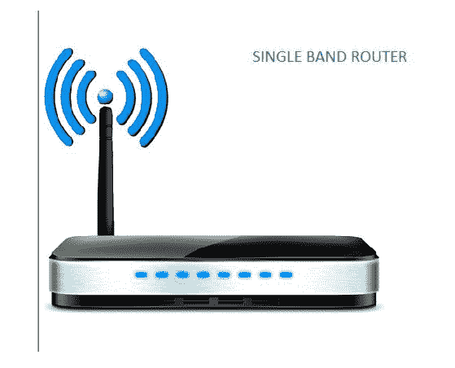
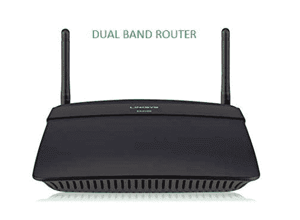
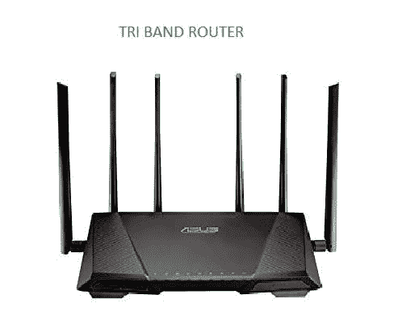

# 单频段、双频段和多频段路由器

> 原文:[https://www . geeksforgeeks . org/单带双带多带路由器/](https://www.geeksforgeeks.org/single-band-double-band-and-multi-band-routers/)

[路由器](https://www.geeksforgeeks.org/network-devices-hub-repeater-bridge-switch-router-gateways/)是我们日常生活中的数字家电。路由器的性能对我们的 Wi-Fi 在线体验有很大的影响，所以选择合适的路由器非常重要。路由器连接多个网络并将数据包转发到其他网络。

**1。单带路由器:**

*   它仅限于一个频带，也称为“无线网络”。
*   2.4 千兆赫频段的单频段路由器理论速度高达 800 兆比特/秒。互联网服务限制就是一个例子。
*   用户可能会遇到频繁的连接问题，从而影响无线网络的速度和灵活性。
*   单波段路由器不支持设备优先级和基于应用程序的监控等现代功能。
*   单波段路由器的范围较短，信号强度较低。
*   成本是经济的，因此最适合较小的家庭。

*单带路由器*用于:

*   网上冲浪
*   电子邮件
*   网上聊天
*   查看照片

**2。双频路由器:**

*   一台 2.4 千兆赫的双频路由器使用 5 千兆赫的频带。
*   与单波段路由器相比，它具有相对更好的速度和更长的范围。
*   双频路由器通过提供更高的稳定性和范围来支持许多现代硬件设备。
*   连接设备的数量对无线网络的速度有影响，其中几个可能会降低一点速度。
*   波段之间可以自动切换。
*   成本昂贵，因此最适合较大的家庭。

*双频路由器*用于:

*   高清流媒体
*   大型文件传输
*   电影
*   游戏应用

**3。三波段路由器:**

*   三频段路由器支持 2.4 千兆赫和两个 5 千兆赫频段。
*   在不影响无线网络速度的情况下，可以轻松连接尽可能多的设备。
*   由于三个独立的无线频段，带宽增加了三倍。
*   高效处理多个设备和更快的文件传输是三带路由器高 CPU 速度的结果。
*   如果你没有很多兼容 5 Ghz 的 Wi-Fi 设备，升级可能不会太明显，这里多一个 5 GHz 就相当于多了一个 LAN。
*   与单波段和双波段路由器相比，成本最高。

*三带路由器*用于:

*   流式设备
*   网络游戏
*   多个设备

选择路由器时**必须考虑以下因素:**

1.  所需的网络速度
2.  应用场景
3.  兼容设备
4.  价格

如果需求对应于小型家庭，则可以使用成本较低的单波段路由器。然而，对于更大的区域和优化家庭/办公室的互联网速度，可以使用双频路由器或三频带路由器，但是可能会出现兼容性问题。