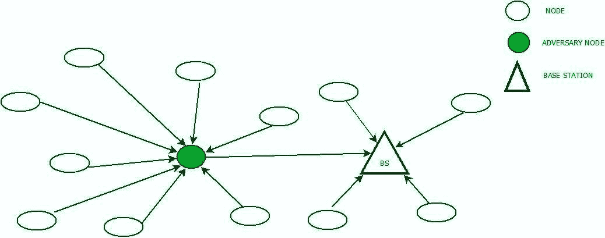

# 无线传感器网络中的天坑攻击

> 原文:[https://www . geesforgeks . org/sink hole-无线传感器网络攻击/](https://www.geeksforgeeks.org/sinkhole-attack-in-wireless-sensor-networks/)

天坑攻击是通过黑客攻击网络中的一个节点或在网络中引入一个虚构的节点来实现的。恶意节点将自己提升为到基站的最短路径，并试图将来自其他节点的流量导向自己。这不仅吸引了天坑附近的所有节点，而且吸引了比天坑更靠近基站的每个节点。入侵者节点或天坑可以很容易地改变数据，危及网络安全。

天坑攻击可以从网络内部发起，也可以从外部发起。在第一种情况下，攻击者可能使用一个被窃听的节点开始入侵，在第二种情况下，入侵者可能通过它形成一条到基站的直接路径，诱使其他节点通过它发送流量。

**1。异常相关:**
在异常相关入侵防御中，系统活动被观察到，并被分类为异常或正常。这里，任何类型的干扰或入侵都被视为异常活动。为了成功识别攻击流量，系统最初必须经过培训，以识别正常的系统活动。

异常检测系统主要由训练阶段和测试阶段组成，在训练阶段，系统被配置为检测正常活动。这种技术的问题是，它在识别天坑时可能并不总是准确的，并且会发出错误的警报。统计技术和基于规则的技术都是异常相关方法的一个分支。

**2。基于规则/签名:**
在这种类型的入侵检测系统中，定义了 WSN 的每个节点都要遵循的某些规则。这些规则奠定了执行天坑攻击的风格和方式的基础。被发现违反规则的节点被标记为入侵者节点，因此被解散。

这种类型的检测机制的缺点是，它只能检测已经注册的攻击，并且容易受到新的攻击。

**3。统计:**
这是基于异常的检测技术的另一个子集。在该方法中，记录和分析与节点执行的不同任务相关的信息。信息可以是从 CPU 使用到节点之间的数据包传输的任何信息。然后通过将入侵者节点的行为与参考数据进行匹配来找到入侵者节点。

**4。混合:**
这种方法结合了基于异常和签名的入侵检测系统，消除了两者的缺点。它甚至能够捕获那些签名不属于数据库的攻击。此外，与基于异常的方法相比，精度得到了显著提高。

**5。密钥管理:**
这种方法基于密码学的原理，其中节点之间传输的数据被编码，并且只能在密钥的帮助下被解码。在这种方法中，即使是消息中的微小变化也可以很容易地被检测到。

节点可以方便地验证消息的合法性，并确定数据是否是借助密钥从基站发送的。