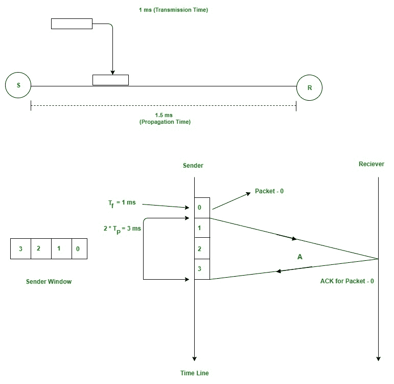
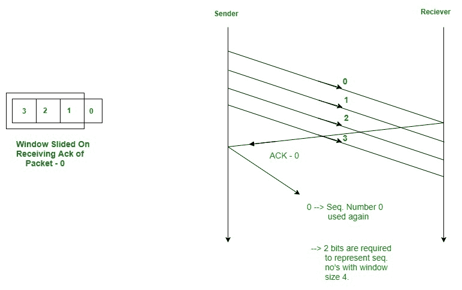

# 滑动窗口协议|设置 1(发送方)

> 原文:[https://www . geesforgeks . org/sliding-window-protocol-set-1/](https://www.geeksforgeeks.org/sliding-window-protocol-set-1/)

先决条件:[停车等待 ARQ](https://www.geeksforgeeks.org/stop-and-wait-arq/)

停止和等待 ARQ 提供错误和流量控制，但可能会导致大的性能问题，因为发送方总是等待确认，即使它有下一个数据包准备发送。考虑一种情况，您有一个高带宽连接，传播延迟也很高(您通过高速连接连接到其他国家的某个服务器)，由于停止和等待的限制，您不能使用这个全速。

滑动窗口协议通过一次发送多个序列号较大的数据包来解决这一效率问题。这个想法和架构中的流水线一样。

## **少数术语:**

**传输延迟(TT)**–将数据包从主机传输到输出链路的时间。如果 B 是链路带宽，D 是要传输的数据大小

```
    Tt = D/B  
```

**传播延迟(Tp)**–这是主机传输到输出链路上的第一位到达目的地所需的时间。它取决于距离 d 和波的传播速度 s(取决于介质的特性)。

```
   Tp = d/s  
```

**效率**–它被定义为包的总有用时间与总周期时间的比率。对于停止和等待协议，

```
Total cycle time = Tt(data) + Tp(data) + 
                    Tt(acknowledgement) + Tp(acknowledgement)
              =  Tt(data) + Tp(data) + Tp(acknowledgement)
         =   Tt + 2*Tp

```

由于确认的大小非常小，因此可以忽略它们的传输延迟。

```
Efficiency = Useful Time / Total Cycle Time 
           = Tt/(Tt + 2*Tp) (For Stop and Wait)
           = 1/(1+2a)  [ Using a = Tp/Tt ]

```

**有效带宽(EB)或吞吐量**–每秒发送的位数。

```
EB = Data Size(L) / Total Cycle time(Tt + 2*Tp)
Multiplying and dividing by Bandwidth (B),
       =  (1/(1+2a)) * B   [ Using a = Tp/Tt ]
       =  Efficiency * Bandwidth

```

**链路容量**–如果信道是全双工的，那么比特可以双向传输，没有任何冲突。信道/链路最大可容纳的位数是其容量。

```
 Capacity = Bandwidth(B) * Propagation(Tp)

 For Full Duplex channels, 
 Capacity = 2*Bandwidth(B) * Propagation(Tp)

```

## 流水线的概念

在停止和等待协议中，只有 1 个数据包传输到链路上，然后发送方等待接收方的确认。这个设置中的问题是效率非常低，因为在第一个数据包被放到链路上之后，我们没有用更多的数据包填充信道。在 Tt + 2*Tp 单位的总周期时间内，我们现在将计算发送方在获得确认之前可以在链路上传输的最大数据包数量。

```
 In Tt units ----> 1 packet is Transmitted.
 In 1 units  ----> 1/Tt packet can be Transmitted.
 In  Tt + 2*Tp units ----->  (Tt + 2*Tp)/Tt 
                             packets can be Transmitted
                ------>  1 + 2a  [Using a = Tp/Tt]

```

总周期时间内可传输的最大数据包数= 1+2*a

现在让我借助一个例子来解释一下。

考虑 Tp =毫秒，Tp = 1.5 毫秒

在下图中，发送方发送完数据包 0 后，将立即发送数据包 1、2、3。0 的确认将在 2 * 1.5 = 3 毫秒后到达。在停止和等待中，在时间 1+2 * 1.5 = 4 毫秒内，我们只传输了一个数据包。这里我们保留一个我们已经传输但尚未确认的数据包的**窗口**。



在我们收到数据包 0 的 Ack 后，窗口滑动，下一个数据包可以被分配序列号 0。我们重复使用我们已经确认的序列号，这样报头大小可以保持最小，如下图所示。



## 发送器窗口的最小位数(对 GATE 非常重要)

正如我们在上面看到的，

```
 Maximum window size = 1 + 2*a    where a = Tp/Tt

 Minimum sequence numbers required = 1 + 2*a. 
```

当前窗口中的所有数据包都将被赋予一个序列号。表示发送方窗口所需的位数= ceil(log2(1+2*a))。

但是有时协议头中的位数是预先定义的。报头中序列号字段的大小也将决定我们在总周期时间内可以发送的最大数据包数量。如果 N 是报头中序列号字段的大小(以位为单位)，那么我们可以有 2 个 <sup>N 个</sup>序列号。

窗口大小 ws =最小值(1+2*a，2 <sup>N</sup> )

如果要计算表示序列号/发送方窗口所需的最小位数，将是 **ceil(log2(ws))** 。

在本文中，我们只讨论了发送窗口。对于接收窗口，有 2 个协议，即**返回 N** 和**选择性重复**，用于实际实现流水线操作。我们将在第二集讨论接收窗口。

本文由**普伦珠尔·阿胡佳供稿。**如果您发现任何不正确的地方，或者您想分享更多关于上述主题的信息，请写评论