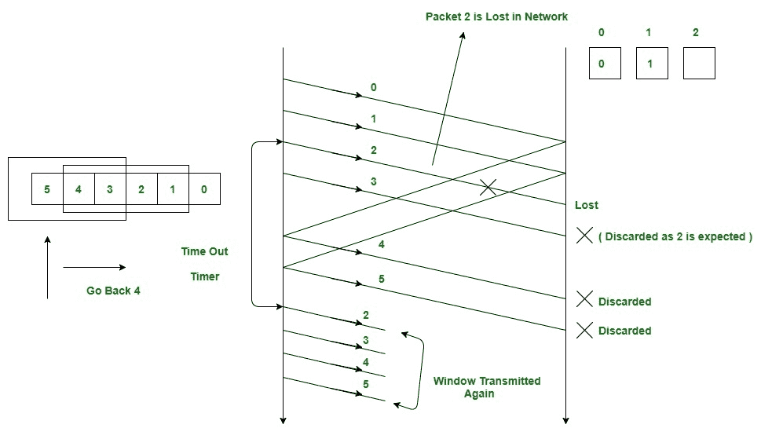
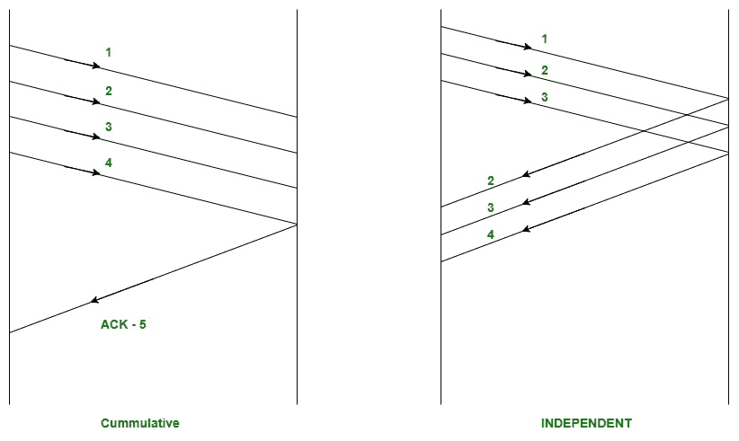
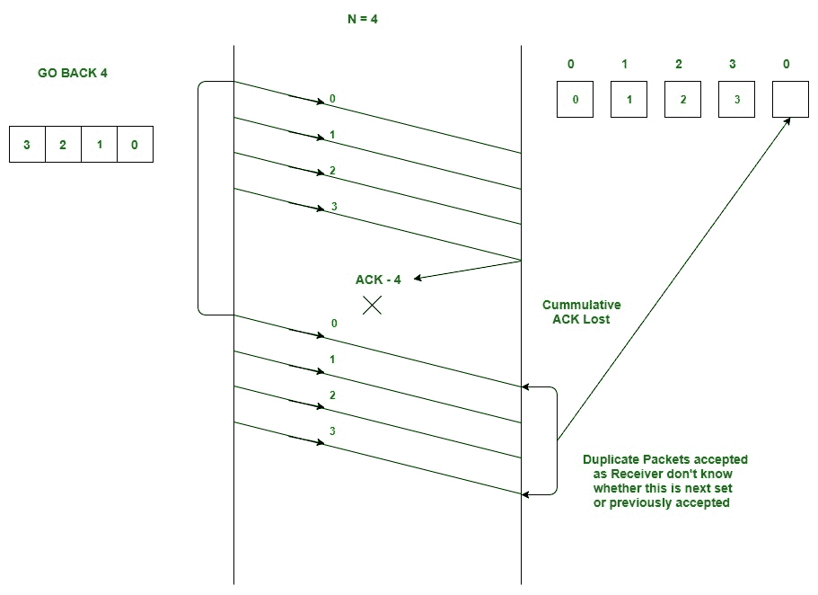
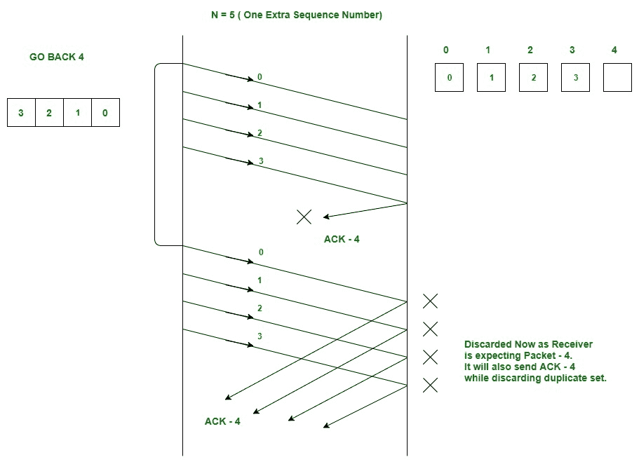

# 滑动窗口协议|集合 2(接收方)

> 原文:[https://www . geesforgeks . org/滑动窗口-协议-set-2-接收方/](https://www.geeksforgeeks.org/sliding-window-protocol-set-2-receiver-side/)

请以此为前提文章:[滑动窗口协议(发送方)|设置 1](https://www.geeksforgeeks.org/sliding-window-protocol-set-1/)

**滑动窗口协议**实际上是一个理论概念，在这个概念中，我们只讨论了为了提高停止和等待 arq 的效率，发送方窗口大小应该是多少(1+2a)。现在，我们将讨论实际的实现，在这些实现中，我们将考虑接收器窗口的大小。实际上，它以两种协议实现，即:

1.  返回北(GBN)
2.  选择性重复

在本文中，我们将向您解释第一个协议，即 GBN 协议的三个主要特征，在下一部分中，我们将讨论服务请求以及这两个协议的比较

### 返回 N (GBN)协议

GBN 的三大特色是:

1.  **Sender Window Size (WS)**
    It is N itself. If we say the protocol is GB10, then Ws = 10\. N should be always greater than 1 in order to implement pipelining. For N = 1, it reduces to Stop and Wait protocol.

    ```
    Efficiency Of GBN = N/(1+2a)
    where a = Tp/Tt
    ```

    如果 B 是信道的带宽，那么

    ```
    Effective Bandwidth or Throughput
     = Efficiency * Bandwidth
     = (N/(1+2a)) * B
    ```

2.  **Receiver Window Size (WR)**

    ```
    WR is always 1 in GBN.
    ```

    现在 GBN 到底发生了什么，我们将用一个例子来解释。考虑下面给出的图表。我们的发送窗口大小为 4。为了便于解释，假设我们有很多序列号。现在发送方已经发送了数据包 0、1、2 和 3。在确认分组 0 和 1 之后，接收器现在正在等待分组 2，并且发送器窗口也已经滑动以进一步发送分组 4 和 5。现在假设数据包 2 在网络中丢失，接收器将丢弃发送器在数据包 2 之后发送的所有数据包，因为它预期序列号为 2。在发送方，对于每个发送的数据包，都有一个超时计时器，该计时器将在数据包编号 2 到期。现在，从最后一次传输的数据包 5 开始，发送方将返回到当前窗口中的数据包编号 2，并传输所有数据包，直到数据包编号 5。这就是为什么它被称为“返回 N”。返回意味着发送方必须从未确认窗口中最后一次传输的数据包返回 N 个位置，而不是从数据包丢失的位置。

    [](https://www.geeksforgeeks.org/wp-content/uploads/Sliding_SET_2-1.jpg)

3.  **Acknowledgements**
    There are 2 kinds of acknowledgements namely:
    *   **累积确认**:一个确认用于多个数据包。主要优势是流量少。缺点是不太可靠，好像一个 ack 就是丢失，这意味着所有发送的数据包都丢失了。
    *   **独立确认**:如果每个数据包都要独立得到确认。这里的可靠性很高，但缺点是流量也很高，因为对于每个数据包，我们都接收到独立的 ack。

    

    **GBN 使用累计确认**。在接收器端，每当接收器接收到任何固定的数据包时，它都会启动一个确认定时器，当它到期时，它会发送一个累计的确认，以确认在该定时器间隔内接收到的数据包数量。如果接收器已经接收到 N 个数据包，那么确认号将是 N+1。重要的一点是，确认计时器不会在第一个计时器到期后启动，而是在接收器收到数据包后启动。
    *发送端的超时计时器应大于确认计时器*。

**窗口大小和序列号之间的关系**
我们已经知道，在任何滑动窗口协议中，所需的序列号应该总是等于窗口的大小。

```
Minimum sequence numbers required in GBN = N + 1
```

```
Bits Required in GBN = ceil(log2 (N + 1))

The extra 1 is required in order to 
avoid the problem of duplicate packets
as described below.
```

**例:考虑一个 GB4 的例子。**

*   发送方窗口大小为 4，因此我们需要至少 4 个序列号来标记窗口中的每个数据包。
*   现在假设接收者已经接收到所有的分组(发送者发送的 0、1、2 和 3)，因此现在再次等待分组号 0(我们不能在这里使用 4，因为我们只有 4 个序列号可用，因为 N = 4)。
*   现在假设上述 4 个数据包的累积 ack 在网络中丢失。
*   在发送方，数据包 0 将超时，因此所有 4 个数据包都将再次传输。
*   现在的问题是接收器正在等待新的数据包集，它应该从 0 开始，但是现在它将接收以前接受的数据包的副本。
*   为了避免这种情况，我们需要一个额外的序列号。
*   现在，接收器可以轻松地拒绝所有从 0 开始的重复数据包，因为现在它将等待数据包编号 4(我们现在添加了一个额外的序列号)。

这将通过下面的插图来解释。

**尝试序列号 4。**

[](https://www.geeksforgeeks.org/wp-content/uploads/Sliding_SET_2-3.jpg)

**现在再尝试一个序列号。**

[](https://www.geeksforgeeks.org/wp-content/uploads/Sliding_SET_2-4.jpg)

现在很清楚为什么我们需要在 GBN 协议中多加 1 位。

在下一篇文章中，我们将解释选择性重复和两种协议之间的比较。

本文由**普兰珠**供稿。如果你喜欢 GeeksforGeeks 并想投稿，你也可以使用[write.geeksforgeeks.org](https://write.geeksforgeeks.org)写一篇文章或者把你的文章邮寄到 review-team@geeksforgeeks.org。看到你的文章出现在极客博客主页上，帮助其他极客。

如果你发现任何不正确的地方，或者你想分享更多关于上面讨论的话题的信息，请写评论。