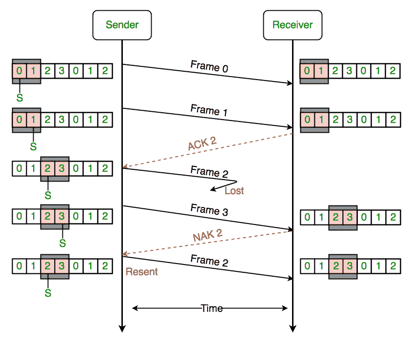

# 滑动窗口协议|设置 3(选择性重复)

> 原文:[https://www . geesforgeks . org/滑动窗口-协议-设置-3-选择性-重复/](https://www.geeksforgeeks.org/sliding-window-protocol-set-3-selective-repeat/)

先决条件:[滑动窗口协议–设置 1(发送方)](https://www.geeksforgeeks.org/sliding-window-protocol-set-1/)、[设置 2(接收方)](https://www.geeksforgeeks.org/sliding-window-protocol-set-2-receiver-side/)

**为什么选择重复方案？**
如果错误较少，back-n 协议可以很好地工作，但是如果线路很差，它会在重新传输的帧上浪费大量带宽。另一种策略是选择性重复协议，它允许接收器接受并缓冲损坏或丢失的帧。

选择性重复尝试仅重传那些实际丢失的数据包(由于错误) :

*   接收器必须能够接受无序的数据包。
*   由于接收器必须按顺序向更高层释放数据包，因此接收器必须能够缓冲一些数据包。

**重传请求:**

*   **隐式–**接收器确认每个好的数据包，超时前未被确认的数据包被认为丢失或出错。请注意，必须使用这种方法来确保最终收到每个数据包。
*   **显式–**显式 NAK(选择性拒绝)可以只请求重传一个数据包。这种方法可以加速重传，但不是严格需要的。
*   实践中使用一种或两种方法。

**选择性重复协议(SRP) :**
该协议(SRP)与 GBN 协议基本相同，只是使用了缓冲区，接收方和发送方各自维护一个大小的窗口。当链路非常不可靠时，SRP 工作得更好。因为在这种情况下，重传往往发生得更频繁，所以有选择地重传帧比重传所有帧更有效。SRP 还需要全双工链路。反向确认也在进行中。

*   发送方窗口(Ws) =接收方窗口(Wr)。
*   窗口大小应小于或等于服务请求协议中序列号的一半。这是为了避免数据包被错误识别。如果窗口的大小大于序列号空间的一半，那么如果确认丢失，发送者可以发送接收者认为是重传的新分组。
*   只要新数据包的数量与所有未确认数据包的数量相同，发送方就可以发送新数据包。
*   发送方在超时后重新发送未分组的数据包，或者如果使用了否定应答，则在否定应答后重新发送。
*   接收器确认所有正确的数据包。
*   接收器存储正确的数据包，直到它们可以按顺序传送到更高层。
*   在选择性重复 ARQ 中，发送方和接收方窗口的大小必须至多为 2^m.的一半



<center>**Figure –** the sender only retransmits frames, for which a NAK is received</center>

选择性重复协议的效率与去重协议的效率相同:

```
Efficiency = N/(1+2a)
Where a = Propagation delay / Transmission delay  
Buffers = N + N
Sequence number  = N(sender side)  + N  ( Receiver Side)

```

**参考文献–**

[幻灯片分享](https://www.slideshare.net/manushadilan/selective-repeat-protocol-49828840)
[【YouTube】](https://www.youtube.com/watch?v=Oipm5DdYYAs)[(附文章](https://ocw.mit.edu/courses/aeronautics-and-astronautics/16-36-communication-systems-engineering-spring-2009/lecture-notes/MIT16_36s09_lec18.pdf)

本文由**阿卡什·莎兰**供稿。如果你喜欢 GeeksforGeeks 并想投稿，你也可以使用[write.geeksforgeeks.org](https://write.geeksforgeeks.org)写一篇文章或者把你的文章邮寄到 review-team@geeksforgeeks.org。看到你的文章出现在极客博客主页上，帮助其他极客。

如果你发现任何不正确的地方，或者你想分享更多关于上面讨论的话题的信息，请写评论。