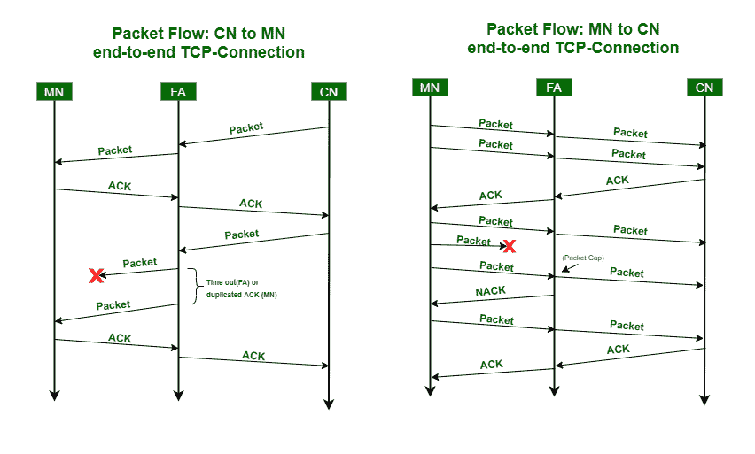

# 窥探 TCP

> 原文:[https://www.geeksforgeeks.org/snooping-tcp/](https://www.geeksforgeeks.org/snooping-tcp/)

在本文中，我们将讨论监听 TCP 的概述及其工作原理，然后讨论监听 TCP 的优缺点。我们一个一个来讨论。

**概述:**
窥探 [TCP](https://www.geeksforgeeks.org/services-and-segment-structure-in-tcp/) 是经典的 TCP 改进方法之一。该方法旨在解决 I-TCP 中的端到端语义丢失问题。基本概念是在移动节点附近缓冲数据包，并在数据包丢失时在本地重新传输。

**监听 TCP 的工作方式** :
下面我们来讨论一下 TCP 的工作方式。

*   在收到来自移动节点的确认之前，外地代理缓冲该分组。
*   外地代理在两个方向上窥探分组流和确认。
*   如果外地代理没有从移动节点接收到确认，或者如果它接收到重复的确认，它认为分组或确认已经丢失。外来代理会立即从其缓冲区中重新传输数据包。
*   此外，外地代理维护其自己的定时器，用于在缓冲的分组在无线链路上丢失的情况下重传该分组。
*   当数据从移动节点传输到通信节点时，如果外地代理检测到丢失的分组，它向移动节点返回 NACK 否定确认。它现在可以立即重发丢失的数据包。数据包的重新排序是通过 TCP 在通信节点自动完成的。
*   在监听 TCP 的概念中，如果外地代理现在崩溃，通信节点的超时仍然有效并触发重传。外地代理可以丢弃已经在本地重传并由移动节点确认的分组的副本。这避免了无线链路上不必要的流量。
*   为了保持透明，外地代理不向固定节点确认分组，但是移动节点确认分组(保持端到端语义)。

**优势:**
在这里，我们将讨论以下优势。

1.  **保留端到端的 TCP 语义–**
    FA 不承认数据包。如果外地代理或基站出现故障，解决方案将恢复为标准的 TCP。

2.  **固定主机无修改–**
    固定计算机 TCP 不需要任何更改。大部分变更都是在国外代理商处进行的。

3.  **切换期间无数据包丢失–**
    在切换的情况下，如果任何数据没有传递给新的外地代理，则固定主机将超时，并激活通过移动 IP 向新的 COA 重传数据包。

**劣势:**
在这里，我们将讨论如下劣势。

1.  **无线链路的行为–**
    窥探 TCP 不会隔离无线链路或 I-TCP 的行为。传输错误会传播到通信节点。

2.  **移动节点需要额外的机制–**
    外地代理和移动节点之间使用 NACK 需要移动节点具有额外的机制。对于任意移动节点，该方法不再透明。

3.  **端到端加密–**
    如果在通信节点和移动节点之间端到端使用这种加密方案，窥探和缓冲数据可能被认为是没有价值的。如果在传输层(例如，SSL/TLS)之上使用加密，则可以使用监听 TCP。