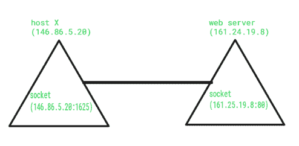
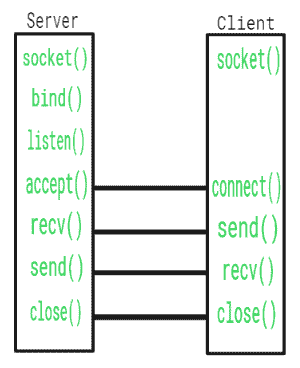

# 计算机网络中的插座

> 原文:[https://www.geeksforgeeks.org/socket-in-computer-network/](https://www.geeksforgeeks.org/socket-in-computer-network/)

一个**套接字**是网络上运行的两个程序之间的一个**双向**通信链路的一个端点。套接字机制通过建立通信发生的命名接触点来提供进程间通信的手段。

像“管道”是用来创建管道和插座是使用**“插座”**系统调用创建的。插座通过网络提供双向**先进先出**通信设施。在通信的每一端都创建一个连接到网络的套接字。每个套接字都有一个特定的地址。该地址由一个 IP 地址和一个端口号组成。

套接字通常用于客户端服务器应用程序。服务器创建一个套接字，将其附加到网络端口地址，然后等待客户端与其联系。客户端创建一个套接字，然后尝试连接到服务器套接字。当连接建立时，数据传输发生。

**套接字类型:**
套接字有两种类型:**数据报**套接字和**流**套接字。

1.  **数据报套接字:**
    这是一种无连接点的网络，用于发送和接收数据包。它类似于邮箱。投到信箱中的信件(数据)被收集并传送到信箱(接收插座)。
2.  **流套接字**
    在计算机操作系统中，流套接字是一种[进程间通信](https://www.geeksforgeeks.org/inter-process-communication-ipc/)套接字或网络套接字，它提供面向连接、有序且唯一的数据流，没有记录边界，具有定义良好的创建和销毁连接以及检测错误的机制。它类似于电话。在电话(两端)之间建立连接，并进行对话(数据传输)。

| 函数调用 | 描述 |
| --- | --- |
| 创建() | 创建套接字 |
| 绑定() | 这是一个插座标识，就像要联系的电话号码一样 |
| 听着() | 准备接收连接 |
| 连接() | 准备好充当发送者了吗 |
| 接受() | 确认，就像接受来自发送者的呼叫 |
| 写() | 发送数据 |
| 已读() | 接收数据 |
| 关闭() | 关闭连接 |

