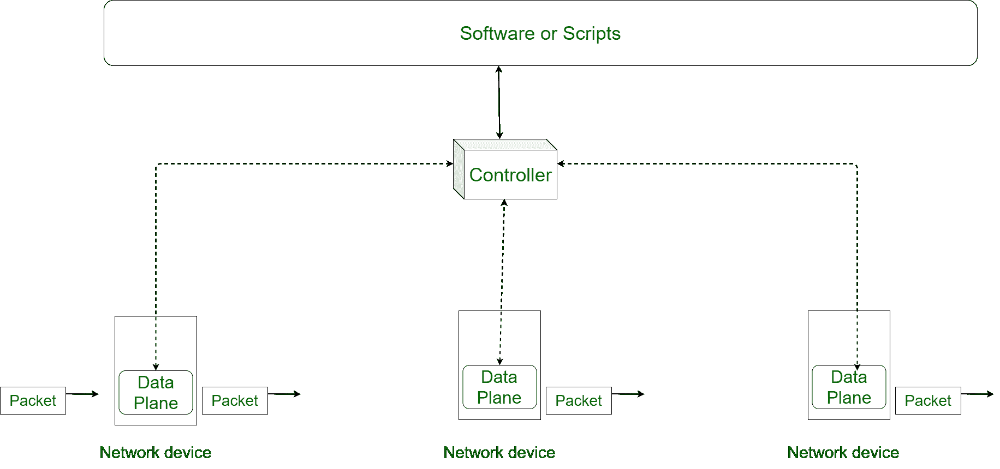

# 软件定义网络(SDN)控制器

> 原文:[https://www . geesforgeks . org/software-defined-networking-sdn-controller/](https://www.geeksforgeeks.org/software-defined-networking-sdn-controller/)

像[路由器](https://www.geeksforgeeks.org/introduction-of-a-router/)和[交换机](https://www.geeksforgeeks.org/types-of-switches-in-computer-network/)这样的所有传统网络设备都使用分布式控制平面。但是较新的网络模式，即 **[【软件定义网络】](https://www.geeksforgeeks.org/software-defined-networking/)** 使用集中控制平面。分布式控制平面意味着所有网络设备的控制平面都位于设备本身内。

每个设备都有自己的控制平面来控制数据平面。在集中控制平面系统中，有一个设备包含所有设备的控制平面。该设备同时控制所有网络设备的数据平面的活动。该装置称为**控制器或 SDN 控制器。**

下图显示了基于控制器的网络模型。

**图-** 基于控制器的网络模型

1.  **Southbound Interface :**
    In SDN, all networking devices must be connected to controller so that it can regulate data planes of all devices. When drawing architecture of network, usually the network architect places networking devices below controller. Now according to map conventions, interface between controller and networking devices lies to south of controller. Hence, these interfaces are called **Southbound Interface**.

    Southbound interface is an interface between a program on controller and a program on networking device. Note that these interfaces we are discussing are software interface not physical one.
2.  **北行接口:**
    控制器需要知道很多关于网络的信息，这样才能控制网络设备的数据平面，这些信息都是由网络程序员提供的。网络程序员通过各种软件或脚本向控制器提供它必须执行的功能的基本信息。同样，在网络体系结构中，这些软件/脚本位于控制器之上。根据地图惯例，软件/脚本的这种放置使得控制器和软件之间的接口在北向。因此，控制器和软件之间的接口称为**北行接口**。这些接口支持网络的可编程性。

    我们上面讨论的所有接口都是基于程序的接口。这些广义的接口称为**应用程序接口(API)** 。应用编程接口是一个接口，两个程序可以通过它在它们之间交换数据。