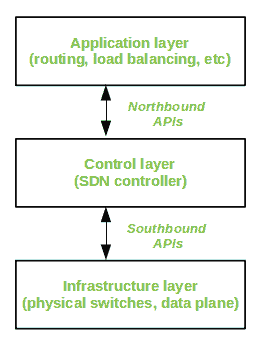

# 软件定义的网络

> 原文:[https://www.geeksforgeeks.org/software-defined-networking/](https://www.geeksforgeeks.org/software-defined-networking/)

为了理解软件定义的网络，我们需要理解网络中涉及的各个层面。

**数据平面:**
终端用户发送的数据包所涉及和产生的所有活动都属于这个平面。这包括:

*   数据包转发
*   数据的分段和重组
*   多播数据包的复制

**控制平面:**
执行数据平面活动所需但不涉及最终用户数据包的所有活动都属于该平面。换句话说，这是网络的大脑。控制平面的活动包括:

*   制作路由表
*   设置数据包处理策略

在传统网络中，每个[交换机](https://www.geeksforgeeks.org/network-devices-hub-repeater-bridge-switch-router-gateways/)都有自己的数据平面和控制平面。各种交换机的控制平面交换[拓扑](//www.geeksforgeeks.org/network-topologies-computer-networks/)信息，并因此构建转发表，该转发表决定进入的数据分组必须经由数据平面转发到哪里。

软件定义网络(SDN)是一种方法，通过这种方法，我们将控制平面从交换机上移开，并将其分配给一个称为 SDN 控制器的中央单元。因此，网络管理员可以通过中央控制台来控制流量，而无需接触单个交换机。数据平面仍然驻留在交换机中，当数据包进入交换机时，它的转发活动是根据控制器预先分配的流表条目来决定的。流表由匹配字段(如输入端口号和数据包报头)和指令组成。首先将数据包与流表条目的匹配字段进行匹配。

然后执行相应流条目的指令。指令可以是通过一个或多个端口转发数据包、丢弃数据包或向数据包添加报头。如果数据包在流表中没有找到相应的匹配项，交换机会询问控制器，控制器会向交换机发送一个新的流条目。交换机根据该流条目转发或丢弃数据包。

典型的 SDN 架构由三层组成。

*   **应用层:**
    包含[入侵检测](https://www.geeksforgeeks.org/intrusion-detection-system-ids/)[防火墙](https://www.geeksforgeeks.org/introduction-to-firewall/)[负载均衡](https://www.geeksforgeeks.org/load-balancing-on-servers-random-algorithm/)等典型网络应用
*   **控制层:**
    它由作为网络大脑的 SDN 控制器组成。它还允许对写在其上的应用程序进行硬件抽象。
*   **基础设施层:**
    这由形成数据平面并执行数据包实际移动的物理交换机组成。

这些层通过一组接口进行通信，这些接口被称为北向接口(在应用层和控制层之间)和南向接口(在控制层和基础设施层之间)。

**SDN 架构:**

**SDN 的优势:**

*   网络是可编程的，因此可以通过控制器而不是单个开关轻松修改。
*   交换机硬件变得更便宜，因为每个交换机只需要一个数据平面。
*   硬件是抽象的，因此应用程序可以独立于交换机供应商编写在控制器之上。
*   提供更好的安全性，因为控制器可以监控流量并部署安全策略。例如，如果控制器检测到网络流量中有可疑活动，它可以重新路由或丢弃数据包。

**SDN 的缺点:**
网络的中心依赖性意味着单点故障，即如果控制器损坏，整个网络都会受到影响。